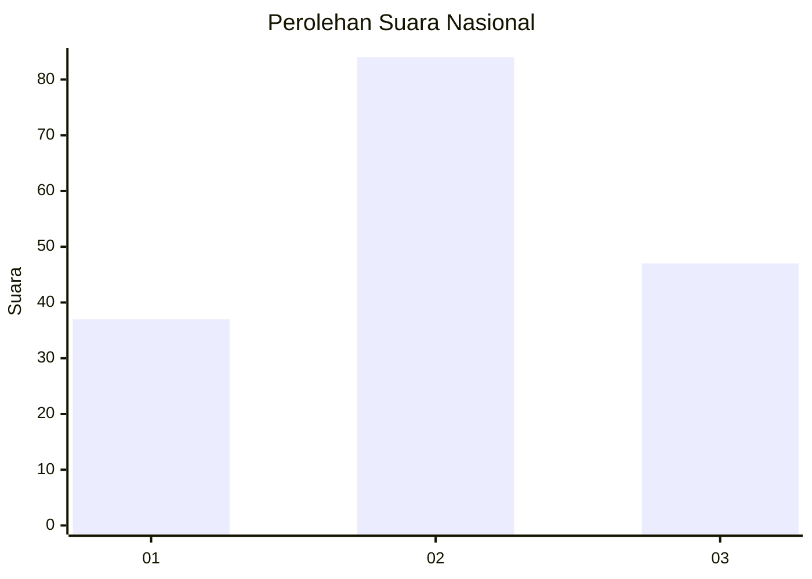
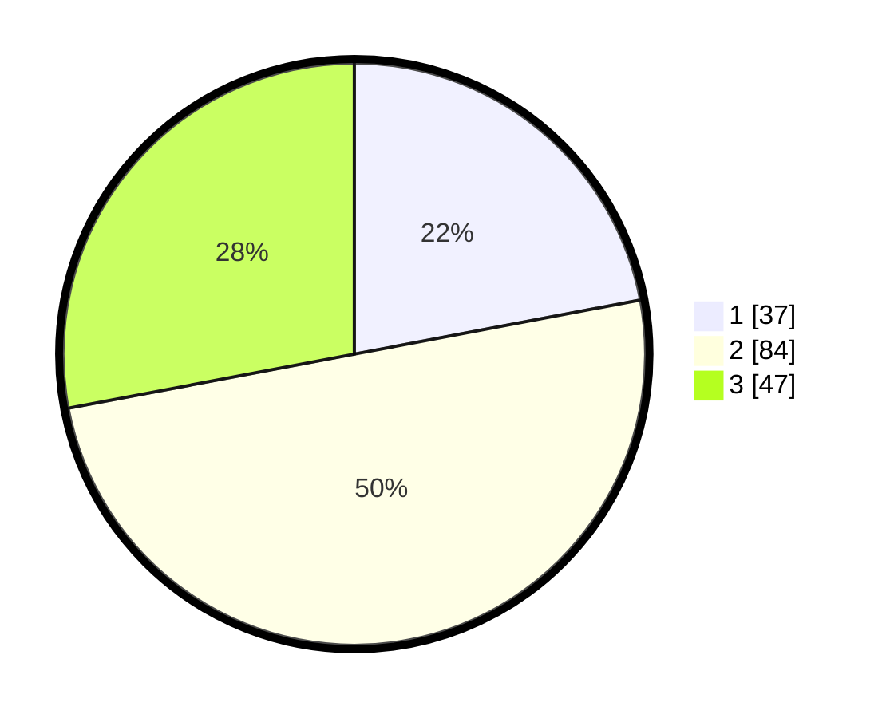

# Hasil

## Grafik

## Tabel

| No. | Nama Paslon    | Suara | Suara (raw) | Persentase |
|:--- |:-------------- | -----:| -----------:| ----------:|
| 1   | ANIES MUHAIMIN | 37    | [37][p-1]   | 22,02      |
| 2   | PRABOWO GIBRAN | 84    | [84][p-2]   | 50,00      |
| 3   | GANJAR MAHFUD  | 47    | [47][p-3]   | 27,98      |

[p-1]: https://github.com/gigit-pemilu/pemilu-2024/blob/main/pilpres/hitung-suara/sub/34-di-yogyakarta/sub/04-sleman/sub/10-kalasan/sub/2003-tamanmartani/sub/010-tps/sub/paslon-1.txt
[p-2]: https://github.com/gigit-pemilu/pemilu-2024/blob/main/pilpres/hitung-suara/sub/34-di-yogyakarta/sub/04-sleman/sub/10-kalasan/sub/2003-tamanmartani/sub/010-tps/sub/paslon-2.txt
[p-3]: https://github.com/gigit-pemilu/pemilu-2024/blob/main/pilpres/hitung-suara/sub/34-di-yogyakarta/sub/04-sleman/sub/10-kalasan/sub/2003-tamanmartani/sub/010-tps/sub/paslon-3.txt

## Foto C Plano

https://sirekap-obj-formc.kpu.go.id/ebcd/pemilu/ppwp/34/04/10/20/03/3404102003010-20240214-230255--2d3e67eb-fffc-4e44-b397-685fa7d501af.jpg

https://sirekap-obj-formc.kpu.go.id/ebcd/pemilu/ppwp/34/04/10/20/03/3404102003010-20240214-230443--1e9e0ec1-8420-45ff-bd1c-c32b696d6541.jpg

https://sirekap-obj-formc.kpu.go.id/ebcd/pemilu/ppwp/34/04/10/20/03/3404102003010-20240214-230554--021371a3-3059-4eb2-a3e8-29f7cbc76bbe.jpg

## Metadata

| Key        | Value               |
| ---------- | ------------------- |
| Time Stamp | 2024-02-16 22:01:00 |

