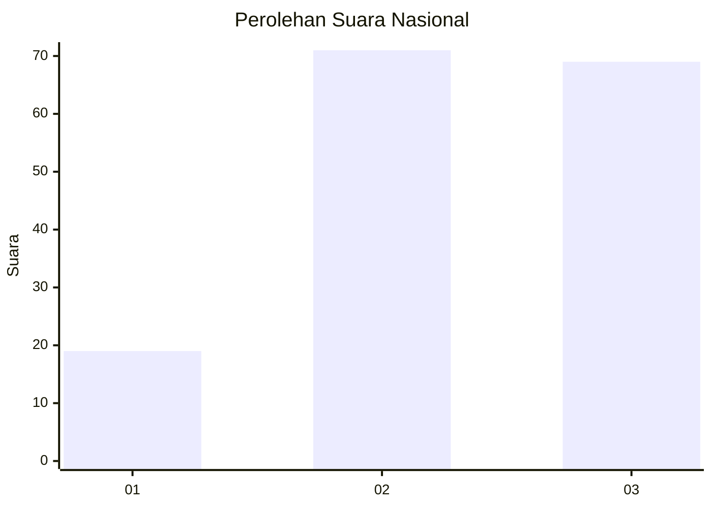
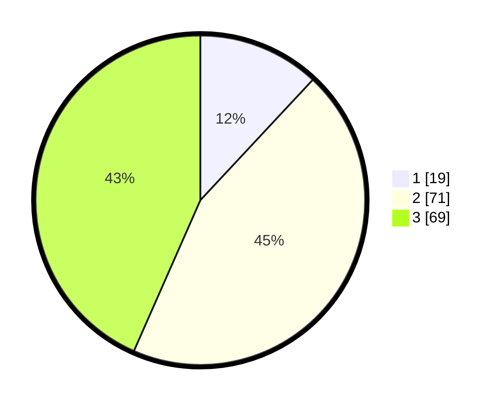

# Hasil

## Grafik

## Tabel

| No. | Nama Paslon    | Suara | Suara (raw) | Persentase |
|:--- |:-------------- | -----:| -----------:| ----------:|
| 1   | ANIES MUHAIMIN | 19    | [19][p-1]   | 11,95      |
| 2   | PRABOWO GIBRAN | 71    | [71][p-2]   | 44,65      |
| 3   | GANJAR MAHFUD  | 69    | [69][p-3]   | 43,40      |

[p-1]: https://github.com/gigit-pemilu/pemilu-2024/blob/main/pilpres/hitung-suara/sub/34-di-yogyakarta/sub/04-sleman/sub/10-kalasan/sub/2003-tamanmartani/sub/015-tps/sub/paslon-1.txt
[p-2]: https://github.com/gigit-pemilu/pemilu-2024/blob/main/pilpres/hitung-suara/sub/34-di-yogyakarta/sub/04-sleman/sub/10-kalasan/sub/2003-tamanmartani/sub/015-tps/sub/paslon-2.txt
[p-3]: https://github.com/gigit-pemilu/pemilu-2024/blob/main/pilpres/hitung-suara/sub/34-di-yogyakarta/sub/04-sleman/sub/10-kalasan/sub/2003-tamanmartani/sub/015-tps/sub/paslon-3.txt

## Foto C Plano

https://sirekap-obj-formc.kpu.go.id/8f70/pemilu/ppwp/34/04/10/20/03/3404102003015-20240214-214358--d14eb184-fc8e-4228-9827-404e7c8946d4.jpg

https://sirekap-obj-formc.kpu.go.id/8f70/pemilu/ppwp/34/04/10/20/03/3404102003015-20240214-214540--7dda1621-a549-45f7-a14f-a286a4736d8c.jpg

https://sirekap-obj-formc.kpu.go.id/8f70/pemilu/ppwp/34/04/10/20/03/3404102003015-20240214-214715--70126fcd-ec76-4323-ba4d-29c749c18687.jpg

## Metadata

| Key        | Value               |
| ---------- | ------------------- |
| Time Stamp | 2024-02-16 13:30:32 |

