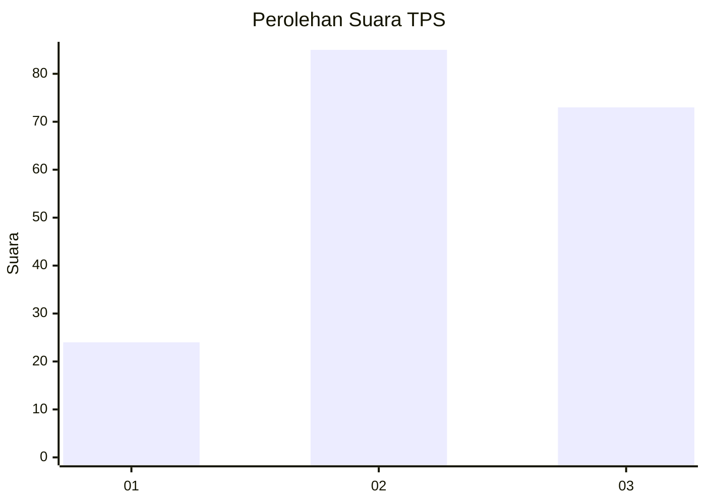
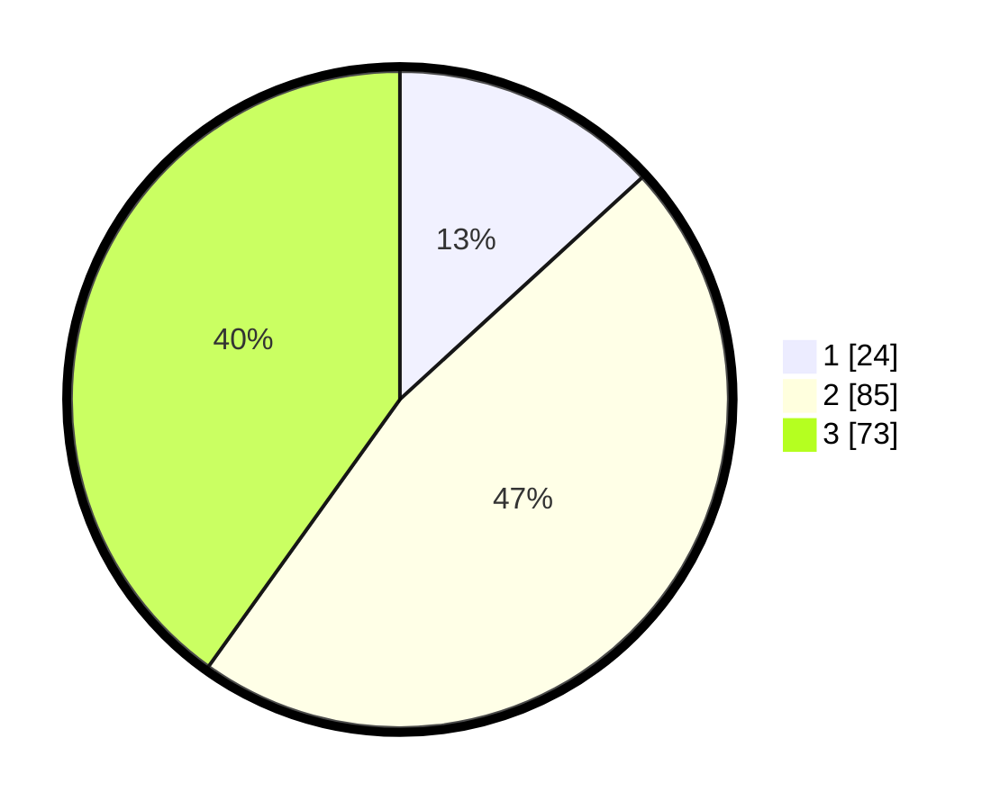

# Hasil

## Grafik

## Tabel

| No. | Nama Paslon    | Suara | Suara (raw) | Persentase |
|:--- |:-------------- | -----:| -----------:| ----------:|
| 1   | ANIES MUHAIMIN | 24    | [24][p-1]   | 13,19      |
| 2   | PRABOWO GIBRAN | 85    | [85][p-2]   | 46,70      |
| 3   | GANJAR MAHFUD  | 73    | [73][p-3]   | 40,11      |

[p-1]: https://github.com/gigit-pemilu/pemilu-2024-34-di-yogyakarta/blob/main/pilpres/hitung-suara/sub/34-di-yogyakarta/sub/04-sleman/sub/10-kalasan/sub/2003-tamanmartani/sub/021-tps/sub/paslon-1.txt
[p-2]: https://github.com/gigit-pemilu/pemilu-2024-34-di-yogyakarta/blob/main/pilpres/hitung-suara/sub/34-di-yogyakarta/sub/04-sleman/sub/10-kalasan/sub/2003-tamanmartani/sub/021-tps/sub/paslon-2.txt
[p-3]: https://github.com/gigit-pemilu/pemilu-2024-34-di-yogyakarta/blob/main/pilpres/hitung-suara/sub/34-di-yogyakarta/sub/04-sleman/sub/10-kalasan/sub/2003-tamanmartani/sub/021-tps/sub/paslon-3.txt

## Foto C Plano

https://sirekap-obj-formc.kpu.go.id/6c68/pemilu/ppwp/34/04/10/20/03/3404102003021-20240215-015441--7c3f3e20-8d86-4db0-8119-4f2ad756bbc8.jpg

https://sirekap-obj-formc.kpu.go.id/6c68/pemilu/ppwp/34/04/10/20/03/3404102003021-20240215-015635--7e157c34-8e58-4722-9686-e548767e6c85.jpg

https://sirekap-obj-formc.kpu.go.id/6c68/pemilu/ppwp/34/04/10/20/03/3404102003021-20240215-015713--5686763d-0535-4498-8db3-ad1abc0aa660.jpg

## Metadata

| Key        | Value               |
| ---------- | ------------------- |
| Time Stamp | 2024-02-15 19:30:26 |

