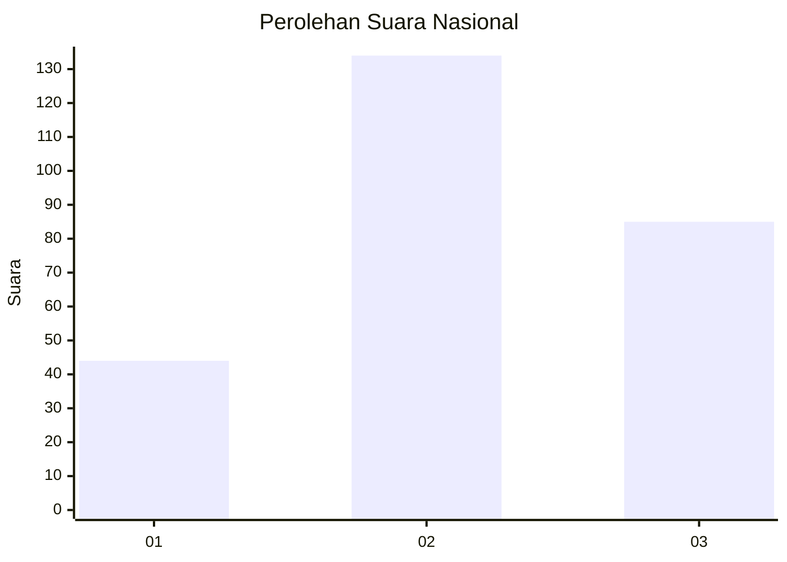
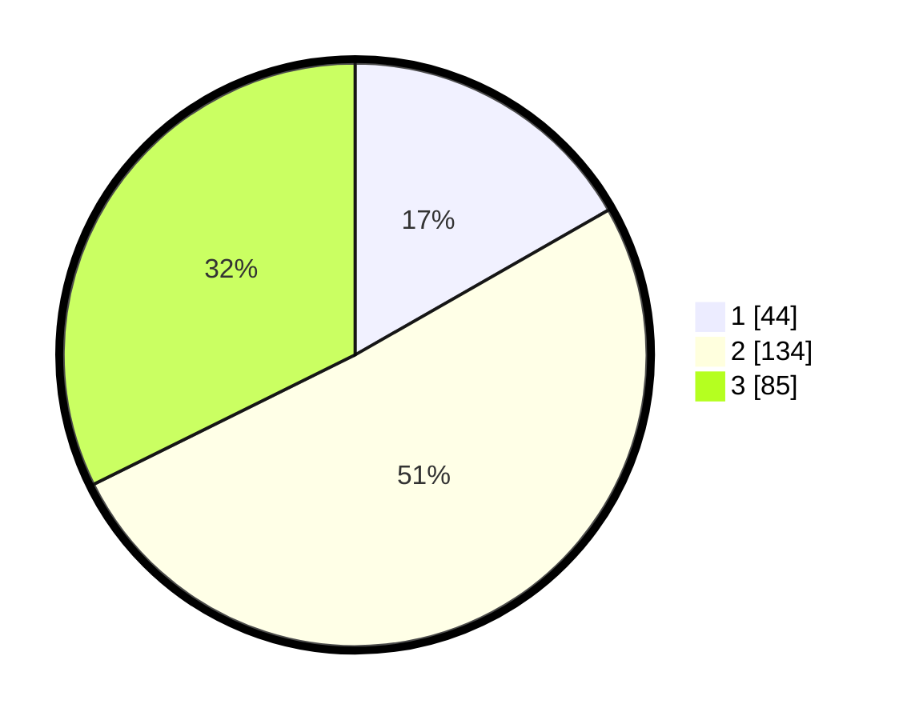

# Hasil

## Grafik

## Tabel

| No. | Nama Paslon    | Suara | Suara (raw) | Persentase |
|:--- |:-------------- | -----:| -----------:| ----------:|
| 1   | ANIES MUHAIMIN | 44    | [44][p-1]   | 16,73      |
| 2   | PRABOWO GIBRAN | 134   | [134][p-2]  | 50,95      |
| 3   | GANJAR MAHFUD  | 85    | [85][p-3]   | 32,32      |

[p-1]: https://github.com/gigit-pemilu/pemilu-2024/blob/main/pilpres/hitung-suara/sub/34-di-yogyakarta/sub/04-sleman/sub/10-kalasan/sub/2003-tamanmartani/sub/027-tps/sub/paslon-1.txt
[p-2]: https://github.com/gigit-pemilu/pemilu-2024/blob/main/pilpres/hitung-suara/sub/34-di-yogyakarta/sub/04-sleman/sub/10-kalasan/sub/2003-tamanmartani/sub/027-tps/sub/paslon-2.txt
[p-3]: https://github.com/gigit-pemilu/pemilu-2024/blob/main/pilpres/hitung-suara/sub/34-di-yogyakarta/sub/04-sleman/sub/10-kalasan/sub/2003-tamanmartani/sub/027-tps/sub/paslon-3.txt

## Foto C Plano

https://sirekap-obj-formc.kpu.go.id/5e74/pemilu/ppwp/34/04/10/20/03/3404102003027-20240215-100006--b4639506-0459-40a2-89a0-74c0f6d913b4.jpg

https://sirekap-obj-formc.kpu.go.id/5e74/pemilu/ppwp/34/04/10/20/03/3404102003027-20240215-100134--5eb76d0e-64a7-42b3-97d7-9a70d2d6b984.jpg

https://sirekap-obj-formc.kpu.go.id/5e74/pemilu/ppwp/34/04/10/20/03/3404102003027-20240215-100150--d7e36b7d-9f17-4733-b577-5223354de4d0.jpg

## Metadata

| Key        | Value               |
| ---------- | ------------------- |
| Time Stamp | 2024-02-16 22:01:00 |

