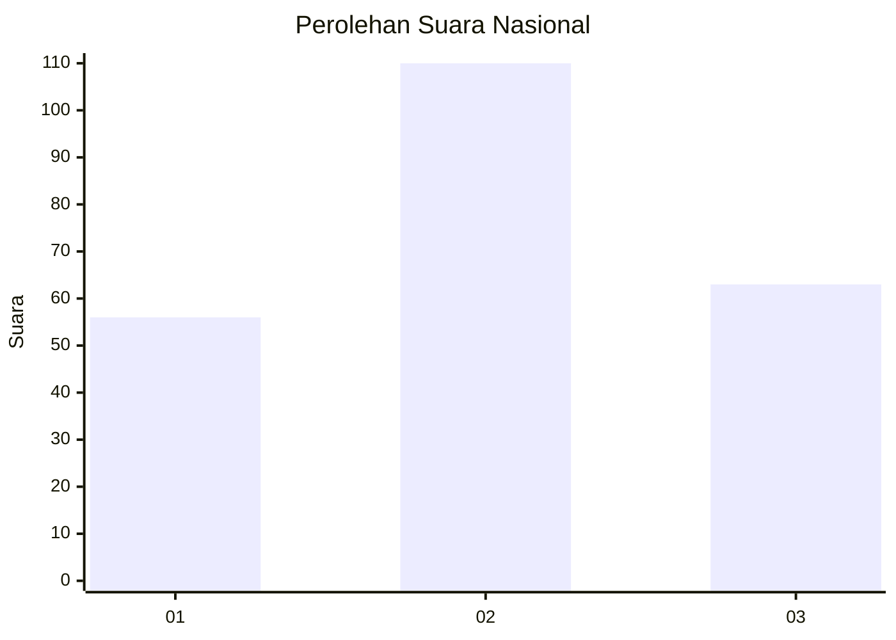
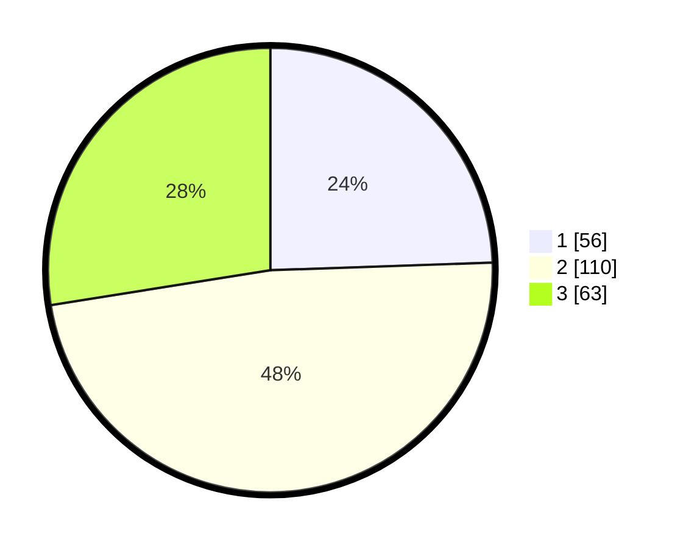

# Hasil

## Grafik

## Tabel

| No. | Nama Paslon    | Suara | Suara (raw) | Persentase |
|:--- |:-------------- | -----:| -----------:| ----------:|
| 1   | ANIES MUHAIMIN | 56    | [56][p-1]   | 24,45      |
| 2   | PRABOWO GIBRAN | 110   | [110][p-2]  | 48,03      |
| 3   | GANJAR MAHFUD  | 63    | [63][p-3]   | 27,51      |

[p-1]: https://github.com/gigit-pemilu/pemilu-2024/blob/main/pilpres/hitung-suara/sub/34-di-yogyakarta/sub/04-sleman/sub/10-kalasan/sub/2003-tamanmartani/sub/031-tps/sub/paslon-1.txt
[p-2]: https://github.com/gigit-pemilu/pemilu-2024/blob/main/pilpres/hitung-suara/sub/34-di-yogyakarta/sub/04-sleman/sub/10-kalasan/sub/2003-tamanmartani/sub/031-tps/sub/paslon-2.txt
[p-3]: https://github.com/gigit-pemilu/pemilu-2024/blob/main/pilpres/hitung-suara/sub/34-di-yogyakarta/sub/04-sleman/sub/10-kalasan/sub/2003-tamanmartani/sub/031-tps/sub/paslon-3.txt

## Foto C Plano

https://sirekap-obj-formc.kpu.go.id/71fe/pemilu/ppwp/34/04/10/20/03/3404102003031-20240214-224839--0ba80aa1-b024-41ca-9297-0ea8f5536644.jpg

https://sirekap-obj-formc.kpu.go.id/71fe/pemilu/ppwp/34/04/10/20/03/3404102003031-20240214-224925--5b041969-09a1-43d4-91b5-a1b0ada98dd1.jpg

https://sirekap-obj-formc.kpu.go.id/71fe/pemilu/ppwp/34/04/10/20/03/3404102003031-20240214-225004--47d650a7-ab81-4fbf-bee6-bb9cbe9efd60.jpg

## Metadata

| Key        | Value               |
| ---------- | ------------------- |
| Time Stamp | 2024-02-16 22:01:00 |

