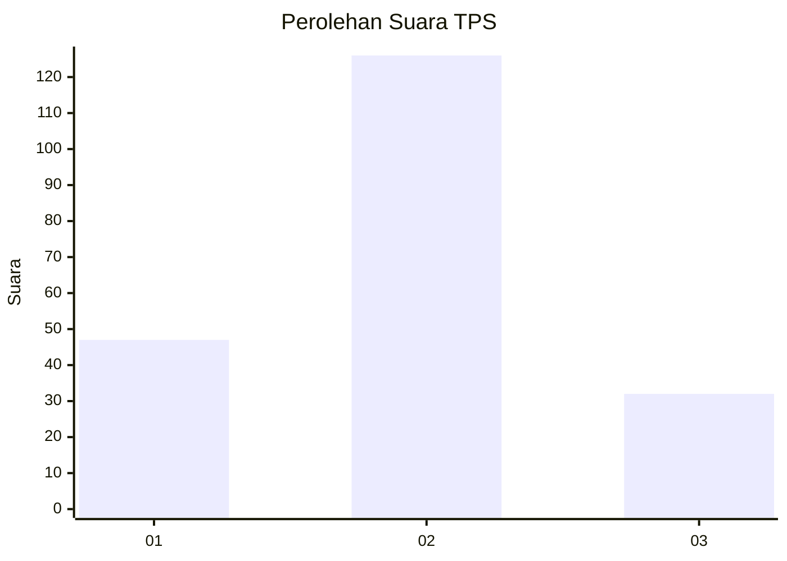
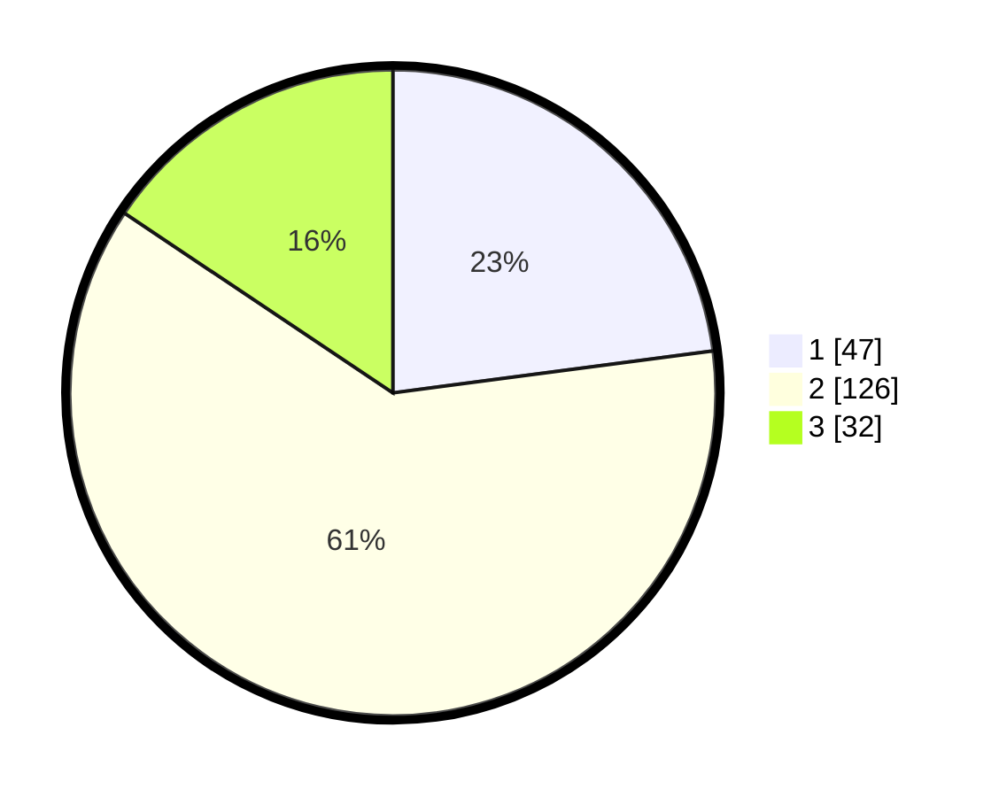

# Hasil

## Grafik

## Tabel

| No. | Nama Paslon    | Suara | Suara (raw) | Persentase |
|:--- |:-------------- | -----:| -----------:| ----------:|
| 1   | ANIES MUHAIMIN | 47    | [47][p-1]   | 22,93      |
| 2   | PRABOWO GIBRAN | 126   | [126][p-2]  | 61,46      |
| 3   | GANJAR MAHFUD  | 32    | [32][p-3]   | 15,61      |

[p-1]: https://github.com/gigit-pemilu/pemilu-2024-34-di-yogyakarta/blob/main/pilpres/hitung-suara/sub/34-di-yogyakarta/sub/04-sleman/sub/10-kalasan/sub/2003-tamanmartani/sub/038-tps/sub/paslon-1.txt
[p-2]: https://github.com/gigit-pemilu/pemilu-2024-34-di-yogyakarta/blob/main/pilpres/hitung-suara/sub/34-di-yogyakarta/sub/04-sleman/sub/10-kalasan/sub/2003-tamanmartani/sub/038-tps/sub/paslon-2.txt
[p-3]: https://github.com/gigit-pemilu/pemilu-2024-34-di-yogyakarta/blob/main/pilpres/hitung-suara/sub/34-di-yogyakarta/sub/04-sleman/sub/10-kalasan/sub/2003-tamanmartani/sub/038-tps/sub/paslon-3.txt

## Foto C Plano

https://sirekap-obj-formc.kpu.go.id/598a/pemilu/ppwp/34/04/10/20/03/3404102003038-20240215-010440--5f478ad0-7751-4604-a36e-e62a4eacfd1b.jpg

https://sirekap-obj-formc.kpu.go.id/598a/pemilu/ppwp/34/04/10/20/03/3404102003038-20240215-010516--d1a17fdd-1df8-4ed2-9754-862023eaf386.jpg

https://sirekap-obj-formc.kpu.go.id/598a/pemilu/ppwp/34/04/10/20/03/3404102003038-20240215-010543--9146dcc7-98d4-479c-9883-4cdd2d81316e.jpg

## Metadata

| Key        | Value               |
| ---------- | ------------------- |
| Time Stamp | 2024-02-15 19:30:26 |

