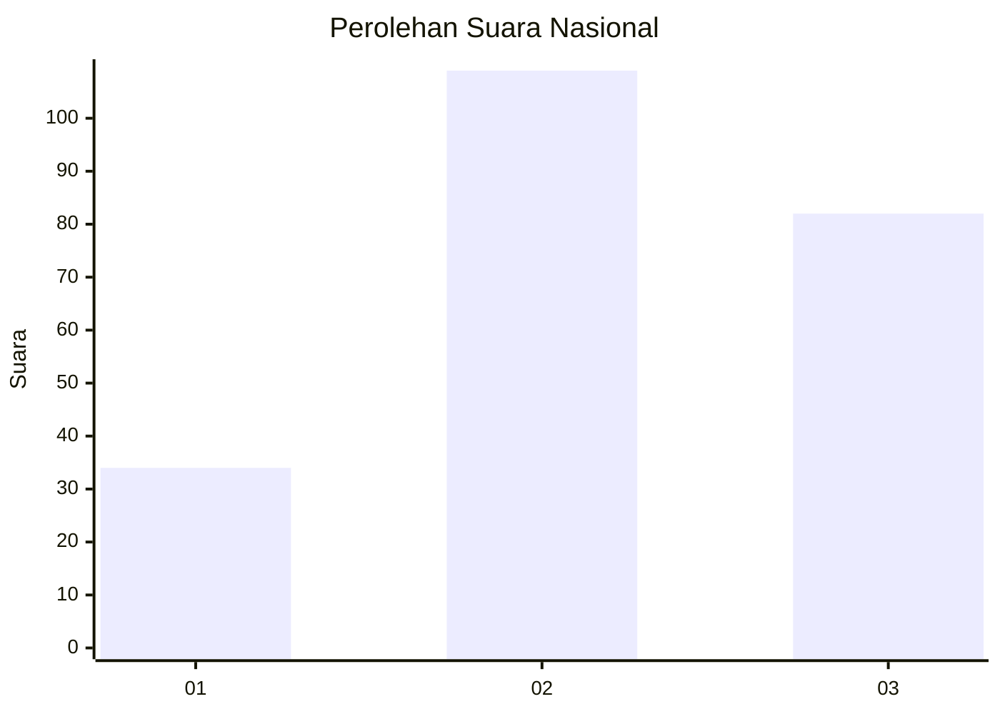
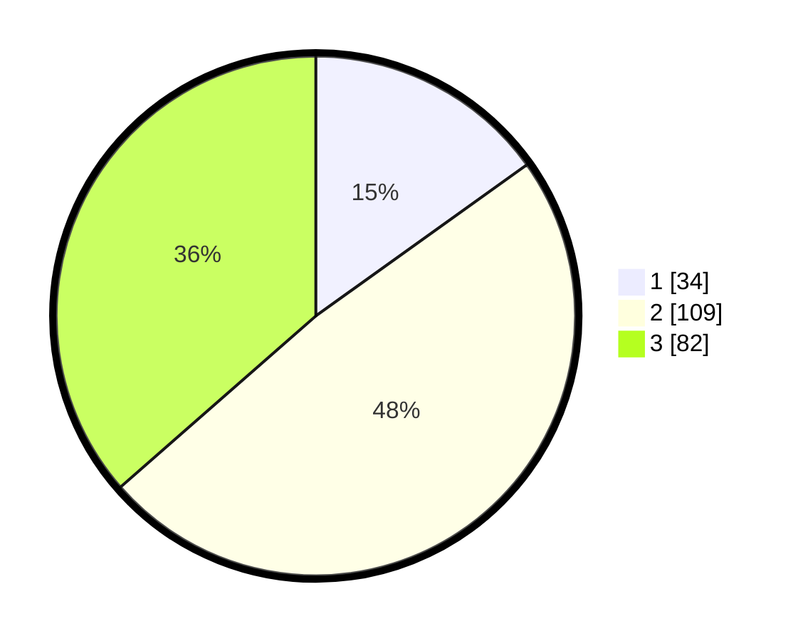

# Hasil

## Grafik

## Tabel

| No. | Nama Paslon    | Suara | Suara (raw) | Persentase |
|:--- |:-------------- | -----:| -----------:| ----------:|
| 1   | ANIES MUHAIMIN | 34    | [34][p-1]   | 15,11      |
| 2   | PRABOWO GIBRAN | 109   | [109][p-2]  | 48,44      |
| 3   | GANJAR MAHFUD  | 82    | [82][p-3]   | 36,44      |

[p-1]: https://github.com/gigit-pemilu/pemilu-2024/blob/main/pilpres/hitung-suara/sub/34-di-yogyakarta/sub/04-sleman/sub/10-kalasan/sub/2003-tamanmartani/sub/041-tps/sub/paslon-1.txt
[p-2]: https://github.com/gigit-pemilu/pemilu-2024/blob/main/pilpres/hitung-suara/sub/34-di-yogyakarta/sub/04-sleman/sub/10-kalasan/sub/2003-tamanmartani/sub/041-tps/sub/paslon-2.txt
[p-3]: https://github.com/gigit-pemilu/pemilu-2024/blob/main/pilpres/hitung-suara/sub/34-di-yogyakarta/sub/04-sleman/sub/10-kalasan/sub/2003-tamanmartani/sub/041-tps/sub/paslon-3.txt

## Foto C Plano

https://sirekap-obj-formc.kpu.go.id/7959/pemilu/ppwp/34/04/10/20/03/3404102003041-20240215-013721--ddd4686b-0714-49ae-a65a-58d227cff8f5.jpg

https://sirekap-obj-formc.kpu.go.id/7959/pemilu/ppwp/34/04/10/20/03/3404102003041-20240215-013729--86b4e74a-1988-4798-93bf-c9a3f4ccc2bd.jpg

https://sirekap-obj-formc.kpu.go.id/7959/pemilu/ppwp/34/04/10/20/03/3404102003041-20240215-013734--a1115778-bca2-471e-8d42-c5e4c29781af.jpg

## Metadata

| Key        | Value               |
| ---------- | ------------------- |
| Time Stamp | 2024-02-15 19:30:26 |

