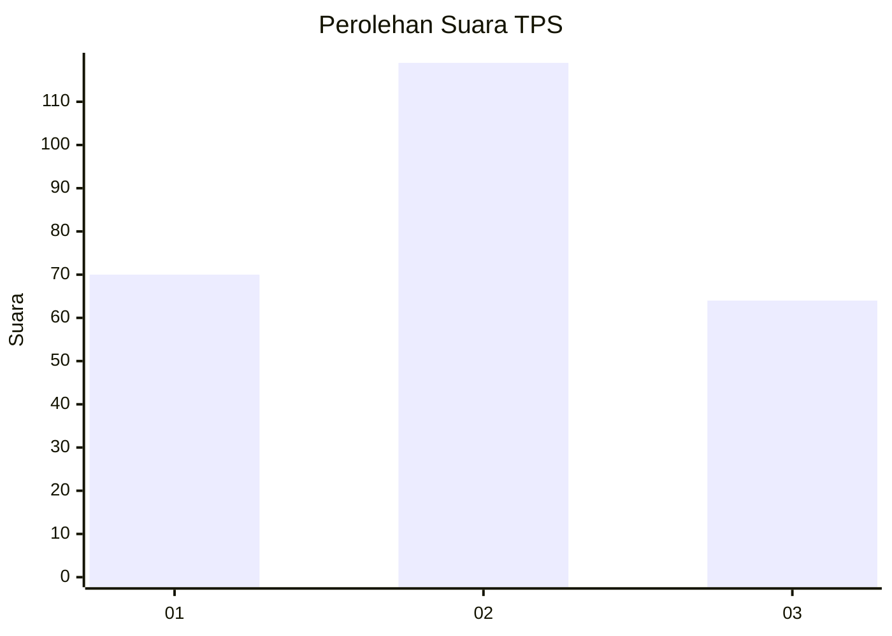
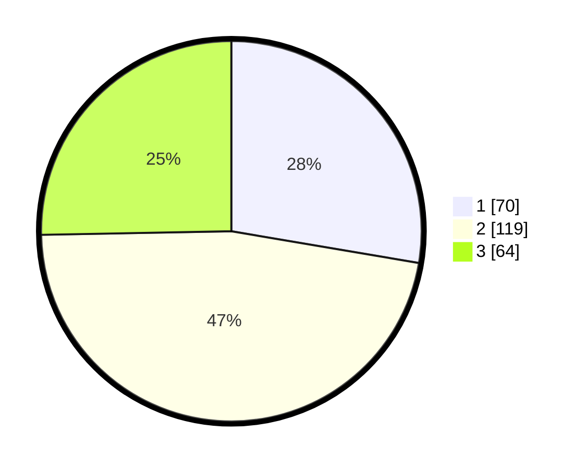

# Hasil

## Grafik

## Tabel

| No. | Nama Paslon    | Suara | Suara (raw) | Persentase |
|:--- |:-------------- | -----:| -----------:| ----------:|
| 1   | ANIES MUHAIMIN | 70    | [70][p-1]   | 27,67      |
| 2   | PRABOWO GIBRAN | 119   | [119][p-2]  | 47,04      |
| 3   | GANJAR MAHFUD  | 64    | [64][p-3]   | 25,30      |

[p-1]: https://github.com/gigit-pemilu/pemilu-2024-34-di-yogyakarta/blob/main/pilpres/hitung-suara/sub/34-di-yogyakarta/sub/04-sleman/sub/10-kalasan/sub/2003-tamanmartani/sub/045-tps/sub/paslon-1.txt
[p-2]: https://github.com/gigit-pemilu/pemilu-2024-34-di-yogyakarta/blob/main/pilpres/hitung-suara/sub/34-di-yogyakarta/sub/04-sleman/sub/10-kalasan/sub/2003-tamanmartani/sub/045-tps/sub/paslon-2.txt
[p-3]: https://github.com/gigit-pemilu/pemilu-2024-34-di-yogyakarta/blob/main/pilpres/hitung-suara/sub/34-di-yogyakarta/sub/04-sleman/sub/10-kalasan/sub/2003-tamanmartani/sub/045-tps/sub/paslon-3.txt

## Foto C Plano

https://sirekap-obj-formc.kpu.go.id/6e00/pemilu/ppwp/34/04/10/20/03/3404102003045-20240214-225420--bbad9e0f-d719-41b8-a784-85821f0bd126.jpg

https://sirekap-obj-formc.kpu.go.id/6e00/pemilu/ppwp/34/04/10/20/03/3404102003045-20240214-225543--104db856-0331-4562-aada-f00fa21d5064.jpg

https://sirekap-obj-formc.kpu.go.id/6e00/pemilu/ppwp/34/04/10/20/03/3404102003045-20240214-225956--183585bf-260b-496f-a8d2-efe37d54551b.jpg

## Metadata

| Key        | Value               |
| ---------- | ------------------- |
| Time Stamp | 2024-02-15 09:00:24 |

