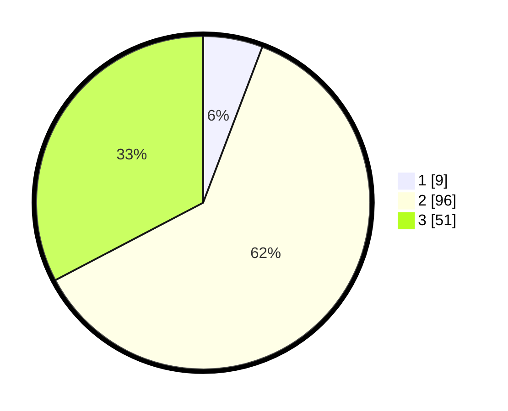

# Hasil

## Grafik

## Tabel

| No. | Nama Paslon    | Suara | Suara (raw) | Persentase |
|:--- |:-------------- | -----:| -----------:| ----------:|
| 1   | ANIES MUHAIMIN | 9     | [9][p-1]    | 5,77       |
| 2   | PRABOWO GIBRAN | 96    | [96][p-2]   | 61,54      |
| 3   | GANJAR MAHFUD  | 51    | [51][p-3]   | 32,69      |

[p-1]: https://github.com/gigit-pemilu/pemilu-2024-34-di-yogyakarta/blob/main/pilpres/hitung-suara/sub/34-di-yogyakarta/sub/04-sleman/sub/10-kalasan/sub/2004-selomartani/sub/004-tps/sub/paslon-1.txt
[p-2]: https://github.com/gigit-pemilu/pemilu-2024-34-di-yogyakarta/blob/main/pilpres/hitung-suara/sub/34-di-yogyakarta/sub/04-sleman/sub/10-kalasan/sub/2004-selomartani/sub/004-tps/sub/paslon-2.txt
[p-3]: https://github.com/gigit-pemilu/pemilu-2024-34-di-yogyakarta/blob/main/pilpres/hitung-suara/sub/34-di-yogyakarta/sub/04-sleman/sub/10-kalasan/sub/2004-selomartani/sub/004-tps/sub/paslon-3.txt

## Foto C Plano

https://sirekap-obj-formc.kpu.go.id/87a6/pemilu/ppwp/34/04/10/20/04/3404102004004-20240216-180302--bb8caf80-b54f-40c4-b9d1-21723a6c2db3.jpg

https://sirekap-obj-formc.kpu.go.id/87a6/pemilu/ppwp/34/04/10/20/04/3404102004004-20240216-180704--06d4e461-2e64-481b-8e3e-2c2cccf6a006.jpg

https://sirekap-obj-formc.kpu.go.id/87a6/pemilu/ppwp/34/04/10/20/04/3404102004004-20240216-180819--d06423ff-6ba2-4764-8144-4cd4d5aadee3.jpg

## Metadata

| Key        | Value               |
| ---------- | ------------------- |
| Time Stamp | 2024-02-16 21:01:00 |

