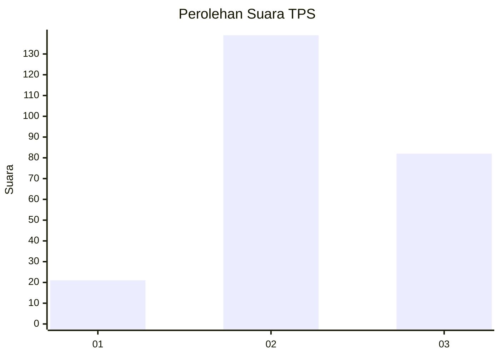
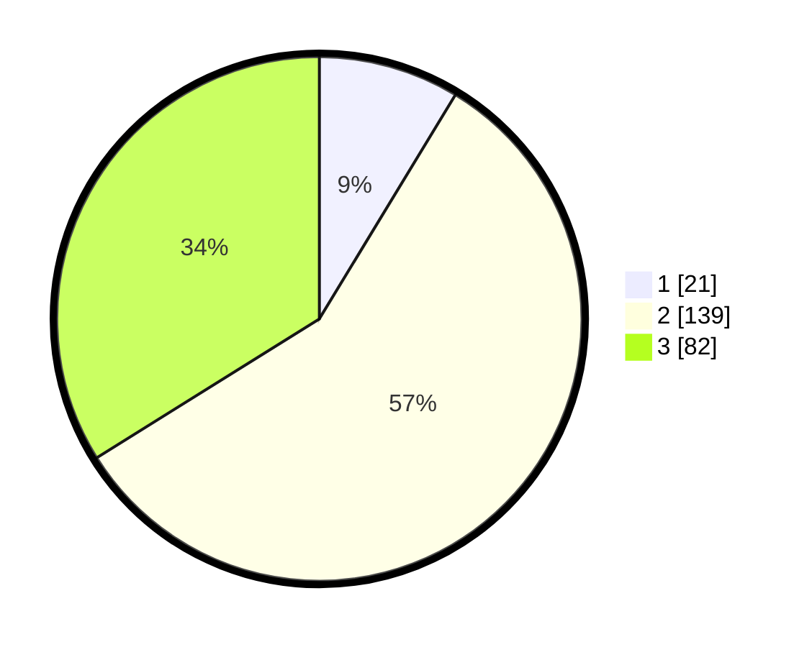

# Hasil

## Grafik

## Tabel

| No. | Nama Paslon    | Suara | Suara (raw) | Persentase |
|:--- |:-------------- | -----:| -----------:| ----------:|
| 1   | ANIES MUHAIMIN | 21    | [21][p-1]   | 8,68       |
| 2   | PRABOWO GIBRAN | 139   | [139][p-2]  | 57,44      |
| 3   | GANJAR MAHFUD  | 82    | [82][p-3]   | 33,88      |

[p-1]: https://github.com/gigit-pemilu/pemilu-2024-34-di-yogyakarta/blob/main/pilpres/hitung-suara/sub/34-di-yogyakarta/sub/04-sleman/sub/10-kalasan/sub/2004-selomartani/sub/005-tps/sub/paslon-1.txt
[p-2]: https://github.com/gigit-pemilu/pemilu-2024-34-di-yogyakarta/blob/main/pilpres/hitung-suara/sub/34-di-yogyakarta/sub/04-sleman/sub/10-kalasan/sub/2004-selomartani/sub/005-tps/sub/paslon-2.txt
[p-3]: https://github.com/gigit-pemilu/pemilu-2024-34-di-yogyakarta/blob/main/pilpres/hitung-suara/sub/34-di-yogyakarta/sub/04-sleman/sub/10-kalasan/sub/2004-selomartani/sub/005-tps/sub/paslon-3.txt

## Foto C Plano

https://sirekap-obj-formc.kpu.go.id/1d67/pemilu/ppwp/34/04/10/20/04/3404102004005-20240215-094921--e4881bde-f9ff-47b3-8614-5cbd8e207d29.jpg

https://sirekap-obj-formc.kpu.go.id/1d67/pemilu/ppwp/34/04/10/20/04/3404102004005-20240215-095007--98eeace2-ebc7-4bda-9304-54965b1997eb.jpg

https://sirekap-obj-formc.kpu.go.id/1d67/pemilu/ppwp/34/04/10/20/04/3404102004005-20240215-095110--7efec5fb-8e94-47fe-a5a2-6a2f913da49f.jpg

## Metadata

| Key        | Value               |
| ---------- | ------------------- |
| Time Stamp | 2024-02-15 18:30:25 |

