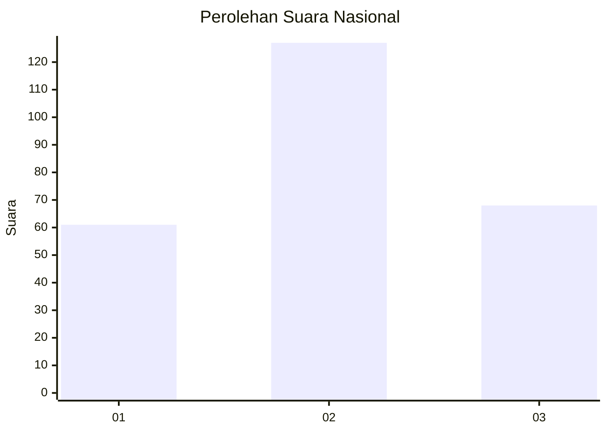
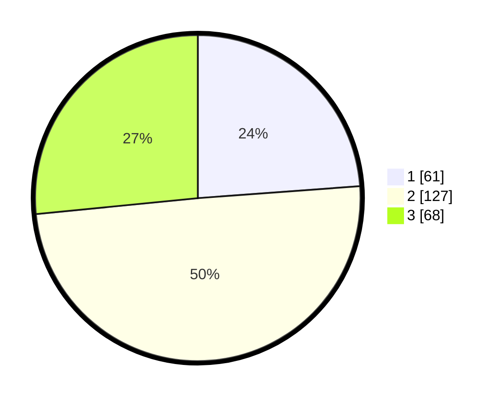

# Hasil

## Grafik

## Tabel

| No. | Nama Paslon    | Suara | Suara (raw) | Persentase |
|:--- |:-------------- | -----:| -----------:| ----------:|
| 1   | ANIES MUHAIMIN | 61    | [61][p-1]   | 23,83      |
| 2   | PRABOWO GIBRAN | 127   | [127][p-2]  | 49,61      |
| 3   | GANJAR MAHFUD  | 68    | [68][p-3]   | 26,56      |

[p-1]: https://github.com/gigit-pemilu/pemilu-2024/blob/main/pilpres/hitung-suara/sub/34-di-yogyakarta/sub/04-sleman/sub/10-kalasan/sub/2004-selomartani/sub/008-tps/sub/paslon-1.txt
[p-2]: https://github.com/gigit-pemilu/pemilu-2024/blob/main/pilpres/hitung-suara/sub/34-di-yogyakarta/sub/04-sleman/sub/10-kalasan/sub/2004-selomartani/sub/008-tps/sub/paslon-2.txt
[p-3]: https://github.com/gigit-pemilu/pemilu-2024/blob/main/pilpres/hitung-suara/sub/34-di-yogyakarta/sub/04-sleman/sub/10-kalasan/sub/2004-selomartani/sub/008-tps/sub/paslon-3.txt

## Foto C Plano

https://sirekap-obj-formc.kpu.go.id/4893/pemilu/ppwp/34/04/10/20/04/3404102004008-20240216-115201--80d311d1-79be-4bc5-ac7f-724165978f92.jpg

https://sirekap-obj-formc.kpu.go.id/4893/pemilu/ppwp/34/04/10/20/04/3404102004008-20240216-115226--247f03f6-f96a-41ef-9e77-9e17293989f8.jpg

https://sirekap-obj-formc.kpu.go.id/4893/pemilu/ppwp/34/04/10/20/04/3404102004008-20240216-115241--1e08edc4-0d12-4a50-baa5-735b8df9df2e.jpg

## Metadata

| Key        | Value               |
| ---------- | ------------------- |
| Time Stamp | 2024-02-16 22:01:00 |

