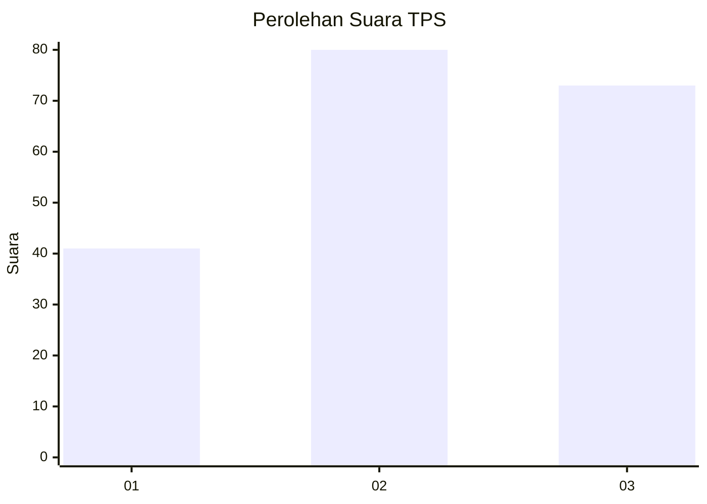
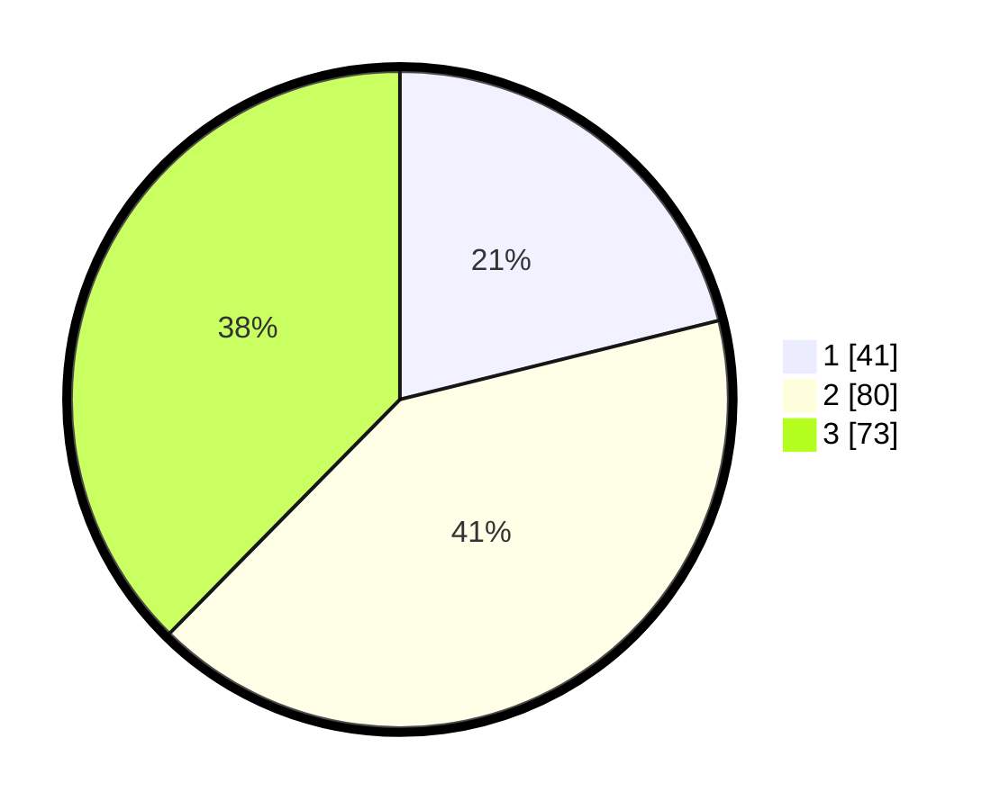

# Hasil

## Grafik

## Tabel

| No. | Nama Paslon    | Suara | Suara (raw) | Persentase |
|:--- |:-------------- | -----:| -----------:| ----------:|
| 1   | ANIES MUHAIMIN | 41    | [41][p-1]   | 21,13      |
| 2   | PRABOWO GIBRAN | 80    | [80][p-2]   | 41,24      |
| 3   | GANJAR MAHFUD  | 73    | [73][p-3]   | 37,63      |

[p-1]: https://github.com/gigit-pemilu/pemilu-2024-34-di-yogyakarta/blob/main/pilpres/hitung-suara/sub/34-di-yogyakarta/sub/04-sleman/sub/10-kalasan/sub/2004-selomartani/sub/014-tps/sub/paslon-1.txt
[p-2]: https://github.com/gigit-pemilu/pemilu-2024-34-di-yogyakarta/blob/main/pilpres/hitung-suara/sub/34-di-yogyakarta/sub/04-sleman/sub/10-kalasan/sub/2004-selomartani/sub/014-tps/sub/paslon-2.txt
[p-3]: https://github.com/gigit-pemilu/pemilu-2024-34-di-yogyakarta/blob/main/pilpres/hitung-suara/sub/34-di-yogyakarta/sub/04-sleman/sub/10-kalasan/sub/2004-selomartani/sub/014-tps/sub/paslon-3.txt

## Foto C Plano

https://sirekap-obj-formc.kpu.go.id/d8b5/pemilu/ppwp/34/04/10/20/04/3404102004014-20240215-065110--aaeb1aae-e825-41c6-9ffd-ed8c3cf9fe8a.jpg

https://sirekap-obj-formc.kpu.go.id/d8b5/pemilu/ppwp/34/04/10/20/04/3404102004014-20240215-065314--14faccf0-590f-40a8-93ab-020d8d97e3a3.jpg

https://sirekap-obj-formc.kpu.go.id/d8b5/pemilu/ppwp/34/04/10/20/04/3404102004014-20240215-065635--6d06ba6e-aaba-4dd3-92b3-853a34d8f125.jpg

## Metadata

| Key        | Value               |
| ---------- | ------------------- |
| Time Stamp | 2024-02-16 22:01:00 |

