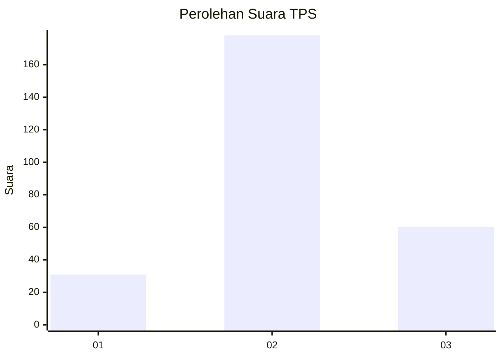
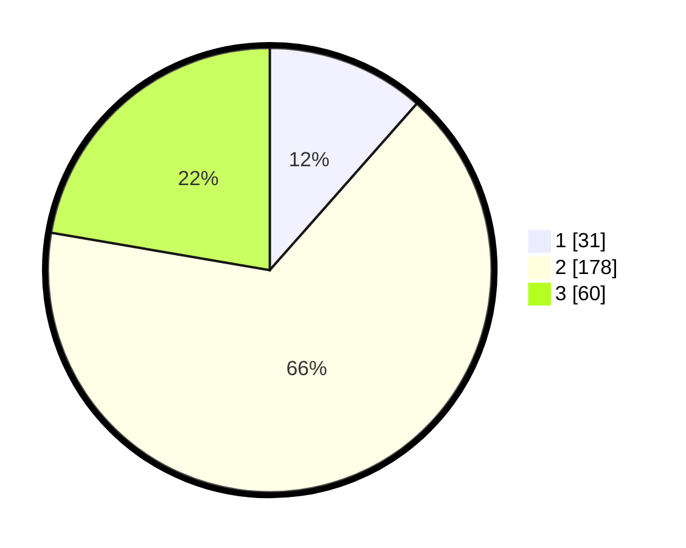

# Hasil

## Grafik

## Tabel

| No. | Nama Paslon    | Suara | Suara (raw) | Persentase |
|:--- |:-------------- | -----:| -----------:| ----------:|
| 1   | ANIES MUHAIMIN | 31    | [31][p-1]   | 11,52      |
| 2   | PRABOWO GIBRAN | 178   | [178][p-2]  | 66,17      |
| 3   | GANJAR MAHFUD  | 60    | [60][p-3]   | 22,30      |

[p-1]: https://github.com/gigit-pemilu/pemilu-2024-34-di-yogyakarta/blob/main/pilpres/hitung-suara/sub/34-di-yogyakarta/sub/04-sleman/sub/10-kalasan/sub/2004-selomartani/sub/019-tps/sub/paslon-1.txt
[p-2]: https://github.com/gigit-pemilu/pemilu-2024-34-di-yogyakarta/blob/main/pilpres/hitung-suara/sub/34-di-yogyakarta/sub/04-sleman/sub/10-kalasan/sub/2004-selomartani/sub/019-tps/sub/paslon-2.txt
[p-3]: https://github.com/gigit-pemilu/pemilu-2024-34-di-yogyakarta/blob/main/pilpres/hitung-suara/sub/34-di-yogyakarta/sub/04-sleman/sub/10-kalasan/sub/2004-selomartani/sub/019-tps/sub/paslon-3.txt

## Foto C Plano

https://sirekap-obj-formc.kpu.go.id/d7b5/pemilu/ppwp/34/04/10/20/04/3404102004019-20240216-032332--9dbdfda6-7258-4730-90bf-cc1ba1990fa5.jpg

https://sirekap-obj-formc.kpu.go.id/d7b5/pemilu/ppwp/34/04/10/20/04/3404102004019-20240216-032341--1379f467-0ff8-4f49-9753-d92872cd352c.jpg

https://sirekap-obj-formc.kpu.go.id/d7b5/pemilu/ppwp/34/04/10/20/04/3404102004019-20240216-032338--f3e5f8c5-4011-4825-8928-3148555c8b05.jpg

## Metadata

| Key        | Value               |
| ---------- | ------------------- |
| Time Stamp | 2024-02-16 10:00:28 |

## DATA PEMILIH TETAP

Jumlah pemilih dalam DPT: **284**.
 * L: **141**.
 * P: **143**.

## DATA PENGGUNA HAK PILIH

Jumlah pengguna hak pilih dalam DPT: **265**.
 * L: **128**.
 * P: **137**.

Jumlah pengguna hak pilih dalam DPTb: **4**.
 * L: **0**.
 * P: **4**.

Jumlah pengguna hak pilih dalam DPK: **9**.
 * L: **2**.
 * P: **7**.

Jumlah pengguna hak pilih: **278**.
 * L: **130**.
 * P: **148**.

## JUMLAH SUARA SAH DAN TIDAK SAH

JUMLAH SELURUH SUARA SAH: **269**.

JUMLAH SUARA TIDAK SAH: **9**.

JUMLAH SELURUH SUARA SAH DAN SUARA TIDAK SAH: **278**.

