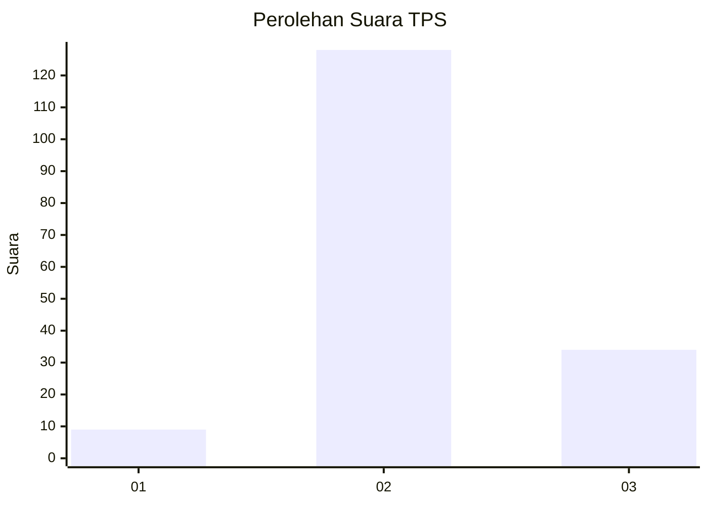

# Hasil

## Grafik

## Tabel

| No. | Nama Paslon    | Suara | Suara (raw) | Persentase |
|:--- |:-------------- | -----:| -----------:| ----------:|
| 1   | ANIES MUHAIMIN | 9     | [9][p-1]    | 5,26       |
| 2   | PRABOWO GIBRAN | 128   | [128][p-2]  | 74,85      |
| 3   | GANJAR MAHFUD  | 34    | [34][p-3]   | 19,88      |

[p-1]: https://github.com/gigit-pemilu/pemilu-2024-34-di-yogyakarta/blob/main/pilpres/hitung-suara/sub/34-di-yogyakarta/sub/04-sleman/sub/10-kalasan/sub/2004-selomartani/sub/024-tps/sub/paslon-1.txt
[p-2]: https://github.com/gigit-pemilu/pemilu-2024-34-di-yogyakarta/blob/main/pilpres/hitung-suara/sub/34-di-yogyakarta/sub/04-sleman/sub/10-kalasan/sub/2004-selomartani/sub/024-tps/sub/paslon-2.txt
[p-3]: https://github.com/gigit-pemilu/pemilu-2024-34-di-yogyakarta/blob/main/pilpres/hitung-suara/sub/34-di-yogyakarta/sub/04-sleman/sub/10-kalasan/sub/2004-selomartani/sub/024-tps/sub/paslon-3.txt

## Foto C Plano

https://sirekap-obj-formc.kpu.go.id/5d52/pemilu/ppwp/34/04/10/20/04/3404102004024-20240214-225808--f8f0050c-f49a-443f-ba3d-059881521f6d.jpg

https://sirekap-obj-formc.kpu.go.id/5d52/pemilu/ppwp/34/04/10/20/04/3404102004024-20240214-230015--d9209ac2-24ed-47c1-adfa-aa4430ab04fb.jpg

https://sirekap-obj-formc.kpu.go.id/5d52/pemilu/ppwp/34/04/10/20/04/3404102004024-20240214-230224--df9692c6-778b-471b-8c32-d552d2598877.jpg

## Metadata

| Key        | Value               |
| ---------- | ------------------- |
| Time Stamp | 2024-02-15 19:30:26 |

