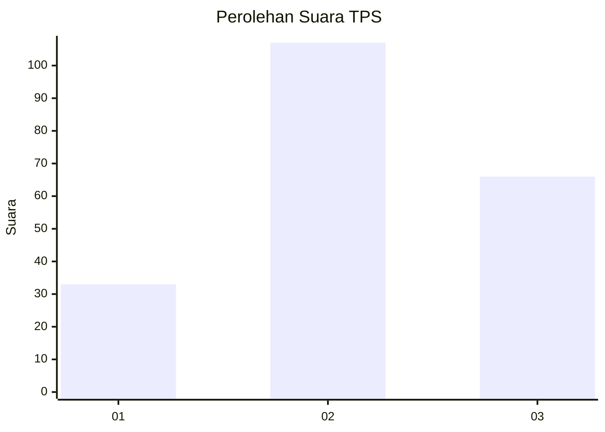
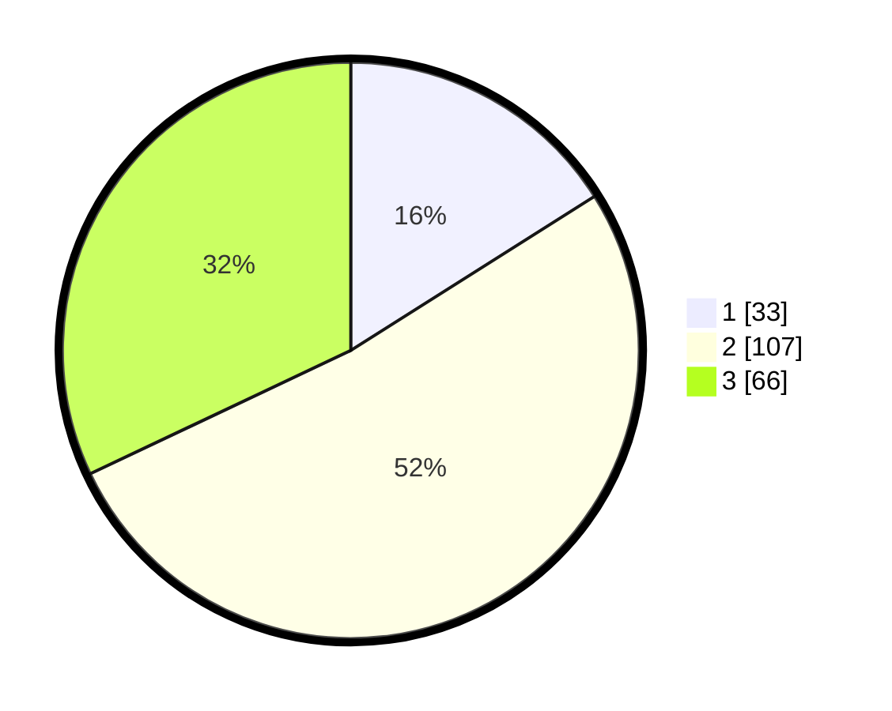

# Hasil

## Grafik

## Tabel

| No. | Nama Paslon    | Suara | Suara (raw) | Persentase |
|:--- |:-------------- | -----:| -----------:| ----------:|
| 1   | ANIES MUHAIMIN | 33    | [33][p-1]   | 16,02      |
| 2   | PRABOWO GIBRAN | 107   | [107][p-2]  | 51,94      |
| 3   | GANJAR MAHFUD  | 66    | [66][p-3]   | 32,04      |

[p-1]: https://github.com/gigit-pemilu/pemilu-2024-34-di-yogyakarta/blob/main/pilpres/hitung-suara/sub/34-di-yogyakarta/sub/04-sleman/sub/10-kalasan/sub/2004-selomartani/sub/025-tps/sub/paslon-1.txt
[p-2]: https://github.com/gigit-pemilu/pemilu-2024-34-di-yogyakarta/blob/main/pilpres/hitung-suara/sub/34-di-yogyakarta/sub/04-sleman/sub/10-kalasan/sub/2004-selomartani/sub/025-tps/sub/paslon-2.txt
[p-3]: https://github.com/gigit-pemilu/pemilu-2024-34-di-yogyakarta/blob/main/pilpres/hitung-suara/sub/34-di-yogyakarta/sub/04-sleman/sub/10-kalasan/sub/2004-selomartani/sub/025-tps/sub/paslon-3.txt

## Foto C Plano

https://sirekap-obj-formc.kpu.go.id/26ca/pemilu/ppwp/34/04/10/20/04/3404102004025-20240214-141500--eeeca7db-82ac-4fcd-8639-95be614621e4.jpg

https://sirekap-obj-formc.kpu.go.id/26ca/pemilu/ppwp/34/04/10/20/04/3404102004025-20240214-141748--9a54e032-36cd-4884-9a16-707e8344fc2c.jpg

https://sirekap-obj-formc.kpu.go.id/26ca/pemilu/ppwp/34/04/10/20/04/3404102004025-20240214-141931--11899ef1-f653-4a5b-8d78-fbd505553df4.jpg

## Metadata

| Key        | Value               |
| ---------- | ------------------- |
| Time Stamp | 2024-02-15 19:30:26 |

