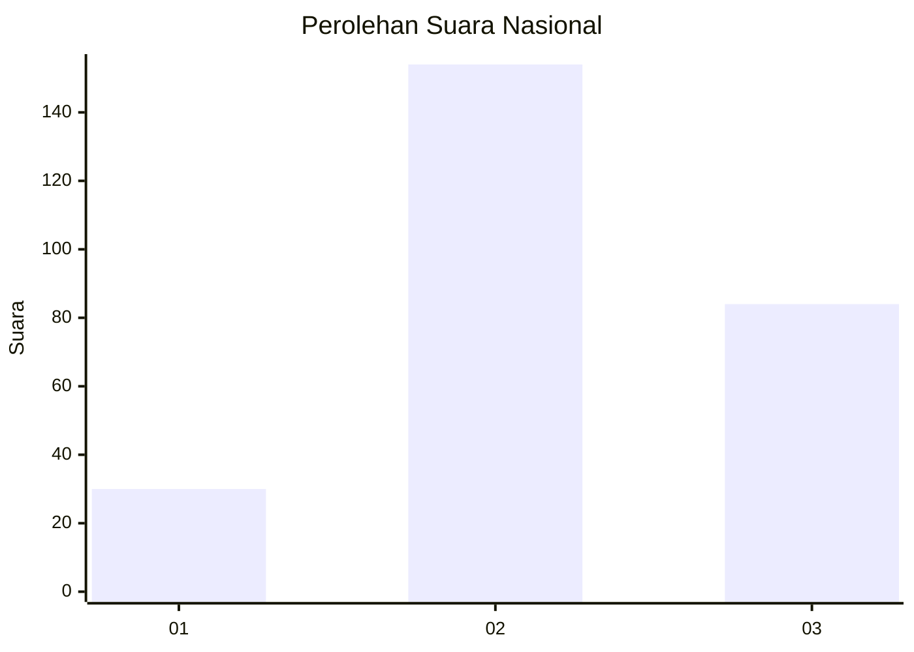
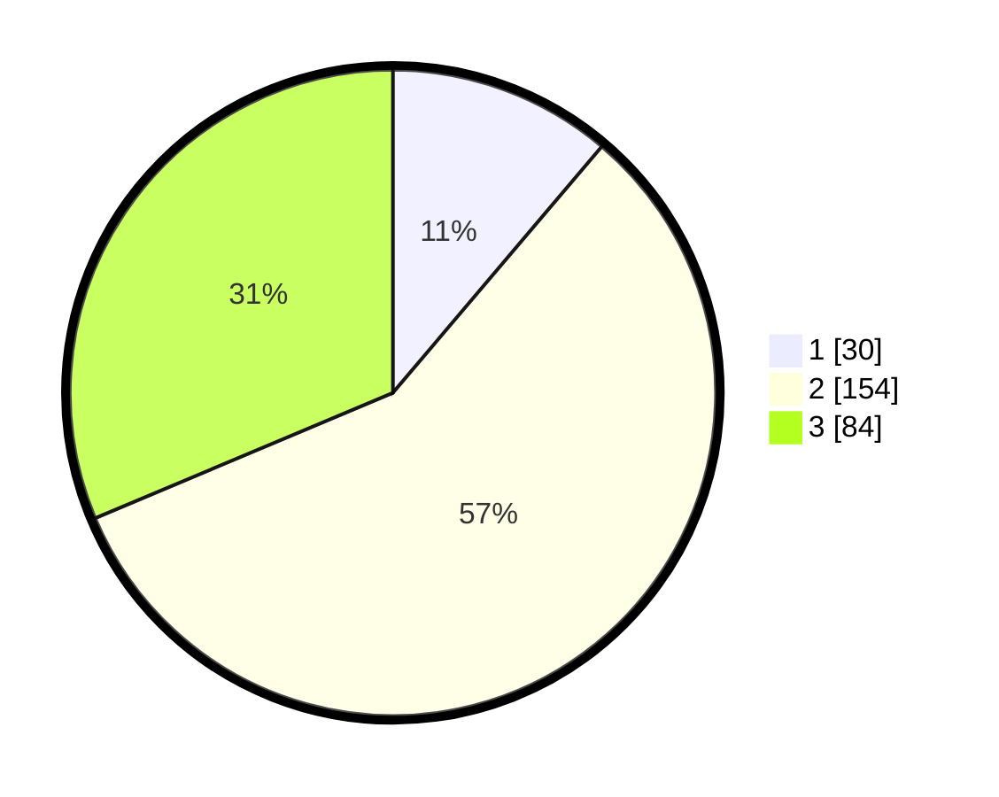

# Hasil

## Grafik

## Tabel

| No. | Nama Paslon    | Suara | Suara (raw) | Persentase |
|:--- |:-------------- | -----:| -----------:| ----------:|
| 1   | ANIES MUHAIMIN | 30    | [30][p-1]   | 11,19      |
| 2   | PRABOWO GIBRAN | 154   | [154][p-2]  | 57,46      |
| 3   | GANJAR MAHFUD  | 84    | [84][p-3]   | 31,34      |

[p-1]: https://github.com/gigit-pemilu/pemilu-2024/blob/main/pilpres/hitung-suara/sub/34-di-yogyakarta/sub/04-sleman/sub/10-kalasan/sub/2004-selomartani/sub/026-tps/sub/paslon-1.txt
[p-2]: https://github.com/gigit-pemilu/pemilu-2024/blob/main/pilpres/hitung-suara/sub/34-di-yogyakarta/sub/04-sleman/sub/10-kalasan/sub/2004-selomartani/sub/026-tps/sub/paslon-2.txt
[p-3]: https://github.com/gigit-pemilu/pemilu-2024/blob/main/pilpres/hitung-suara/sub/34-di-yogyakarta/sub/04-sleman/sub/10-kalasan/sub/2004-selomartani/sub/026-tps/sub/paslon-3.txt

## Foto C Plano

https://sirekap-obj-formc.kpu.go.id/7353/pemilu/ppwp/34/04/10/20/04/3404102004026-20240214-204350--5252da8e-c904-46de-bfe4-f44030dca355.jpg

https://sirekap-obj-formc.kpu.go.id/7353/pemilu/ppwp/34/04/10/20/04/3404102004026-20240214-204441--8671a83a-1817-4f90-8e1f-9e5ac3d81e4e.jpg

https://sirekap-obj-formc.kpu.go.id/7353/pemilu/ppwp/34/04/10/20/04/3404102004026-20240214-204527--5aa22f40-43cf-400f-a5b8-602be758a04d.jpg

## Metadata

| Key        | Value               |
| ---------- | ------------------- |
| Time Stamp | 2024-02-15 19:30:26 |

