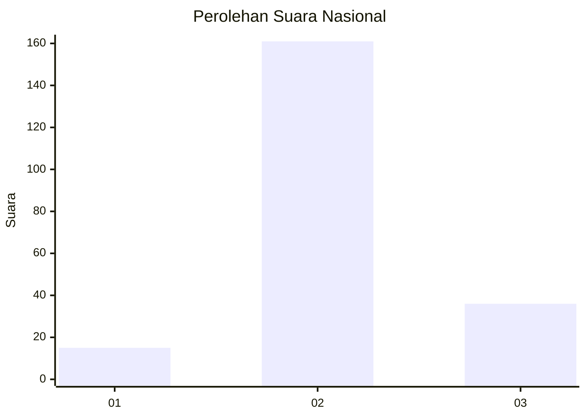

# Hasil

## Grafik

## Tabel

| No. | Nama Paslon    | Suara | Suara (raw) | Persentase |
|:--- |:-------------- | -----:| -----------:| ----------:|
| 1   | ANIES MUHAIMIN | 15    | [15][p-1]   | 7,08       |
| 2   | PRABOWO GIBRAN | 161   | [161][p-2]  | 75,94      |
| 3   | GANJAR MAHFUD  | 36    | [36][p-3]   | 16,98      |

[p-1]: https://github.com/gigit-pemilu/pemilu-2024/blob/main/pilpres/hitung-suara/sub/34-di-yogyakarta/sub/04-sleman/sub/10-kalasan/sub/2004-selomartani/sub/033-tps/sub/paslon-1.txt
[p-2]: https://github.com/gigit-pemilu/pemilu-2024/blob/main/pilpres/hitung-suara/sub/34-di-yogyakarta/sub/04-sleman/sub/10-kalasan/sub/2004-selomartani/sub/033-tps/sub/paslon-2.txt
[p-3]: https://github.com/gigit-pemilu/pemilu-2024/blob/main/pilpres/hitung-suara/sub/34-di-yogyakarta/sub/04-sleman/sub/10-kalasan/sub/2004-selomartani/sub/033-tps/sub/paslon-3.txt

## Foto C Plano

https://sirekap-obj-formc.kpu.go.id/be92/pemilu/ppwp/34/04/10/20/04/3404102004033-20240214-201046--e450cb8c-08ee-487b-9fce-580356e02f97.jpg

https://sirekap-obj-formc.kpu.go.id/be92/pemilu/ppwp/34/04/10/20/04/3404102004033-20240214-201054--035686aa-bb22-4460-b02d-7f4a9d6ccc63.jpg

https://sirekap-obj-formc.kpu.go.id/be92/pemilu/ppwp/34/04/10/20/04/3404102004033-20240214-201104--acaf7e1b-408b-4a36-84b4-2e2db4f24022.jpg

## Metadata

| Key        | Value               |
| ---------- | ------------------- |
| Time Stamp | 2024-02-15 19:30:26 |

