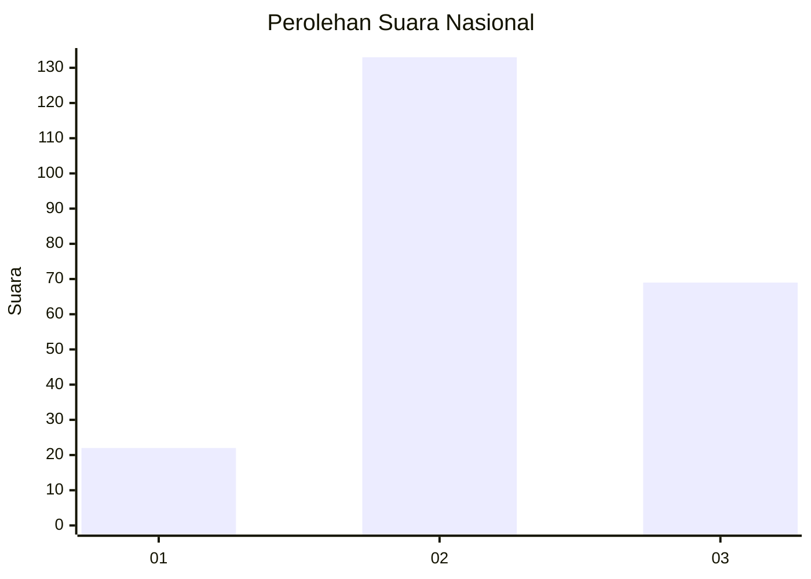
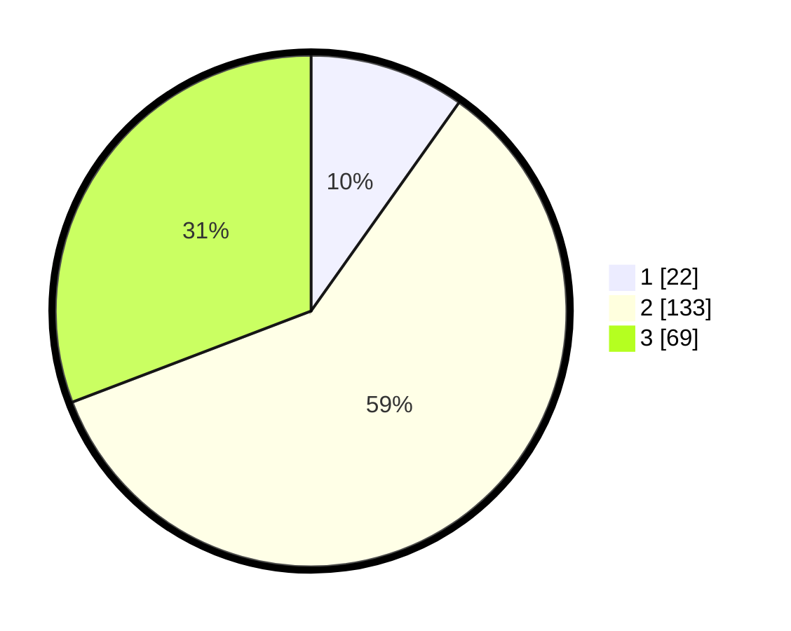

# Hasil

## Grafik

## Tabel

| No. | Nama Paslon    | Suara | Suara (raw) | Persentase |
|:--- |:-------------- | -----:| -----------:| ----------:|
| 1   | ANIES MUHAIMIN | 22    | [22][p-1]   | 9,82       |
| 2   | PRABOWO GIBRAN | 133   | [133][p-2]  | 59,38      |
| 3   | GANJAR MAHFUD  | 69    | [69][p-3]   | 30,80      |

[p-1]: https://github.com/gigit-pemilu/pemilu-2024/blob/main/pilpres/hitung-suara/sub/34-di-yogyakarta/sub/04-sleman/sub/10-kalasan/sub/2004-selomartani/sub/034-tps/sub/paslon-1.txt
[p-2]: https://github.com/gigit-pemilu/pemilu-2024/blob/main/pilpres/hitung-suara/sub/34-di-yogyakarta/sub/04-sleman/sub/10-kalasan/sub/2004-selomartani/sub/034-tps/sub/paslon-2.txt
[p-3]: https://github.com/gigit-pemilu/pemilu-2024/blob/main/pilpres/hitung-suara/sub/34-di-yogyakarta/sub/04-sleman/sub/10-kalasan/sub/2004-selomartani/sub/034-tps/sub/paslon-3.txt

## Foto C Plano

https://sirekap-obj-formc.kpu.go.id/78c8/pemilu/ppwp/34/04/10/20/04/3404102004034-20240215-003010--2c047d37-72e5-4d07-8b94-87cfc9fc1681.jpg

https://sirekap-obj-formc.kpu.go.id/78c8/pemilu/ppwp/34/04/10/20/04/3404102004034-20240215-003016--ddedab3f-f45f-4c9f-8b3c-942c81566fbb.jpg

https://sirekap-obj-formc.kpu.go.id/78c8/pemilu/ppwp/34/04/10/20/04/3404102004034-20240215-003020--78252d04-5c73-4239-bab4-b8e117071e73.jpg

## Metadata

| Key        | Value               |
| ---------- | ------------------- |
| Time Stamp | 2024-02-16 22:01:00 |

