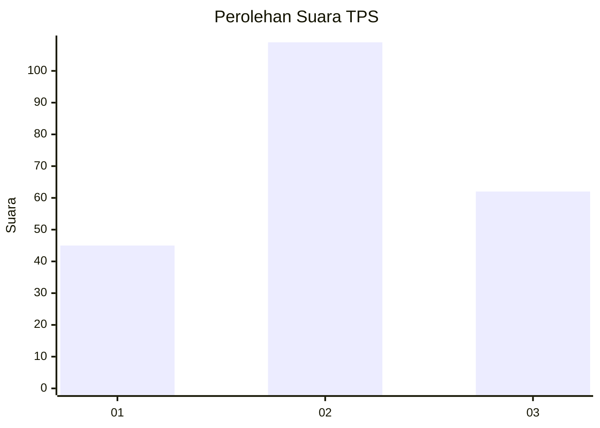
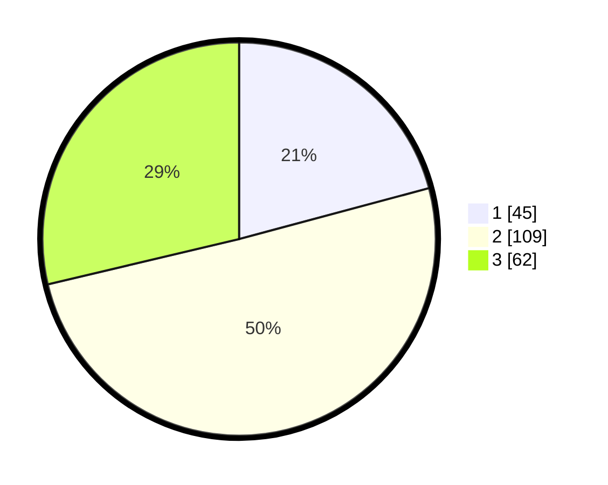

# Hasil

## Grafik

## Tabel

| No. | Nama Paslon    | Suara | Suara (raw) | Persentase |
|:--- |:-------------- | -----:| -----------:| ----------:|
| 1   | ANIES MUHAIMIN | 45    | [45][p-1]   | 20,83      |
| 2   | PRABOWO GIBRAN | 109   | [109][p-2]  | 50,46      |
| 3   | GANJAR MAHFUD  | 62    | [62][p-3]   | 28,70      |

[p-1]: https://github.com/gigit-pemilu/pemilu-2024-34-di-yogyakarta/blob/main/pilpres/hitung-suara/sub/34-di-yogyakarta/sub/04-sleman/sub/10-kalasan/sub/2004-selomartani/sub/035-tps/sub/paslon-1.txt
[p-2]: https://github.com/gigit-pemilu/pemilu-2024-34-di-yogyakarta/blob/main/pilpres/hitung-suara/sub/34-di-yogyakarta/sub/04-sleman/sub/10-kalasan/sub/2004-selomartani/sub/035-tps/sub/paslon-2.txt
[p-3]: https://github.com/gigit-pemilu/pemilu-2024-34-di-yogyakarta/blob/main/pilpres/hitung-suara/sub/34-di-yogyakarta/sub/04-sleman/sub/10-kalasan/sub/2004-selomartani/sub/035-tps/sub/paslon-3.txt

## Foto C Plano

https://sirekap-obj-formc.kpu.go.id/1836/pemilu/ppwp/34/04/10/20/04/3404102004035-20240215-001910--e9d61bbd-9cb9-4c43-811a-c270cab79c31.jpg

https://sirekap-obj-formc.kpu.go.id/1836/pemilu/ppwp/34/04/10/20/04/3404102004035-20240215-002118--cb61c672-c71c-4acc-8319-cd3a712205da.jpg

https://sirekap-obj-formc.kpu.go.id/1836/pemilu/ppwp/34/04/10/20/04/3404102004035-20240215-002344--f821d969-a1e2-429a-935c-20bedb240baa.jpg

## Metadata

| Key        | Value               |
| ---------- | ------------------- |
| Time Stamp | 2024-02-15 19:30:26 |

