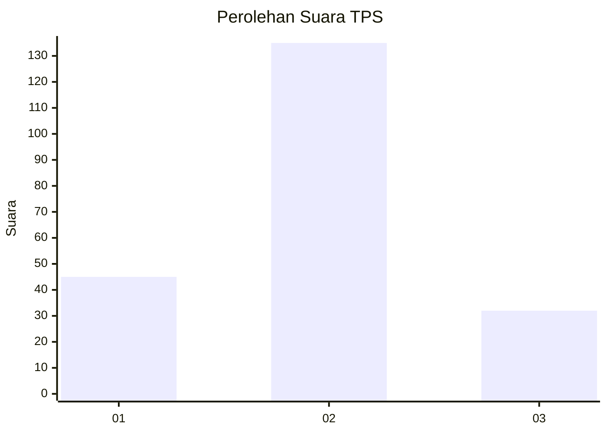
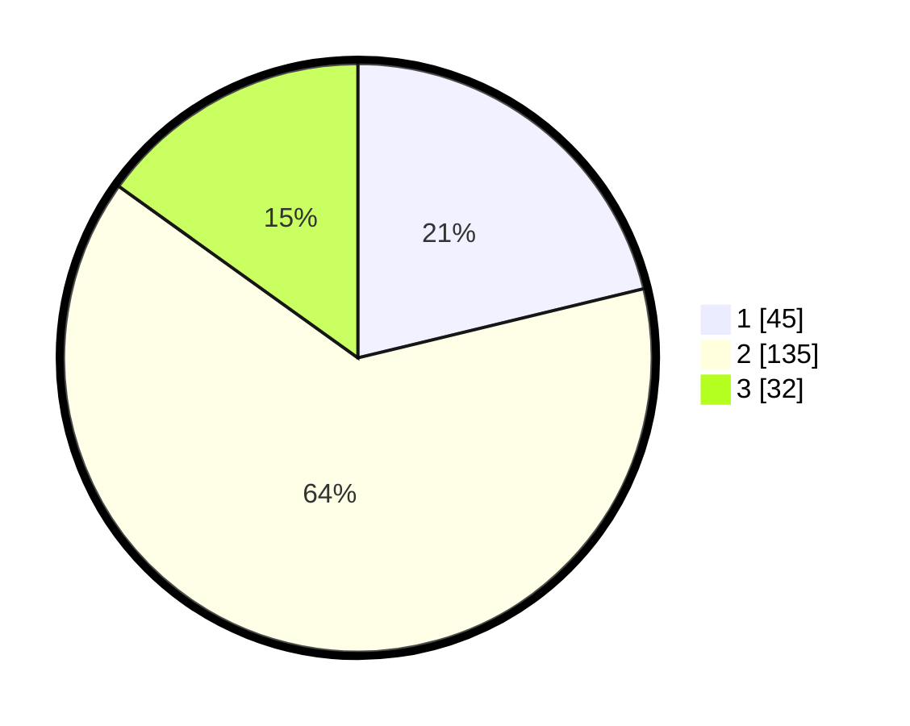

# Hasil

## Grafik

## Tabel

| No. | Nama Paslon    | Suara | Suara (raw) | Persentase |
|:--- |:-------------- | -----:| -----------:| ----------:|
| 1   | ANIES MUHAIMIN | 45    | [45][p-1]   | 21,23      |
| 2   | PRABOWO GIBRAN | 135   | [135][p-2]  | 63,68      |
| 3   | GANJAR MAHFUD  | 32    | [32][p-3]   | 15,09      |

[p-1]: https://github.com/gigit-pemilu/pemilu-2024-34-di-yogyakarta/blob/main/pilpres/hitung-suara/sub/34-di-yogyakarta/sub/04-sleman/sub/10-kalasan/sub/2004-selomartani/sub/042-tps/sub/paslon-1.txt
[p-2]: https://github.com/gigit-pemilu/pemilu-2024-34-di-yogyakarta/blob/main/pilpres/hitung-suara/sub/34-di-yogyakarta/sub/04-sleman/sub/10-kalasan/sub/2004-selomartani/sub/042-tps/sub/paslon-2.txt
[p-3]: https://github.com/gigit-pemilu/pemilu-2024-34-di-yogyakarta/blob/main/pilpres/hitung-suara/sub/34-di-yogyakarta/sub/04-sleman/sub/10-kalasan/sub/2004-selomartani/sub/042-tps/sub/paslon-3.txt

## Foto C Plano

https://sirekap-obj-formc.kpu.go.id/3b23/pemilu/ppwp/34/04/10/20/04/3404102004042-20240214-201755--4623ca0c-f34c-4600-8a5b-37209acd56ab.jpg

https://sirekap-obj-formc.kpu.go.id/3b23/pemilu/ppwp/34/04/10/20/04/3404102004042-20240214-201848--89c06bbb-acae-47cc-8680-6df1d425db19.jpg

https://sirekap-obj-formc.kpu.go.id/3b23/pemilu/ppwp/34/04/10/20/04/3404102004042-20240214-212911--91d4a479-8aff-421f-98eb-cd3ec941de8a.jpg

## Metadata

| Key        | Value               |
| ---------- | ------------------- |
| Time Stamp | 2024-02-15 15:00:29 |

