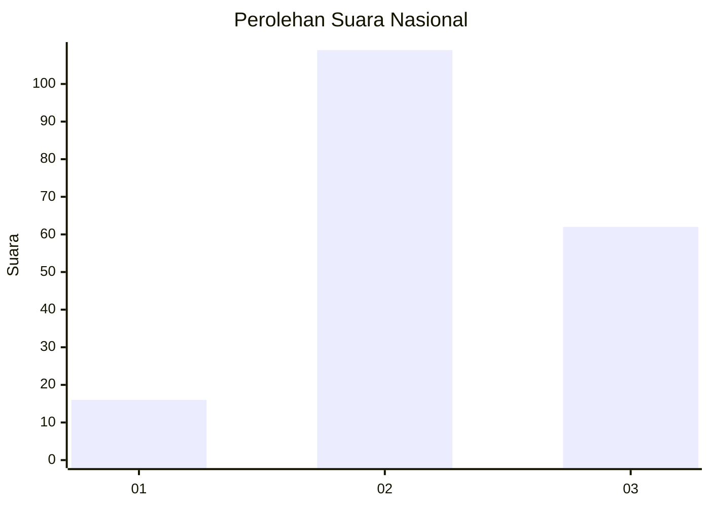
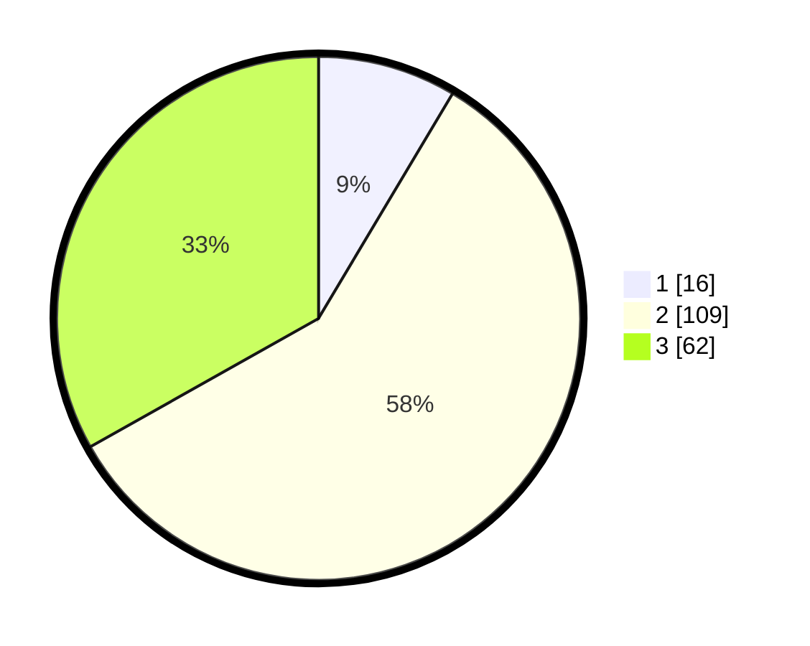

# Hasil

## Grafik

## Tabel

| No. | Nama Paslon    | Suara | Suara (raw) | Persentase |
|:--- |:-------------- | -----:| -----------:| ----------:|
| 1   | ANIES MUHAIMIN | 16    | [16][p-1]   | 8,56       |
| 2   | PRABOWO GIBRAN | 109   | [109][p-2]  | 58,29      |
| 3   | GANJAR MAHFUD  | 62    | [62][p-3]   | 33,16      |

[p-1]: https://github.com/gigit-pemilu/pemilu-2024/blob/main/pilpres/hitung-suara/sub/34-di-yogyakarta/sub/04-sleman/sub/10-kalasan/sub/2004-selomartani/sub/044-tps/sub/paslon-1.txt
[p-2]: https://github.com/gigit-pemilu/pemilu-2024/blob/main/pilpres/hitung-suara/sub/34-di-yogyakarta/sub/04-sleman/sub/10-kalasan/sub/2004-selomartani/sub/044-tps/sub/paslon-2.txt
[p-3]: https://github.com/gigit-pemilu/pemilu-2024/blob/main/pilpres/hitung-suara/sub/34-di-yogyakarta/sub/04-sleman/sub/10-kalasan/sub/2004-selomartani/sub/044-tps/sub/paslon-3.txt

## Foto C Plano

https://sirekap-obj-formc.kpu.go.id/2a39/pemilu/ppwp/34/04/10/20/04/3404102004044-20240214-233446--fb8ac322-994d-495f-89fe-29364aba31b8.jpg

https://sirekap-obj-formc.kpu.go.id/2a39/pemilu/ppwp/34/04/10/20/04/3404102004044-20240214-233630--4396a41d-59df-497c-9788-3f5027bedb70.jpg

https://sirekap-obj-formc.kpu.go.id/2a39/pemilu/ppwp/34/04/10/20/04/3404102004044-20240214-233848--afd912fa-9c47-42d0-a20a-1fc6fd63aa27.jpg

## Metadata

| Key        | Value               |
| ---------- | ------------------- |
| Time Stamp | 2024-02-15 19:30:26 |

