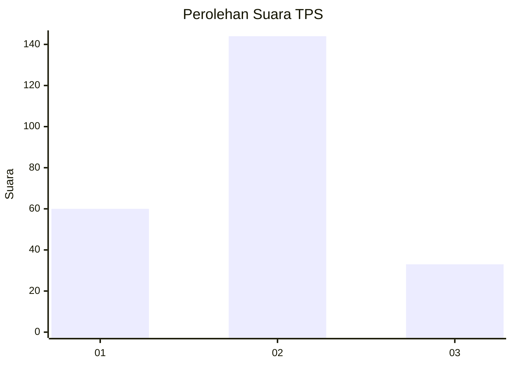
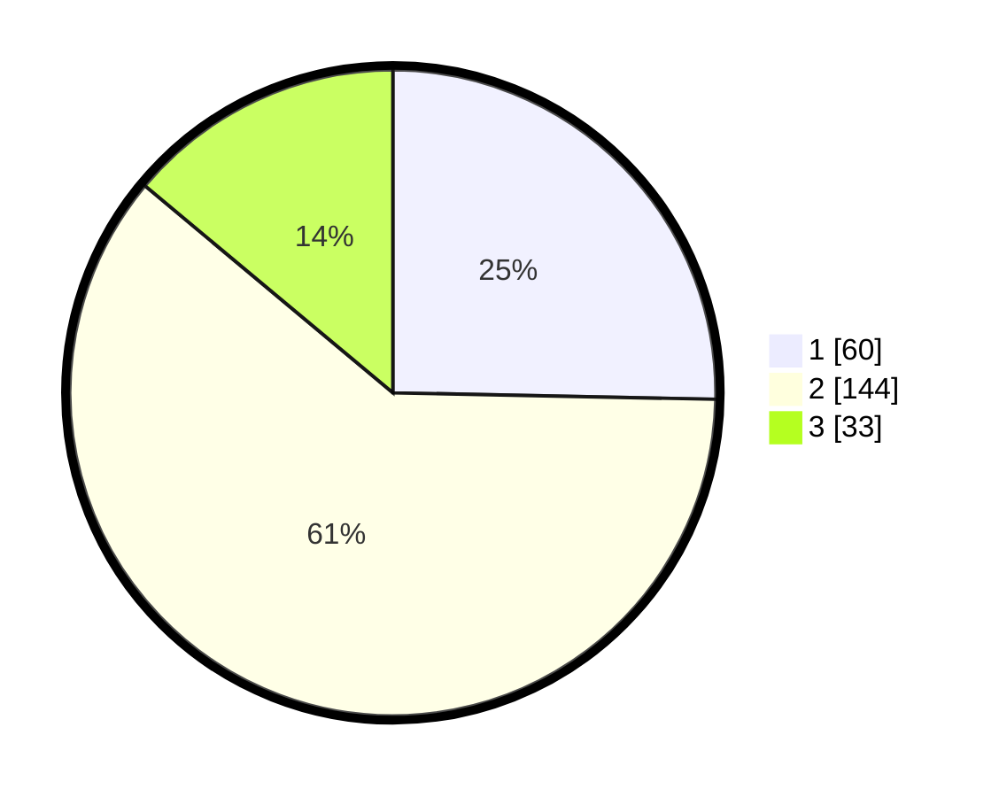

# Hasil

## Grafik

## Tabel

| No. | Nama Paslon    | Suara | Suara (raw) | Persentase |
|:--- |:-------------- | -----:| -----------:| ----------:|
| 1   | ANIES MUHAIMIN | 60    | [60][p-1]   | 25,32      |
| 2   | PRABOWO GIBRAN | 144   | [144][p-2]  | 60,76      |
| 3   | GANJAR MAHFUD  | 33    | [33][p-3]   | 13,92      |

[p-1]: https://github.com/gigit-pemilu/pemilu-2024-34-di-yogyakarta/blob/main/pilpres/hitung-suara/sub/34-di-yogyakarta/sub/04-sleman/sub/11-ngemplak/sub/2001-sindumartani/sub/001-tps/sub/paslon-1.txt
[p-2]: https://github.com/gigit-pemilu/pemilu-2024-34-di-yogyakarta/blob/main/pilpres/hitung-suara/sub/34-di-yogyakarta/sub/04-sleman/sub/11-ngemplak/sub/2001-sindumartani/sub/001-tps/sub/paslon-2.txt
[p-3]: https://github.com/gigit-pemilu/pemilu-2024-34-di-yogyakarta/blob/main/pilpres/hitung-suara/sub/34-di-yogyakarta/sub/04-sleman/sub/11-ngemplak/sub/2001-sindumartani/sub/001-tps/sub/paslon-3.txt

## Foto C Plano

https://sirekap-obj-formc.kpu.go.id/783f/pemilu/ppwp/34/04/11/20/01/3404112001001-20240216-142340--5b2f18cb-5d0f-4e54-a8ce-490d32eb40a4.jpg

https://sirekap-obj-formc.kpu.go.id/783f/pemilu/ppwp/34/04/11/20/01/3404112001001-20240216-142438--d26daa6e-7f3f-4856-8ec2-a19403a680cd.jpg

https://sirekap-obj-formc.kpu.go.id/783f/pemilu/ppwp/34/04/11/20/01/3404112001001-20240216-142525--19cc0bc1-413c-406c-922c-e01b52f7b1ea.jpg

## Metadata

| Key        | Value               |
| ---------- | ------------------- |
| Time Stamp | 2024-02-17 13:37:34 |

