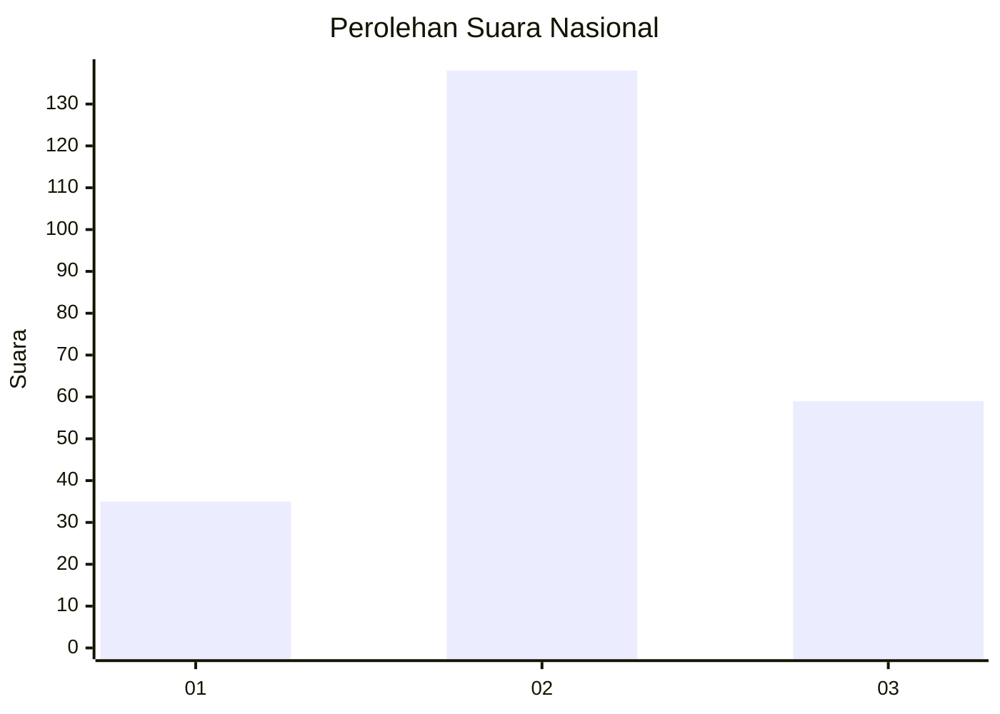
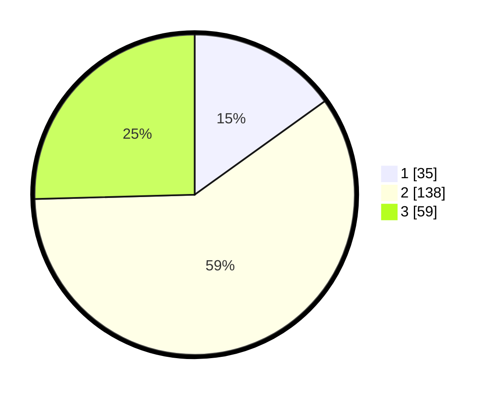

# Hasil

## Grafik

## Tabel

| No. | Nama Paslon    | Suara | Suara (raw) | Persentase |
|:--- |:-------------- | -----:| -----------:| ----------:|
| 1   | ANIES MUHAIMIN | 35    | [35][p-1]   | 15,09      |
| 2   | PRABOWO GIBRAN | 138   | [138][p-2]  | 59,48      |
| 3   | GANJAR MAHFUD  | 59    | [59][p-3]   | 25,43      |

[p-1]: https://github.com/gigit-pemilu/pemilu-2024/blob/main/pilpres/hitung-suara/sub/34-di-yogyakarta/sub/04-sleman/sub/11-ngemplak/sub/2001-sindumartani/sub/002-tps/sub/paslon-1.txt
[p-2]: https://github.com/gigit-pemilu/pemilu-2024/blob/main/pilpres/hitung-suara/sub/34-di-yogyakarta/sub/04-sleman/sub/11-ngemplak/sub/2001-sindumartani/sub/002-tps/sub/paslon-2.txt
[p-3]: https://github.com/gigit-pemilu/pemilu-2024/blob/main/pilpres/hitung-suara/sub/34-di-yogyakarta/sub/04-sleman/sub/11-ngemplak/sub/2001-sindumartani/sub/002-tps/sub/paslon-3.txt

## Foto C Plano

https://sirekap-obj-formc.kpu.go.id/29e6/pemilu/ppwp/34/04/11/20/01/3404112001002-20240214-232750--d8aafec0-24a9-4512-ab89-e9d6ee2b794f.jpg

https://sirekap-obj-formc.kpu.go.id/29e6/pemilu/ppwp/34/04/11/20/01/3404112001002-20240214-232819--96afa2a5-86ea-424c-bc7c-4973b5941da0.jpg

https://sirekap-obj-formc.kpu.go.id/29e6/pemilu/ppwp/34/04/11/20/01/3404112001002-20240214-232849--73312253-ef69-44e3-9d57-df03765d845d.jpg

## Metadata

| Key        | Value               |
| ---------- | ------------------- |
| Time Stamp | 2024-02-15 18:30:25 |

