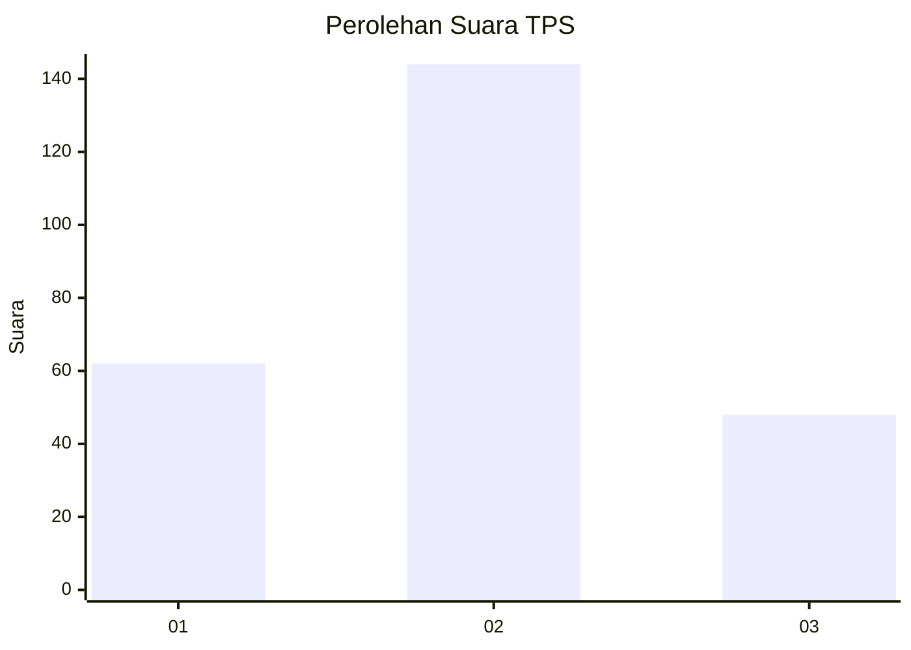
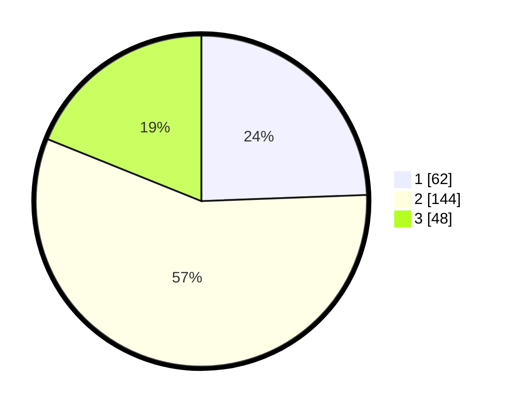

# Hasil

## Grafik

## Tabel

| No. | Nama Paslon    | Suara | Suara (raw) | Persentase |
|:--- |:-------------- | -----:| -----------:| ----------:|
| 1   | ANIES MUHAIMIN | 62    | [62][p-1]   | 24,41      |
| 2   | PRABOWO GIBRAN | 144   | [144][p-2]  | 56,69      |
| 3   | GANJAR MAHFUD  | 48    | [48][p-3]   | 18,90      |

[p-1]: https://github.com/gigit-pemilu/pemilu-2024-34-di-yogyakarta/blob/main/pilpres/hitung-suara/sub/34-di-yogyakarta/sub/04-sleman/sub/11-ngemplak/sub/2001-sindumartani/sub/004-tps/sub/paslon-1.txt
[p-2]: https://github.com/gigit-pemilu/pemilu-2024-34-di-yogyakarta/blob/main/pilpres/hitung-suara/sub/34-di-yogyakarta/sub/04-sleman/sub/11-ngemplak/sub/2001-sindumartani/sub/004-tps/sub/paslon-2.txt
[p-3]: https://github.com/gigit-pemilu/pemilu-2024-34-di-yogyakarta/blob/main/pilpres/hitung-suara/sub/34-di-yogyakarta/sub/04-sleman/sub/11-ngemplak/sub/2001-sindumartani/sub/004-tps/sub/paslon-3.txt

## Foto C Plano

https://sirekap-obj-formc.kpu.go.id/f6bd/pemilu/ppwp/34/04/11/20/01/3404112001004-20240214-155449--0651bb0c-80c5-4106-997f-99831bf9daf7.jpg

https://sirekap-obj-formc.kpu.go.id/f6bd/pemilu/ppwp/34/04/11/20/01/3404112001004-20240215-001617--67c87c06-bd1c-41fa-bc9d-a023088c36e8.jpg

https://sirekap-obj-formc.kpu.go.id/f6bd/pemilu/ppwp/34/04/11/20/01/3404112001004-20240215-001948--523685e3-fa02-4133-999c-64ae3c6b582d.jpg

## Metadata

| Key        | Value               |
| ---------- | ------------------- |
| Time Stamp | 2024-02-15 18:30:25 |

## DATA PEMILIH TETAP

Jumlah pemilih dalam DPT: **271**.
 * L: **125**.
 * P: **146**.

## DATA PENGGUNA HAK PILIH

Jumlah pengguna hak pilih dalam DPT: **246**.
 * L: **111**.
 * P: **135**.

Jumlah pengguna hak pilih dalam DPTb: **13**.
 * L: **3**.
 * P: **3**.

Jumlah pengguna hak pilih dalam DPK: **1**.
 * L: **1**.
 * P: **0**.

Jumlah pengguna hak pilih: **260**.
 * L: **115**.
 * P: **145**.

## JUMLAH SUARA SAH DAN TIDAK SAH

JUMLAH SELURUH SUARA SAH: **254**.

JUMLAH SUARA TIDAK SAH: **6**.

JUMLAH SELURUH SUARA SAH DAN SUARA TIDAK SAH: **260**.

