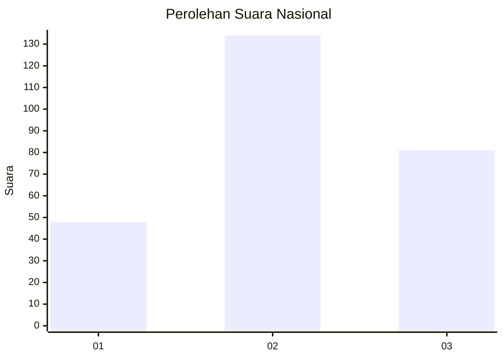
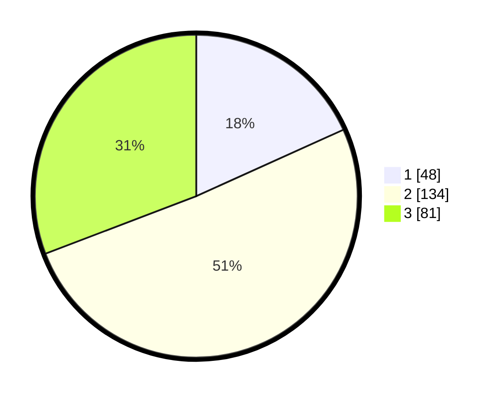

# Hasil

## Grafik

## Tabel

| No. | Nama Paslon    | Suara | Suara (raw) | Persentase |
|:--- |:-------------- | -----:| -----------:| ----------:|
| 1   | ANIES MUHAIMIN | 48    | [48][p-1]   | 18,25      |
| 2   | PRABOWO GIBRAN | 134   | [134][p-2]  | 50,95      |
| 3   | GANJAR MAHFUD  | 81    | [81][p-3]   | 30,80      |

[p-1]: https://github.com/gigit-pemilu/pemilu-2024/blob/main/pilpres/hitung-suara/sub/34-di-yogyakarta/sub/04-sleman/sub/11-ngemplak/sub/2001-sindumartani/sub/005-tps/sub/paslon-1.txt
[p-2]: https://github.com/gigit-pemilu/pemilu-2024/blob/main/pilpres/hitung-suara/sub/34-di-yogyakarta/sub/04-sleman/sub/11-ngemplak/sub/2001-sindumartani/sub/005-tps/sub/paslon-2.txt
[p-3]: https://github.com/gigit-pemilu/pemilu-2024/blob/main/pilpres/hitung-suara/sub/34-di-yogyakarta/sub/04-sleman/sub/11-ngemplak/sub/2001-sindumartani/sub/005-tps/sub/paslon-3.txt

## Foto C Plano

https://sirekap-obj-formc.kpu.go.id/9002/pemilu/ppwp/34/04/11/20/01/3404112001005-20240215-034004--a271cf2c-e781-48ed-852c-5849ef76c6f3.jpg

https://sirekap-obj-formc.kpu.go.id/9002/pemilu/ppwp/34/04/11/20/01/3404112001005-20240214-160123--b72d7f9b-75b3-42f9-a7a1-9e0b4fe3dbd6.jpg

https://sirekap-obj-formc.kpu.go.id/9002/pemilu/ppwp/34/04/11/20/01/3404112001005-20240214-160111--0d9835d3-0b1c-4bf3-b107-9533e692d663.jpg

## Metadata

| Key        | Value               |
| ---------- | ------------------- |
| Time Stamp | 2024-02-15 18:30:25 |

