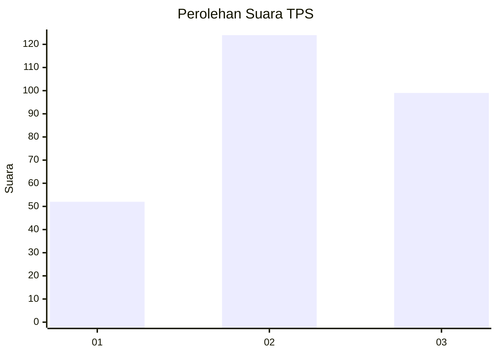
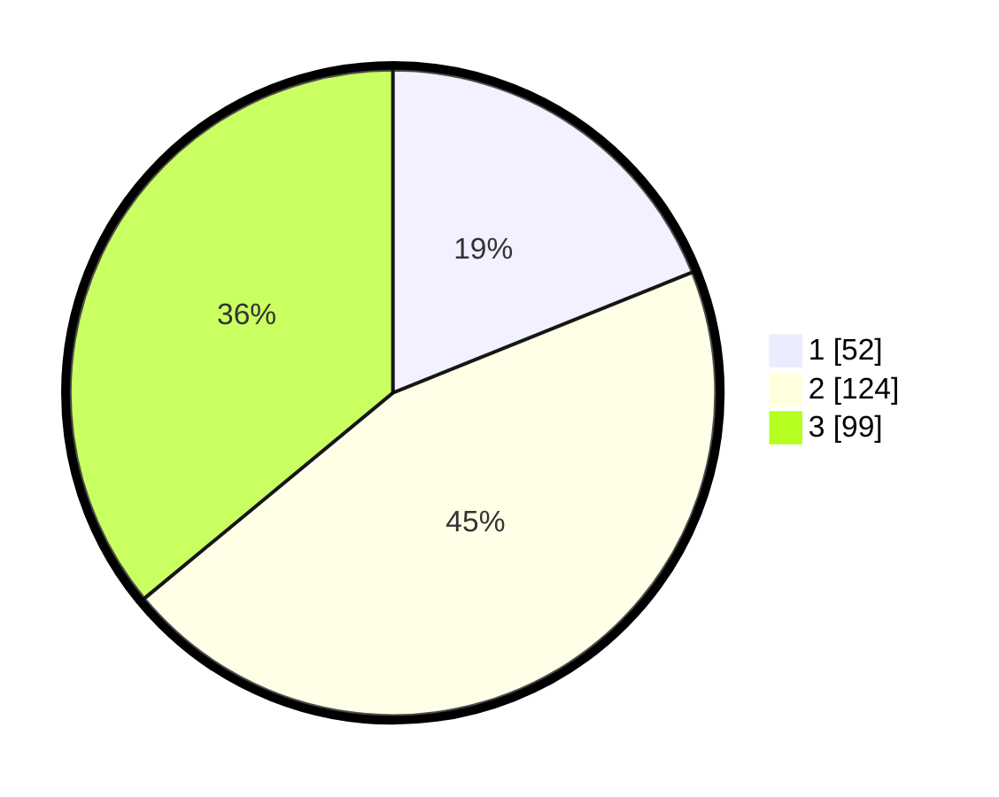

# Hasil

## Grafik

## Tabel

| No. | Nama Paslon    | Suara | Suara (raw) | Persentase |
|:--- |:-------------- | -----:| -----------:| ----------:|
| 1   | ANIES MUHAIMIN | 52    | [52][p-1]   | 18,91      |
| 2   | PRABOWO GIBRAN | 124   | [124][p-2]  | 45,09      |
| 3   | GANJAR MAHFUD  | 99    | [99][p-3]   | 36,00      |

[p-1]: https://github.com/gigit-pemilu/pemilu-2024-34-di-yogyakarta/blob/main/pilpres/hitung-suara/sub/34-di-yogyakarta/sub/04-sleman/sub/11-ngemplak/sub/2001-sindumartani/sub/006-tps/sub/paslon-1.txt
[p-2]: https://github.com/gigit-pemilu/pemilu-2024-34-di-yogyakarta/blob/main/pilpres/hitung-suara/sub/34-di-yogyakarta/sub/04-sleman/sub/11-ngemplak/sub/2001-sindumartani/sub/006-tps/sub/paslon-2.txt
[p-3]: https://github.com/gigit-pemilu/pemilu-2024-34-di-yogyakarta/blob/main/pilpres/hitung-suara/sub/34-di-yogyakarta/sub/04-sleman/sub/11-ngemplak/sub/2001-sindumartani/sub/006-tps/sub/paslon-3.txt

## Foto C Plano

https://sirekap-obj-formc.kpu.go.id/00cc/pemilu/ppwp/34/04/11/20/01/3404112001006-20240215-013440--8010b461-7c9c-45ff-a8e6-8394e978f611.jpg

https://sirekap-obj-formc.kpu.go.id/00cc/pemilu/ppwp/34/04/11/20/01/3404112001006-20240215-013540--c9f9f842-b994-4897-8eb3-57cf3a1cb856.jpg

https://sirekap-obj-formc.kpu.go.id/00cc/pemilu/ppwp/34/04/11/20/01/3404112001006-20240215-013927--a42e4f0c-aa03-4119-bf78-4ca614c55db8.jpg

## Metadata

| Key        | Value               |
| ---------- | ------------------- |
| Time Stamp | 2024-02-15 18:30:25 |

