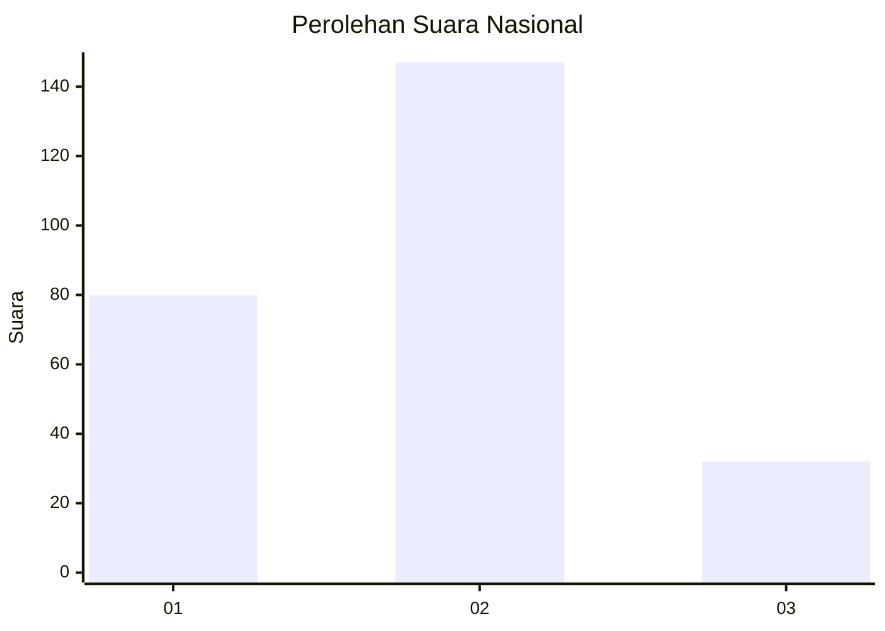
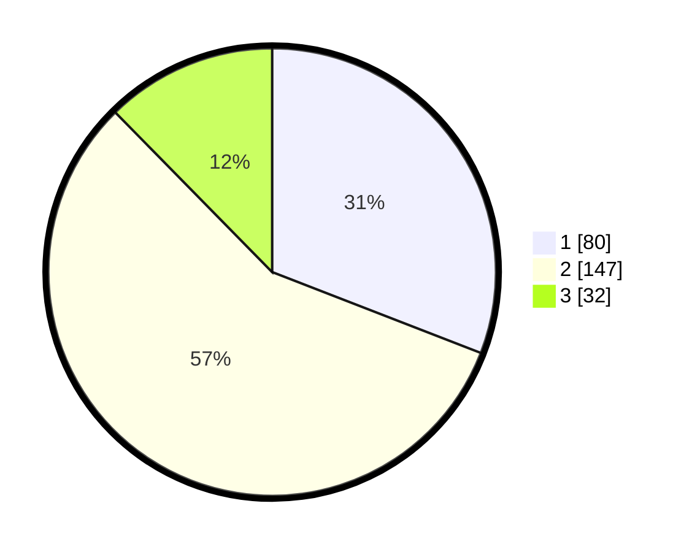

# Hasil

## Grafik

## Tabel

| No. | Nama Paslon    | Suara | Suara (raw) | Persentase |
|:--- |:-------------- | -----:| -----------:| ----------:|
| 1   | ANIES MUHAIMIN | 80    | [80][p-1]   | 30,89      |
| 2   | PRABOWO GIBRAN | 147   | [147][p-2]  | 56,76      |
| 3   | GANJAR MAHFUD  | 32    | [32][p-3]   | 12,36      |

[p-1]: https://github.com/gigit-pemilu/pemilu-2024/blob/main/pilpres/hitung-suara/sub/34-di-yogyakarta/sub/04-sleman/sub/11-ngemplak/sub/2001-sindumartani/sub/011-tps/sub/paslon-1.txt
[p-2]: https://github.com/gigit-pemilu/pemilu-2024/blob/main/pilpres/hitung-suara/sub/34-di-yogyakarta/sub/04-sleman/sub/11-ngemplak/sub/2001-sindumartani/sub/011-tps/sub/paslon-2.txt
[p-3]: https://github.com/gigit-pemilu/pemilu-2024/blob/main/pilpres/hitung-suara/sub/34-di-yogyakarta/sub/04-sleman/sub/11-ngemplak/sub/2001-sindumartani/sub/011-tps/sub/paslon-3.txt

## Foto C Plano

https://sirekap-obj-formc.kpu.go.id/34a8/pemilu/ppwp/34/04/11/20/01/3404112001011-20240214-191219--0bef2d97-c8fb-4117-a31d-1d8ee45bd541.jpg

https://sirekap-obj-formc.kpu.go.id/34a8/pemilu/ppwp/34/04/11/20/01/3404112001011-20240214-191224--ed8d87b3-add2-4c45-a787-9eecade0f38a.jpg

https://sirekap-obj-formc.kpu.go.id/34a8/pemilu/ppwp/34/04/11/20/01/3404112001011-20240214-191232--0b6d3b28-62d5-4a45-ae4c-ae8460930070.jpg

## Metadata

| Key        | Value               |
| ---------- | ------------------- |
| Time Stamp | 2024-02-15 00:41:44 |

## DATA PEMILIH TETAP

Jumlah pemilih dalam DPT: **280**.
 * L: **136**.
 * P: **144**.

## DATA PENGGUNA HAK PILIH

Jumlah pengguna hak pilih dalam DPT: **257**.
 * L: **126**.
 * P: **131**.

Jumlah pengguna hak pilih dalam DPTb: **7**.
 * L: **1**.
 * P: **86**.

Jumlah pengguna hak pilih dalam DPK: **0**.
 * L: **0**.
 * P: **0**.

Jumlah pengguna hak pilih: **264**.
 * L: **127**.
 * P: **137**.

## JUMLAH SUARA SAH DAN TIDAK SAH

JUMLAH SELURUH SUARA SAH: **259**.

JUMLAH SUARA TIDAK SAH: **5**.

JUMLAH SELURUH SUARA SAH DAN SUARA TIDAK SAH: **264**.

