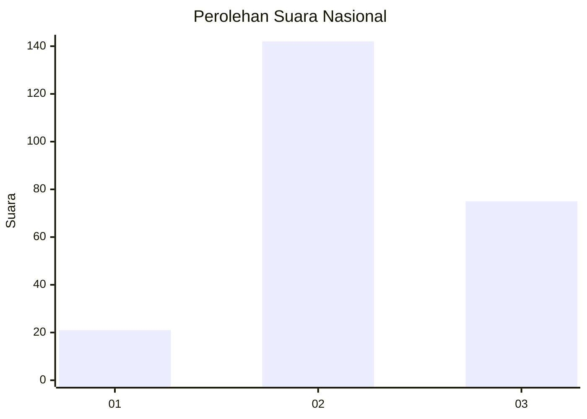
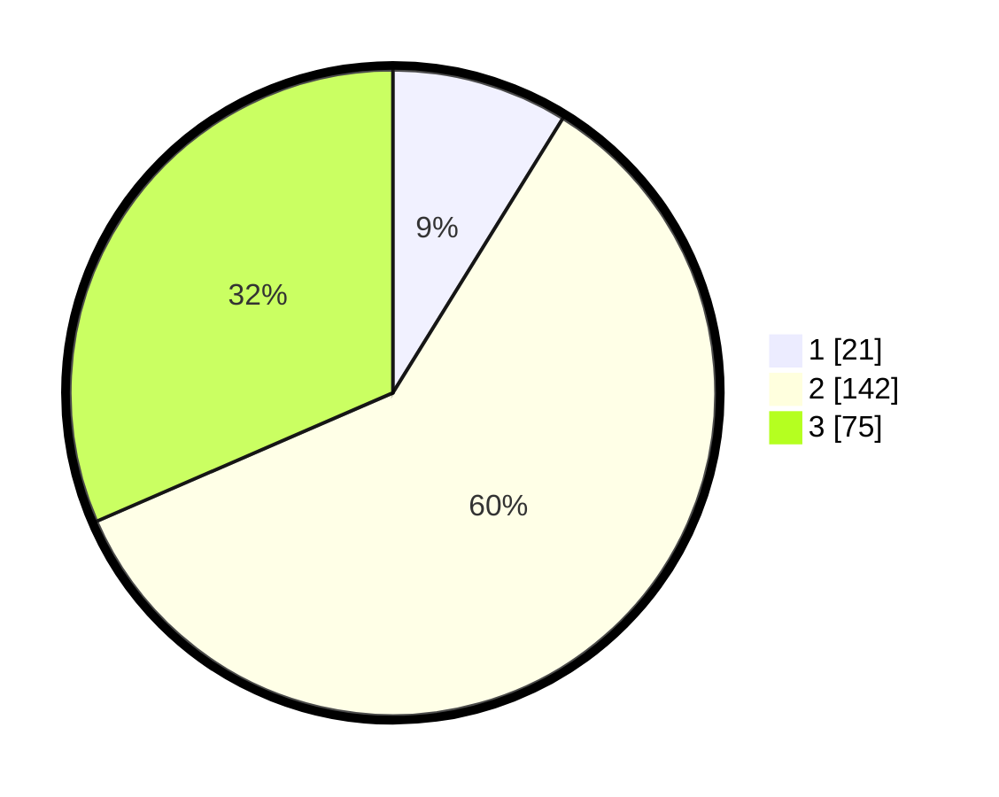

# Hasil

## Grafik

## Tabel

| No. | Nama Paslon    | Suara | Suara (raw) | Persentase |
|:--- |:-------------- | -----:| -----------:| ----------:|
| 1   | ANIES MUHAIMIN | 21    | [21][p-1]   | 8,82       |
| 2   | PRABOWO GIBRAN | 142   | [142][p-2]  | 59,66      |
| 3   | GANJAR MAHFUD  | 75    | [75][p-3]   | 31,51      |

[p-1]: https://github.com/gigit-pemilu/pemilu-2024/blob/main/pilpres/hitung-suara/sub/34-di-yogyakarta/sub/04-sleman/sub/11-ngemplak/sub/2002-bimomartani/sub/001-tps/sub/paslon-1.txt
[p-2]: https://github.com/gigit-pemilu/pemilu-2024/blob/main/pilpres/hitung-suara/sub/34-di-yogyakarta/sub/04-sleman/sub/11-ngemplak/sub/2002-bimomartani/sub/001-tps/sub/paslon-2.txt
[p-3]: https://github.com/gigit-pemilu/pemilu-2024/blob/main/pilpres/hitung-suara/sub/34-di-yogyakarta/sub/04-sleman/sub/11-ngemplak/sub/2002-bimomartani/sub/001-tps/sub/paslon-3.txt

## Foto C Plano

https://sirekap-obj-formc.kpu.go.id/5a52/pemilu/ppwp/34/04/11/20/02/3404112002001-20240215-133231--0b6c2246-196d-4b85-897f-e1c34b9f0023.jpg

https://sirekap-obj-formc.kpu.go.id/5a52/pemilu/ppwp/34/04/11/20/02/3404112002001-20240215-132605--f02c104a-c01c-42ba-b49c-b05b02b1ea34.jpg

https://sirekap-obj-formc.kpu.go.id/5a52/pemilu/ppwp/34/04/11/20/02/3404112002001-20240215-133758--23d0a424-eba4-41a4-a747-100cd728802e.jpg

## Metadata

| Key        | Value               |
| ---------- | ------------------- |
| Time Stamp | 2024-02-15 18:30:25 |

