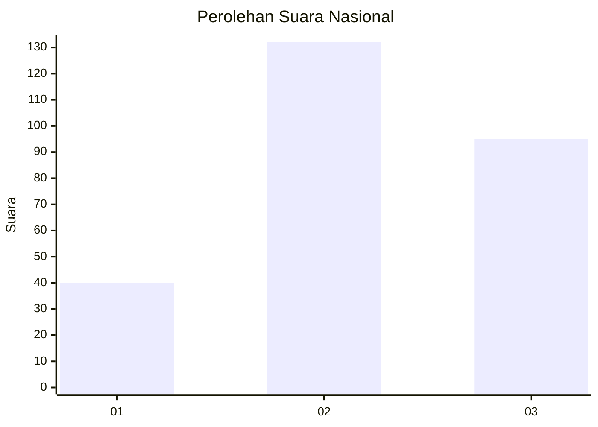
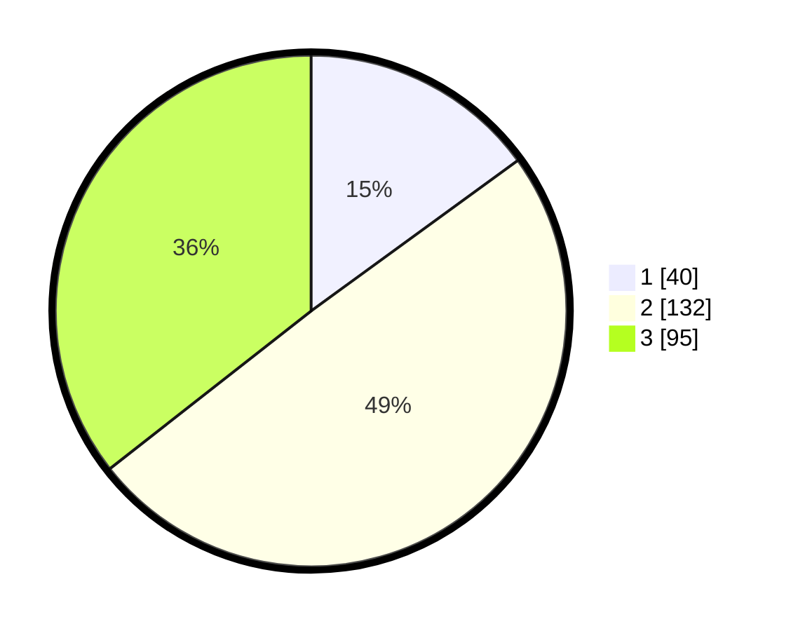

# Hasil

## Grafik

## Tabel

| No. | Nama Paslon    | Suara | Suara (raw) | Persentase |
|:--- |:-------------- | -----:| -----------:| ----------:|
| 1   | ANIES MUHAIMIN | 40    | [40][p-1]   | 14,98      |
| 2   | PRABOWO GIBRAN | 132   | [132][p-2]  | 49,44      |
| 3   | GANJAR MAHFUD  | 95    | [95][p-3]   | 35,58      |

[p-1]: https://github.com/gigit-pemilu/pemilu-2024/blob/main/pilpres/hitung-suara/sub/34-di-yogyakarta/sub/04-sleman/sub/11-ngemplak/sub/2002-bimomartani/sub/005-tps/sub/paslon-1.txt
[p-2]: https://github.com/gigit-pemilu/pemilu-2024/blob/main/pilpres/hitung-suara/sub/34-di-yogyakarta/sub/04-sleman/sub/11-ngemplak/sub/2002-bimomartani/sub/005-tps/sub/paslon-2.txt
[p-3]: https://github.com/gigit-pemilu/pemilu-2024/blob/main/pilpres/hitung-suara/sub/34-di-yogyakarta/sub/04-sleman/sub/11-ngemplak/sub/2002-bimomartani/sub/005-tps/sub/paslon-3.txt

## Foto C Plano

https://sirekap-obj-formc.kpu.go.id/99d8/pemilu/ppwp/34/04/11/20/02/3404112002005-20240214-235601--d00fe355-a58e-416c-a021-96f9b3e64e3a.jpg

https://sirekap-obj-formc.kpu.go.id/99d8/pemilu/ppwp/34/04/11/20/02/3404112002005-20240215-000039--c32d595e-2f94-4688-967a-841361e023d6.jpg

https://sirekap-obj-formc.kpu.go.id/99d8/pemilu/ppwp/34/04/11/20/02/3404112002005-20240215-000418--a99a4ae4-ed10-45f8-b06d-8be2d51f3fee.jpg

## Metadata

| Key        | Value               |
| ---------- | ------------------- |
| Time Stamp | 2024-02-16 22:30:00 |

