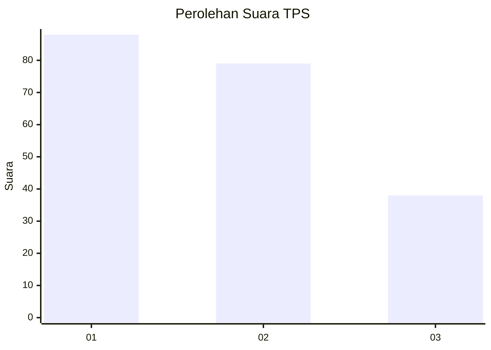
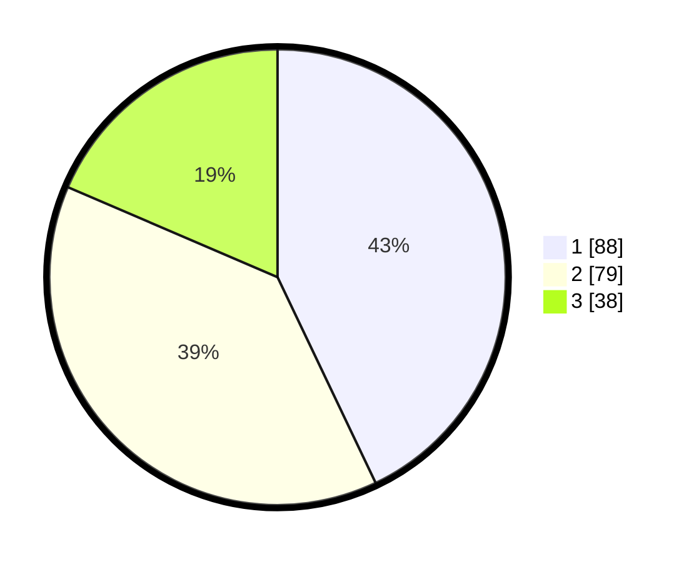

# Hasil

## Grafik

## Tabel

| No. | Nama Paslon    | Suara | Suara (raw) | Persentase |
|:--- |:-------------- | -----:| -----------:| ----------:|
| 1   | ANIES MUHAIMIN | 88    | [88][p-1]   | 42,93      |
| 2   | PRABOWO GIBRAN | 79    | [79][p-2]   | 38,54      |
| 3   | GANJAR MAHFUD  | 38    | [38][p-3]   | 18,54      |

[p-1]: https://github.com/gigit-pemilu/pemilu-2024-34-di-yogyakarta/blob/main/pilpres/hitung-suara/sub/34-di-yogyakarta/sub/04-sleman/sub/11-ngemplak/sub/2002-bimomartani/sub/007-tps/sub/paslon-1.txt
[p-2]: https://github.com/gigit-pemilu/pemilu-2024-34-di-yogyakarta/blob/main/pilpres/hitung-suara/sub/34-di-yogyakarta/sub/04-sleman/sub/11-ngemplak/sub/2002-bimomartani/sub/007-tps/sub/paslon-2.txt
[p-3]: https://github.com/gigit-pemilu/pemilu-2024-34-di-yogyakarta/blob/main/pilpres/hitung-suara/sub/34-di-yogyakarta/sub/04-sleman/sub/11-ngemplak/sub/2002-bimomartani/sub/007-tps/sub/paslon-3.txt

## Foto C Plano

https://sirekap-obj-formc.kpu.go.id/b719/pemilu/ppwp/34/04/11/20/02/3404112002007-20240214-215422--7e418c88-8ad3-406e-8c34-73017a62aadf.jpg

https://sirekap-obj-formc.kpu.go.id/b719/pemilu/ppwp/34/04/11/20/02/3404112002007-20240214-215510--2c84c3ed-f230-4c81-9d94-ad5d46040635.jpg

https://sirekap-obj-formc.kpu.go.id/b719/pemilu/ppwp/34/04/11/20/02/3404112002007-20240214-222120--ab4aaa0e-8f32-40af-9746-5e00485f1a68.jpg

## Metadata

| Key        | Value               |
| ---------- | ------------------- |
| Time Stamp | 2024-02-15 19:00:26 |

