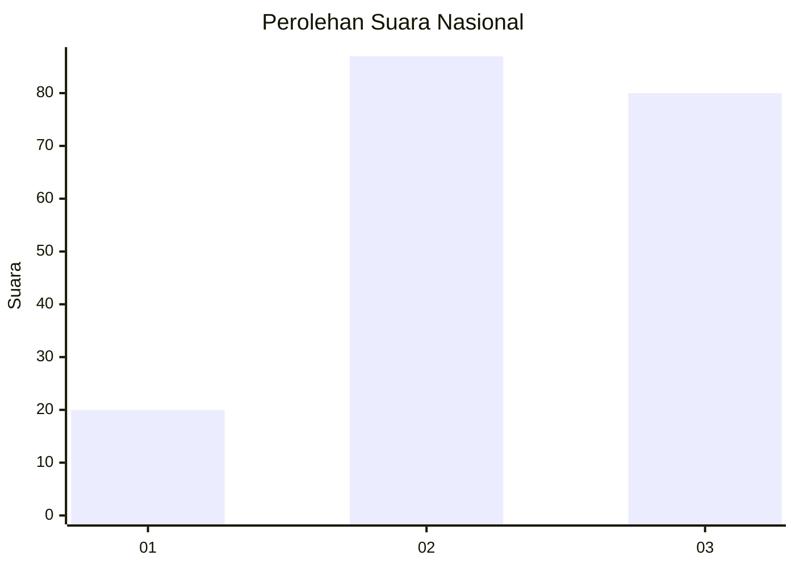
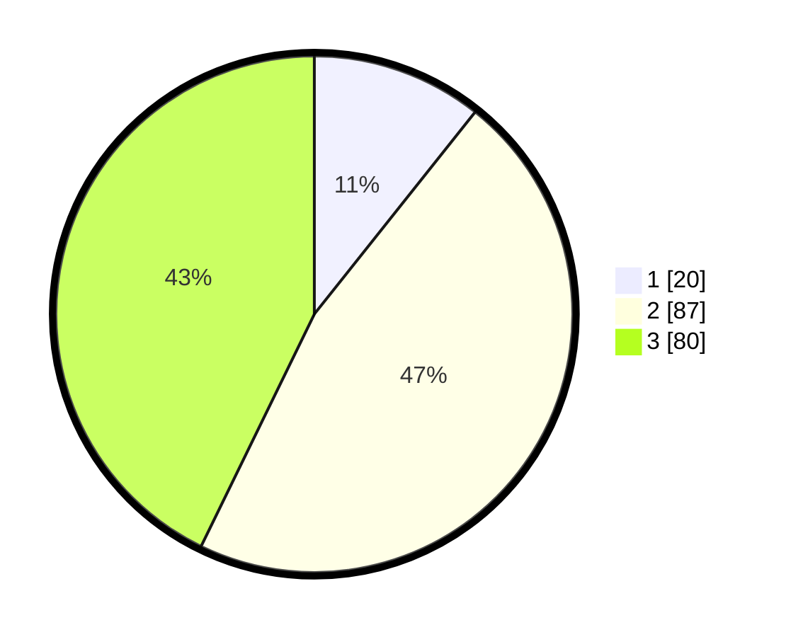

# Hasil

## Grafik

## Tabel

| No. | Nama Paslon    | Suara | Suara (raw) | Persentase |
|:--- |:-------------- | -----:| -----------:| ----------:|
| 1   | ANIES MUHAIMIN | 20    | [20][p-1]   | 10,70      |
| 2   | PRABOWO GIBRAN | 87    | [87][p-2]   | 46,52      |
| 3   | GANJAR MAHFUD  | 80    | [80][p-3]   | 42,78      |

[p-1]: https://github.com/gigit-pemilu/pemilu-2024/blob/main/pilpres/hitung-suara/sub/34-di-yogyakarta/sub/04-sleman/sub/11-ngemplak/sub/2002-bimomartani/sub/016-tps/sub/paslon-1.txt
[p-2]: https://github.com/gigit-pemilu/pemilu-2024/blob/main/pilpres/hitung-suara/sub/34-di-yogyakarta/sub/04-sleman/sub/11-ngemplak/sub/2002-bimomartani/sub/016-tps/sub/paslon-2.txt
[p-3]: https://github.com/gigit-pemilu/pemilu-2024/blob/main/pilpres/hitung-suara/sub/34-di-yogyakarta/sub/04-sleman/sub/11-ngemplak/sub/2002-bimomartani/sub/016-tps/sub/paslon-3.txt

## Foto C Plano

https://sirekap-obj-formc.kpu.go.id/29e9/pemilu/ppwp/34/04/11/20/02/3404112002016-20240214-215942--9b65c389-c162-424b-b6a0-84098b0b5c30.jpg

https://sirekap-obj-formc.kpu.go.id/29e9/pemilu/ppwp/34/04/11/20/02/3404112002016-20240214-220315--97df6d88-abca-426b-aba6-be0dfef8bb88.jpg

https://sirekap-obj-formc.kpu.go.id/29e9/pemilu/ppwp/34/04/11/20/02/3404112002016-20240214-220504--7ebc8896-d583-438e-8839-f2a317157a30.jpg

## Metadata

| Key        | Value               |
| ---------- | ------------------- |
| Time Stamp | 2024-02-15 19:00:26 |

