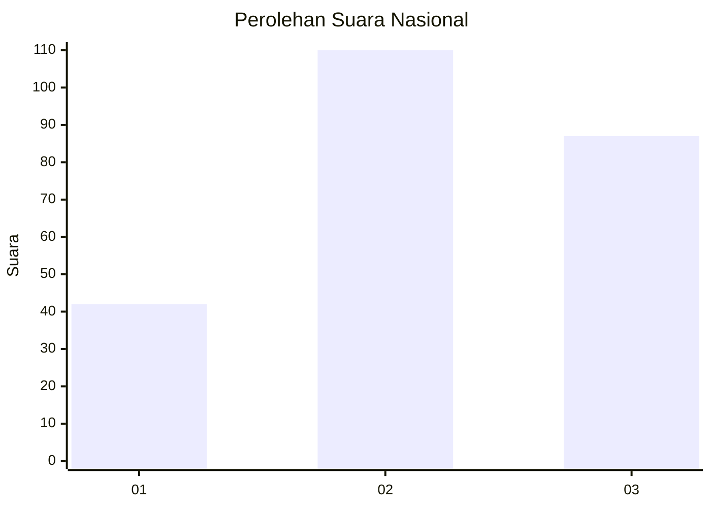
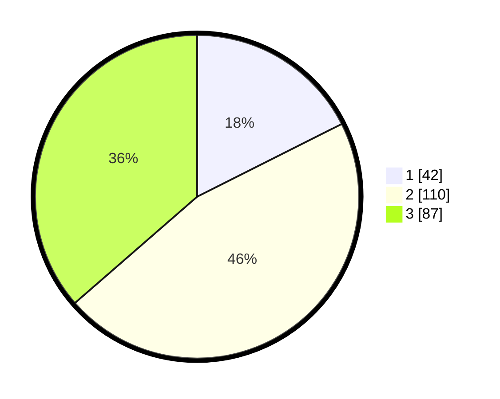

# Hasil

## Grafik

## Tabel

| No. | Nama Paslon    | Suara | Suara (raw) | Persentase |
|:--- |:-------------- | -----:| -----------:| ----------:|
| 1   | ANIES MUHAIMIN | 42    | [42][p-1]   | 17,57      |
| 2   | PRABOWO GIBRAN | 110   | [110][p-2]  | 46,03      |
| 3   | GANJAR MAHFUD  | 87    | [87][p-3]   | 36,40      |

[p-1]: https://github.com/gigit-pemilu/pemilu-2024/blob/main/pilpres/hitung-suara/sub/34-di-yogyakarta/sub/04-sleman/sub/11-ngemplak/sub/2002-bimomartani/sub/019-tps/sub/paslon-1.txt
[p-2]: https://github.com/gigit-pemilu/pemilu-2024/blob/main/pilpres/hitung-suara/sub/34-di-yogyakarta/sub/04-sleman/sub/11-ngemplak/sub/2002-bimomartani/sub/019-tps/sub/paslon-2.txt
[p-3]: https://github.com/gigit-pemilu/pemilu-2024/blob/main/pilpres/hitung-suara/sub/34-di-yogyakarta/sub/04-sleman/sub/11-ngemplak/sub/2002-bimomartani/sub/019-tps/sub/paslon-3.txt

## Foto C Plano

https://sirekap-obj-formc.kpu.go.id/33eb/pemilu/ppwp/34/04/11/20/02/3404112002019-20240214-224427--50742db5-83cb-47e3-94f9-c0952ccc06ba.jpg

https://sirekap-obj-formc.kpu.go.id/33eb/pemilu/ppwp/34/04/11/20/02/3404112002019-20240217-113142--3cf1251c-4191-4aa7-aeac-c49a8536c3b1.jpg

https://sirekap-obj-formc.kpu.go.id/33eb/pemilu/ppwp/34/04/11/20/02/3404112002019-20240217-112630--56e4ea19-42c3-4a15-80c9-695a5973bf6b.jpg

## Metadata

| Key        | Value               |
| ---------- | ------------------- |
| Time Stamp | 2024-02-17 13:42:09 |

