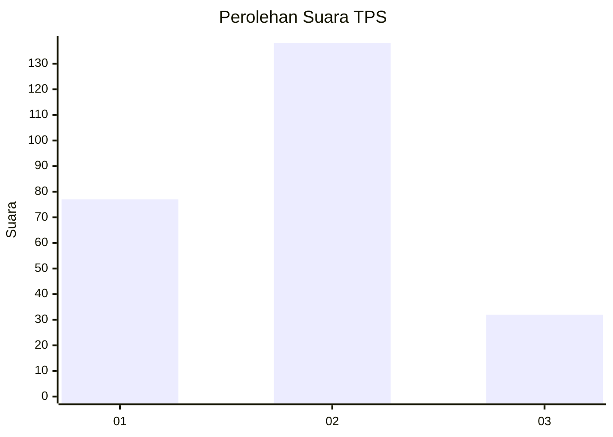
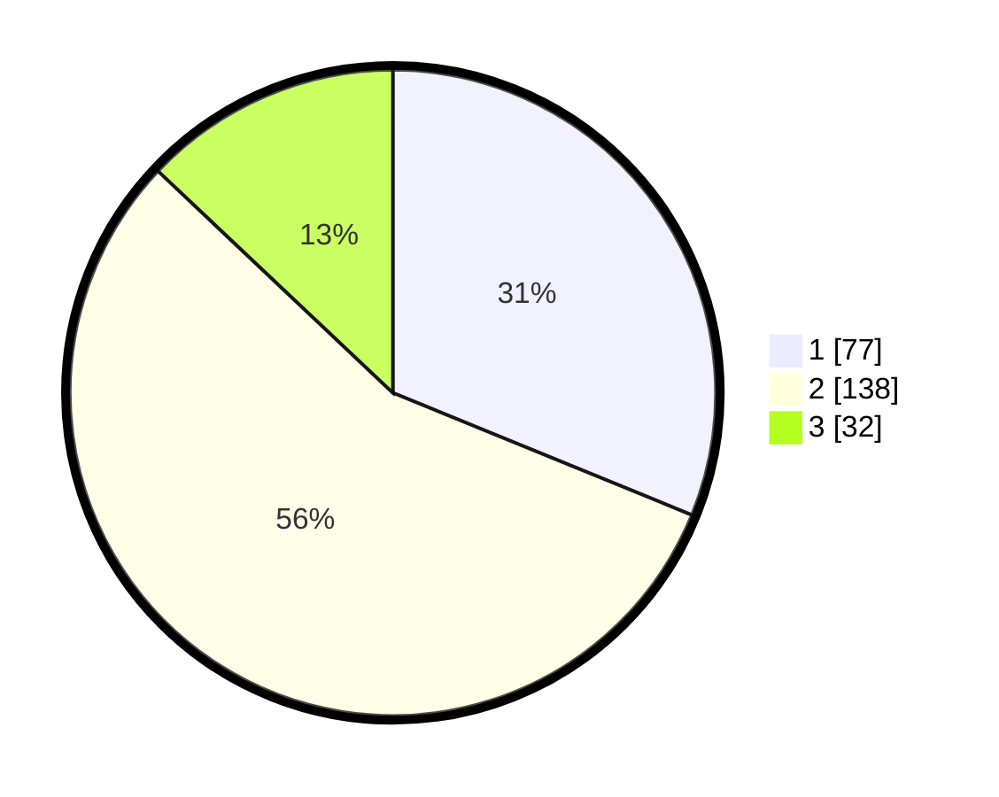

# Hasil

## Grafik

## Tabel

| No. | Nama Paslon    | Suara | Suara (raw) | Persentase |
|:--- |:-------------- | -----:| -----------:| ----------:|
| 1   | ANIES MUHAIMIN | 77    | [77][p-1]   | 31,17      |
| 2   | PRABOWO GIBRAN | 138   | [138][p-2]  | 55,87      |
| 3   | GANJAR MAHFUD  | 32    | [32][p-3]   | 12,96      |

[p-1]: https://github.com/gigit-pemilu/pemilu-2024-34-di-yogyakarta/blob/main/pilpres/hitung-suara/sub/34-di-yogyakarta/sub/04-sleman/sub/11-ngemplak/sub/2002-bimomartani/sub/020-tps/sub/paslon-1.txt
[p-2]: https://github.com/gigit-pemilu/pemilu-2024-34-di-yogyakarta/blob/main/pilpres/hitung-suara/sub/34-di-yogyakarta/sub/04-sleman/sub/11-ngemplak/sub/2002-bimomartani/sub/020-tps/sub/paslon-2.txt
[p-3]: https://github.com/gigit-pemilu/pemilu-2024-34-di-yogyakarta/blob/main/pilpres/hitung-suara/sub/34-di-yogyakarta/sub/04-sleman/sub/11-ngemplak/sub/2002-bimomartani/sub/020-tps/sub/paslon-3.txt

## Foto C Plano

https://sirekap-obj-formc.kpu.go.id/4f2d/pemilu/ppwp/34/04/11/20/02/3404112002020-20240215-052405--7dc8c970-a7e9-46bf-b79a-b7a1c2dd1b02.jpg

https://sirekap-obj-formc.kpu.go.id/4f2d/pemilu/ppwp/34/04/11/20/02/3404112002020-20240215-052423--b69df9f6-05fd-4efc-9a44-dea27161e355.jpg

https://sirekap-obj-formc.kpu.go.id/4f2d/pemilu/ppwp/34/04/11/20/02/3404112002020-20240215-052512--499c7252-17c9-4c63-a822-6549c615ccf2.jpg

## Metadata

| Key        | Value               |
| ---------- | ------------------- |
| Time Stamp | 2024-02-16 22:30:00 |

