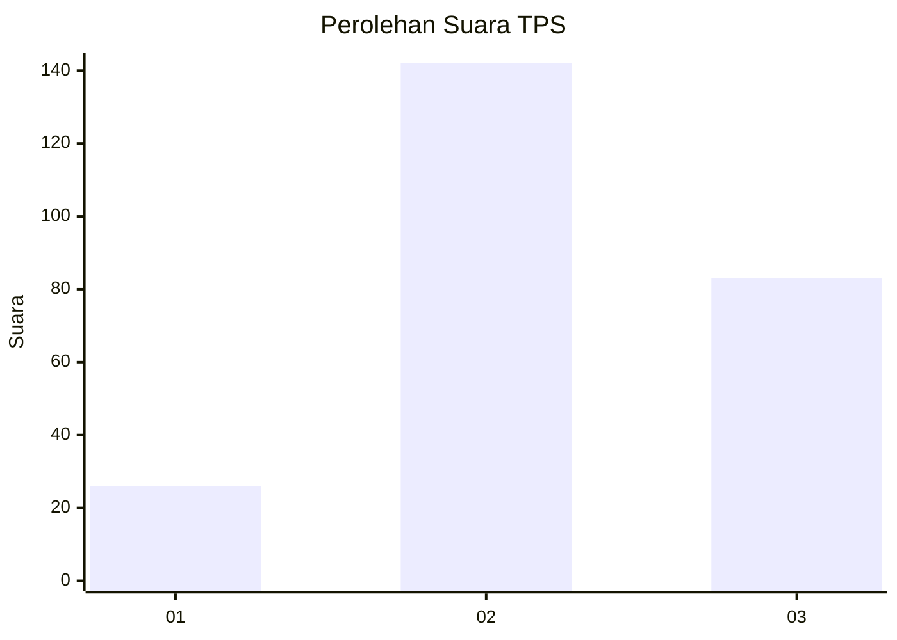
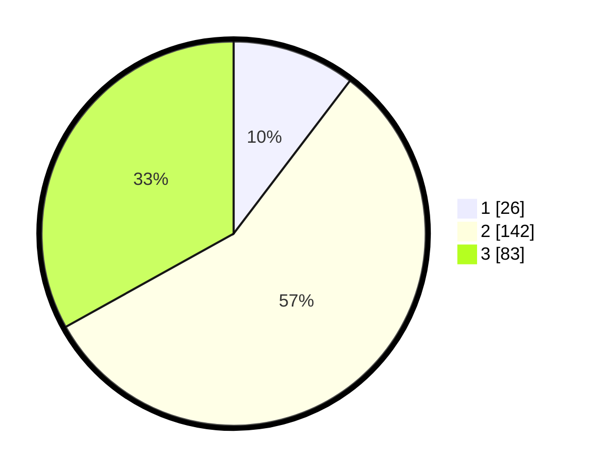

# Hasil

## Grafik

## Tabel

| No. | Nama Paslon    | Suara | Suara (raw) | Persentase |
|:--- |:-------------- | -----:| -----------:| ----------:|
| 1   | ANIES MUHAIMIN | 26    | [26][p-1]   | 10,36      |
| 2   | PRABOWO GIBRAN | 142   | [142][p-2]  | 56,57      |
| 3   | GANJAR MAHFUD  | 83    | [83][p-3]   | 33,07      |

[p-1]: https://github.com/gigit-pemilu/pemilu-2024-34-di-yogyakarta/blob/main/pilpres/hitung-suara/sub/34-di-yogyakarta/sub/04-sleman/sub/11-ngemplak/sub/2003-widodomartani/sub/015-tps/sub/paslon-1.txt
[p-2]: https://github.com/gigit-pemilu/pemilu-2024-34-di-yogyakarta/blob/main/pilpres/hitung-suara/sub/34-di-yogyakarta/sub/04-sleman/sub/11-ngemplak/sub/2003-widodomartani/sub/015-tps/sub/paslon-2.txt
[p-3]: https://github.com/gigit-pemilu/pemilu-2024-34-di-yogyakarta/blob/main/pilpres/hitung-suara/sub/34-di-yogyakarta/sub/04-sleman/sub/11-ngemplak/sub/2003-widodomartani/sub/015-tps/sub/paslon-3.txt

## Foto C Plano

https://sirekap-obj-formc.kpu.go.id/ea29/pemilu/ppwp/34/04/11/20/03/3404112003015-20240215-003011--27023de5-1ade-4397-8b92-2bda7c00f402.jpg

https://sirekap-obj-formc.kpu.go.id/ea29/pemilu/ppwp/34/04/11/20/03/3404112003015-20240215-003234--a503a24d-ad59-4eda-9aa2-6b182012dc84.jpg

https://sirekap-obj-formc.kpu.go.id/ea29/pemilu/ppwp/34/04/11/20/03/3404112003015-20240215-003708--d8d43e5e-0ec3-484d-aac2-34df47dbb0bf.jpg

## Metadata

| Key        | Value               |
| ---------- | ------------------- |
| Time Stamp | 2024-02-15 19:00:26 |

