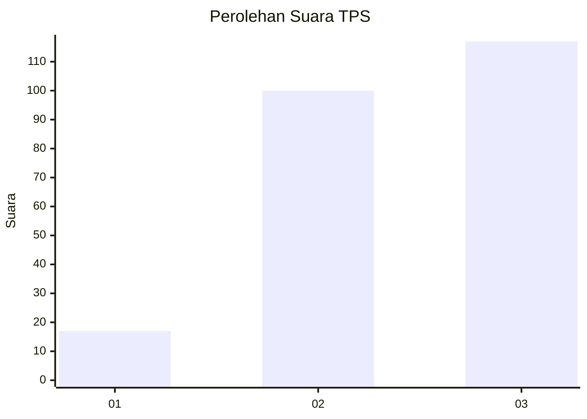
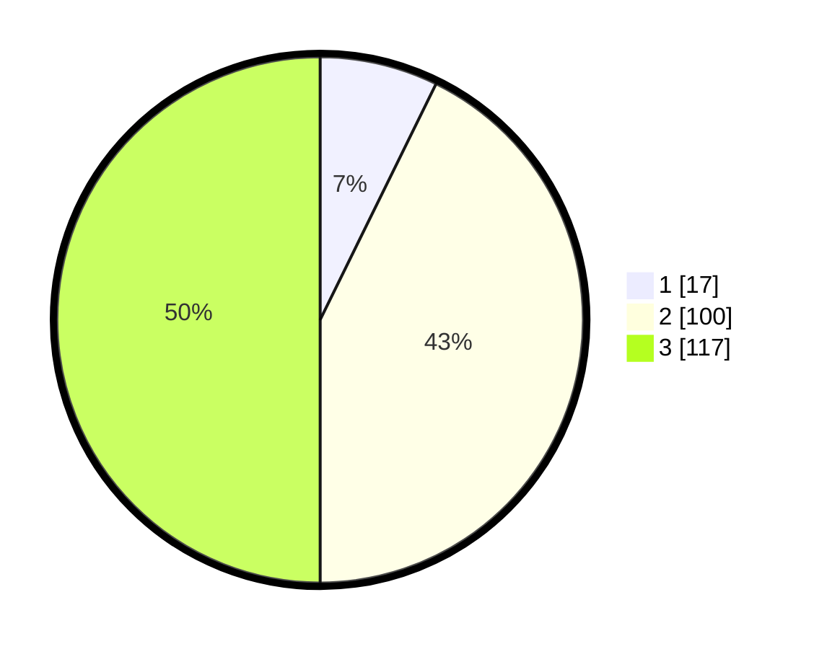

# Hasil

## Grafik

## Tabel

| No. | Nama Paslon    | Suara | Suara (raw) | Persentase |
|:--- |:-------------- | -----:| -----------:| ----------:|
| 1   | ANIES MUHAIMIN | 17    | [17][p-1]   | 7,26       |
| 2   | PRABOWO GIBRAN | 100   | [100][p-2]  | 42,74      |
| 3   | GANJAR MAHFUD  | 117   | [117][p-3]  | 50,00      |

[p-1]: https://github.com/gigit-pemilu/pemilu-2024-34-di-yogyakarta/blob/main/pilpres/hitung-suara/sub/34-di-yogyakarta/sub/04-sleman/sub/11-ngemplak/sub/2004-wedomartani/sub/003-tps/sub/paslon-1.txt
[p-2]: https://github.com/gigit-pemilu/pemilu-2024-34-di-yogyakarta/blob/main/pilpres/hitung-suara/sub/34-di-yogyakarta/sub/04-sleman/sub/11-ngemplak/sub/2004-wedomartani/sub/003-tps/sub/paslon-2.txt
[p-3]: https://github.com/gigit-pemilu/pemilu-2024-34-di-yogyakarta/blob/main/pilpres/hitung-suara/sub/34-di-yogyakarta/sub/04-sleman/sub/11-ngemplak/sub/2004-wedomartani/sub/003-tps/sub/paslon-3.txt

## Foto C Plano

https://sirekap-obj-formc.kpu.go.id/17f8/pemilu/ppwp/34/04/11/20/04/3404112004003-20240216-163224--827e5ef5-b2d9-4a72-a97c-eabdd4c52a50.jpg

https://sirekap-obj-formc.kpu.go.id/17f8/pemilu/ppwp/34/04/11/20/04/3404112004003-20240216-163319--3f3bb046-6f77-43c2-abbf-eed53b78f184.jpg

https://sirekap-obj-formc.kpu.go.id/17f8/pemilu/ppwp/34/04/11/20/04/3404112004003-20240216-163400--ab979b68-2905-4d18-ad0b-95e978f62ce8.jpg

## Metadata

| Key        | Value               |
| ---------- | ------------------- |
| Time Stamp | 2024-02-16 22:30:00 |

