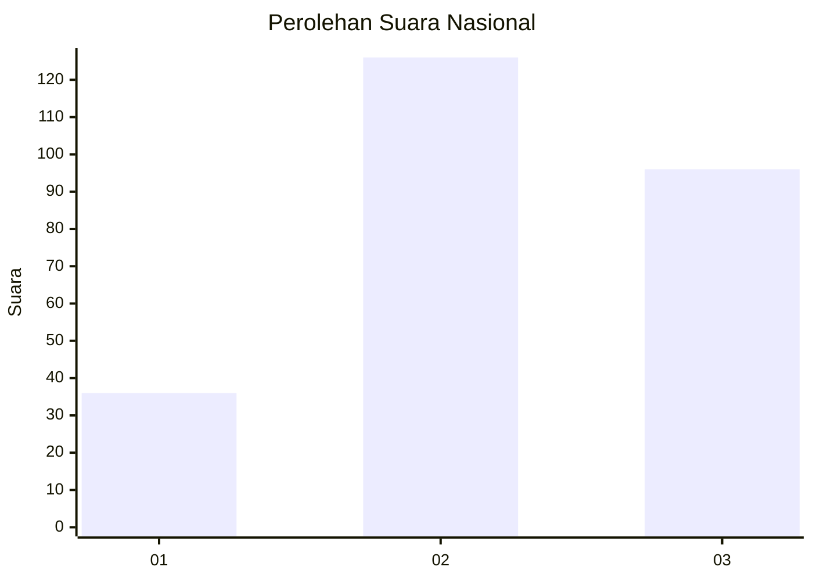
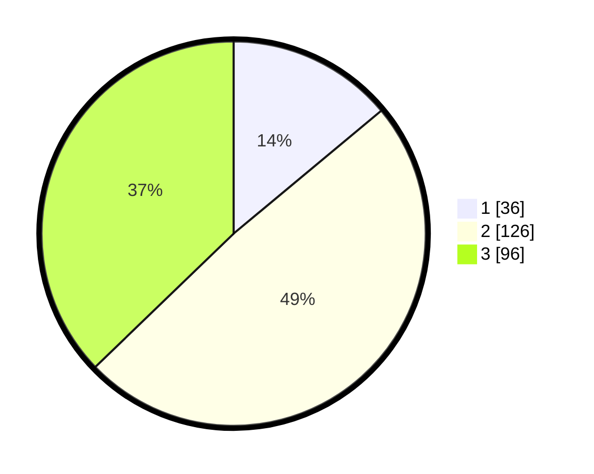

# Hasil

## Grafik

## Tabel

| No. | Nama Paslon    | Suara | Suara (raw) | Persentase |
|:--- |:-------------- | -----:| -----------:| ----------:|
| 1   | ANIES MUHAIMIN | 36    | [36][p-1]   | 13,95      |
| 2   | PRABOWO GIBRAN | 126   | [126][p-2]  | 48,84      |
| 3   | GANJAR MAHFUD  | 96    | [96][p-3]   | 37,21      |

[p-1]: https://github.com/gigit-pemilu/pemilu-2024/blob/main/pilpres/hitung-suara/sub/34-di-yogyakarta/sub/04-sleman/sub/11-ngemplak/sub/2004-wedomartani/sub/008-tps/sub/paslon-1.txt
[p-2]: https://github.com/gigit-pemilu/pemilu-2024/blob/main/pilpres/hitung-suara/sub/34-di-yogyakarta/sub/04-sleman/sub/11-ngemplak/sub/2004-wedomartani/sub/008-tps/sub/paslon-2.txt
[p-3]: https://github.com/gigit-pemilu/pemilu-2024/blob/main/pilpres/hitung-suara/sub/34-di-yogyakarta/sub/04-sleman/sub/11-ngemplak/sub/2004-wedomartani/sub/008-tps/sub/paslon-3.txt

## Foto C Plano

https://sirekap-obj-formc.kpu.go.id/190b/pemilu/ppwp/34/04/11/20/04/3404112004008-20240214-220304--a450eea2-d176-443b-b73f-173ca45241c8.jpg

https://sirekap-obj-formc.kpu.go.id/190b/pemilu/ppwp/34/04/11/20/04/3404112004008-20240214-202912--01f5f997-4d01-42a5-a04f-ad81daa7af27.jpg

https://sirekap-obj-formc.kpu.go.id/190b/pemilu/ppwp/34/04/11/20/04/3404112004008-20240214-202920--c5d494b5-95cc-4d36-b80e-ea184e640d43.jpg

## Metadata

| Key        | Value               |
| ---------- | ------------------- |
| Time Stamp | 2024-02-15 12:00:28 |

