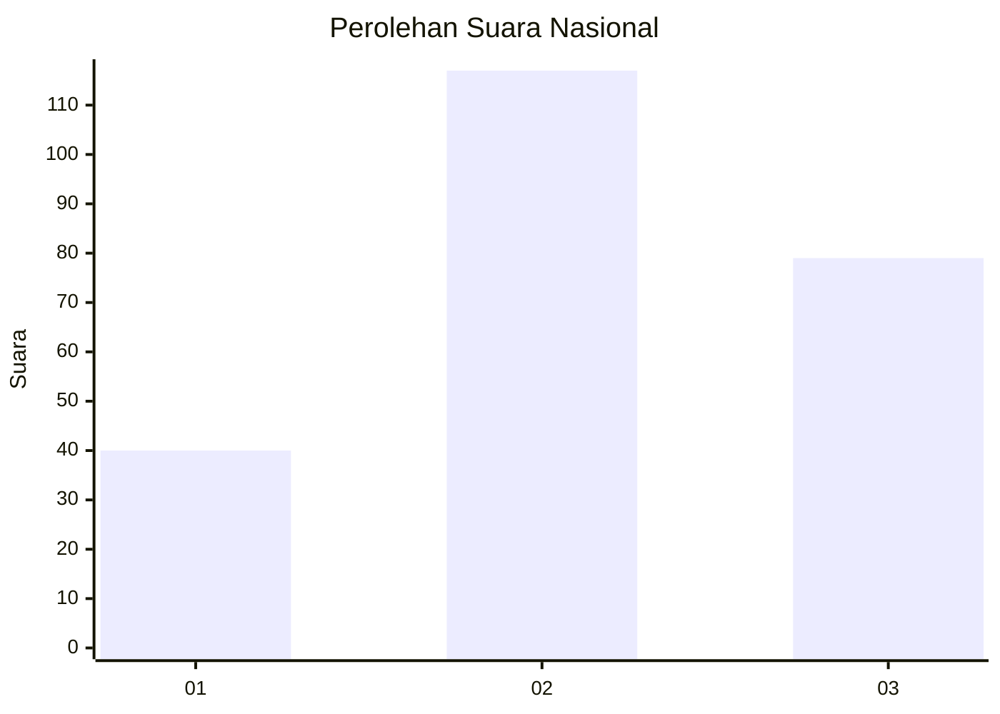
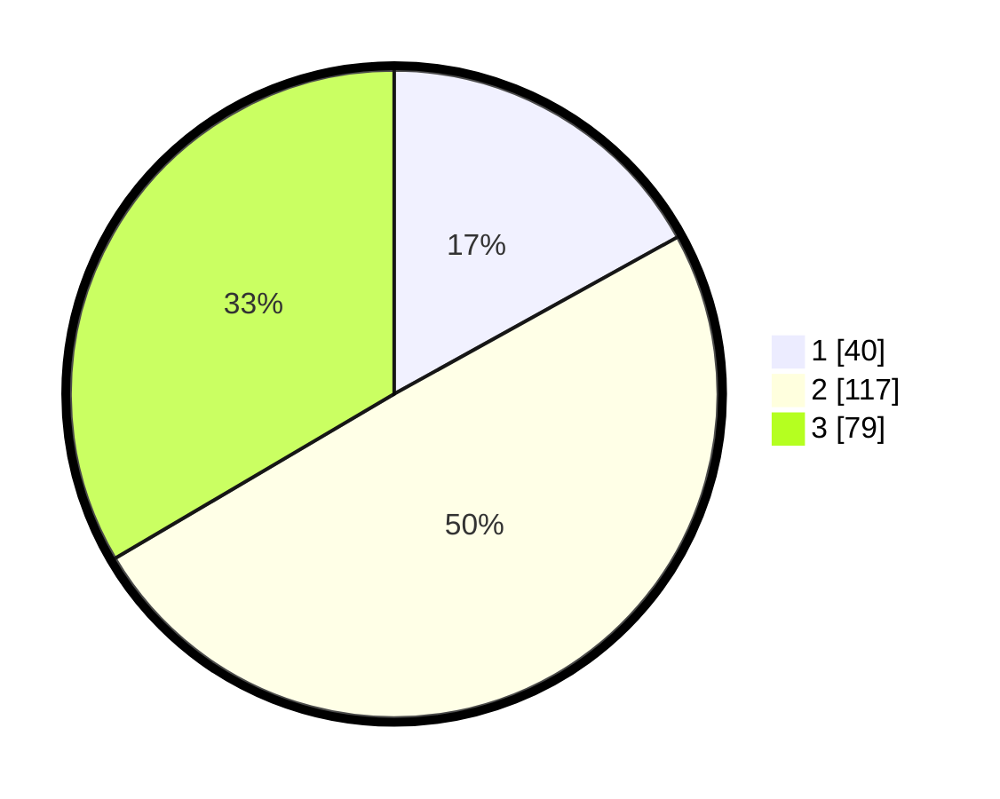

# Hasil

## Grafik

## Tabel

| No. | Nama Paslon    | Suara | Suara (raw) | Persentase |
|:--- |:-------------- | -----:| -----------:| ----------:|
| 1   | ANIES MUHAIMIN | 40    | [40][p-1]   | 16,95      |
| 2   | PRABOWO GIBRAN | 117   | [117][p-2]  | 49,58      |
| 3   | GANJAR MAHFUD  | 79    | [79][p-3]   | 33,47      |

[p-1]: https://github.com/gigit-pemilu/pemilu-2024/blob/main/pilpres/hitung-suara/sub/34-di-yogyakarta/sub/04-sleman/sub/11-ngemplak/sub/2004-wedomartani/sub/015-tps/sub/paslon-1.txt
[p-2]: https://github.com/gigit-pemilu/pemilu-2024/blob/main/pilpres/hitung-suara/sub/34-di-yogyakarta/sub/04-sleman/sub/11-ngemplak/sub/2004-wedomartani/sub/015-tps/sub/paslon-2.txt
[p-3]: https://github.com/gigit-pemilu/pemilu-2024/blob/main/pilpres/hitung-suara/sub/34-di-yogyakarta/sub/04-sleman/sub/11-ngemplak/sub/2004-wedomartani/sub/015-tps/sub/paslon-3.txt

## Foto C Plano

https://sirekap-obj-formc.kpu.go.id/983d/pemilu/ppwp/34/04/11/20/04/3404112004015-20240215-005723--0a7fb8c1-98a6-4888-a7ea-16a725e3dcc5.jpg

https://sirekap-obj-formc.kpu.go.id/983d/pemilu/ppwp/34/04/11/20/04/3404112004015-20240215-010022--0c299b37-aec3-4488-bdc1-2b7b226f6d05.jpg

https://sirekap-obj-formc.kpu.go.id/983d/pemilu/ppwp/34/04/11/20/04/3404112004015-20240215-010116--535d1c43-655c-4742-ba83-ffa5586a9cc0.jpg

## Metadata

| Key        | Value               |
| ---------- | ------------------- |
| Time Stamp | 2024-02-15 19:00:26 |

