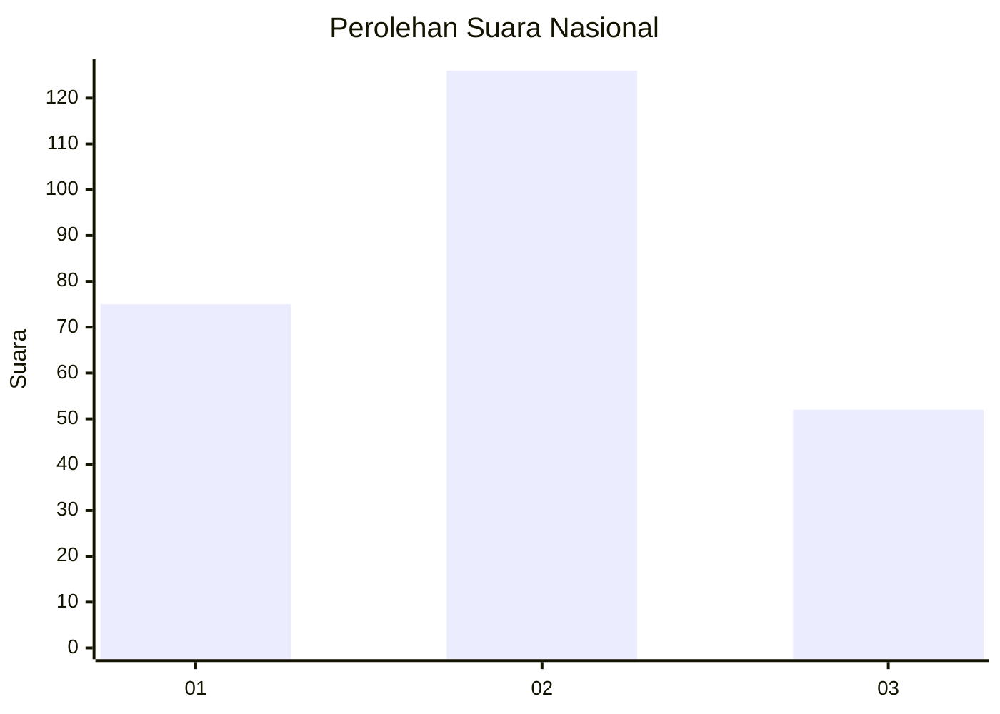
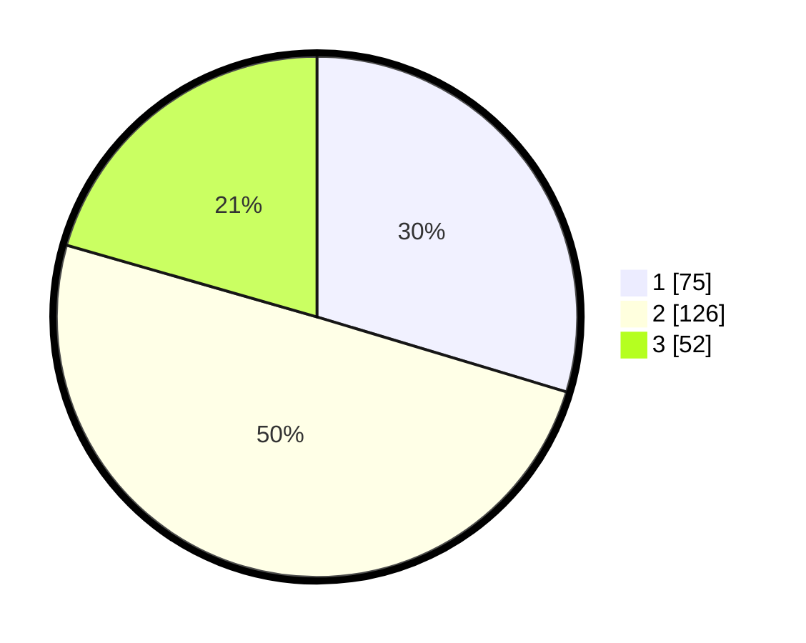

# Hasil

## Grafik

## Tabel

| No. | Nama Paslon    | Suara | Suara (raw) | Persentase |
|:--- |:-------------- | -----:| -----------:| ----------:|
| 1   | ANIES MUHAIMIN | 75    | [75][p-1]   | 29,64      |
| 2   | PRABOWO GIBRAN | 126   | [126][p-2]  | 49,80      |
| 3   | GANJAR MAHFUD  | 52    | [52][p-3]   | 20,55      |

[p-1]: https://github.com/gigit-pemilu/pemilu-2024/blob/main/pilpres/hitung-suara/sub/34-di-yogyakarta/sub/04-sleman/sub/11-ngemplak/sub/2004-wedomartani/sub/021-tps/sub/paslon-1.txt
[p-2]: https://github.com/gigit-pemilu/pemilu-2024/blob/main/pilpres/hitung-suara/sub/34-di-yogyakarta/sub/04-sleman/sub/11-ngemplak/sub/2004-wedomartani/sub/021-tps/sub/paslon-2.txt
[p-3]: https://github.com/gigit-pemilu/pemilu-2024/blob/main/pilpres/hitung-suara/sub/34-di-yogyakarta/sub/04-sleman/sub/11-ngemplak/sub/2004-wedomartani/sub/021-tps/sub/paslon-3.txt

## Foto C Plano

https://sirekap-obj-formc.kpu.go.id/0af4/pemilu/ppwp/34/04/11/20/04/3404112004021-20240215-054342--fcfcffbd-bfe6-4ab2-a714-a7ac0c9ff9b7.jpg

https://sirekap-obj-formc.kpu.go.id/0af4/pemilu/ppwp/34/04/11/20/04/3404112004021-20240215-054455--29b24829-9785-4de4-b0c4-6d06eb2bc5b8.jpg

https://sirekap-obj-formc.kpu.go.id/0af4/pemilu/ppwp/34/04/11/20/04/3404112004021-20240215-054656--436ffafa-dc9e-4e11-b571-2a00ef1f2f90.jpg

## Metadata

| Key        | Value               |
| ---------- | ------------------- |
| Time Stamp | 2024-02-15 19:00:26 |

