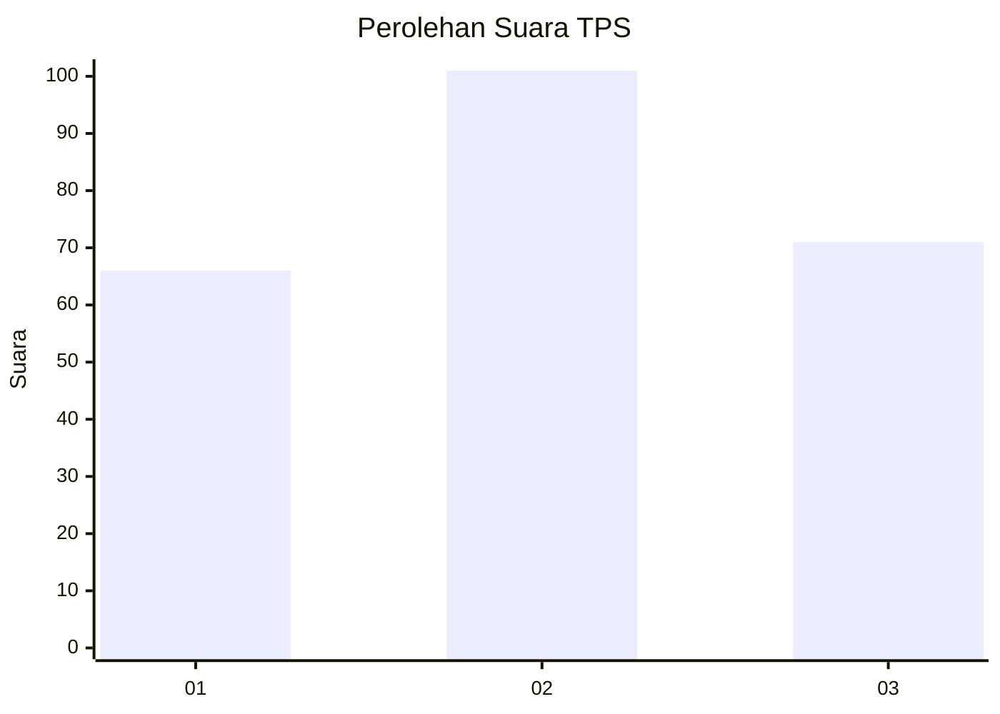
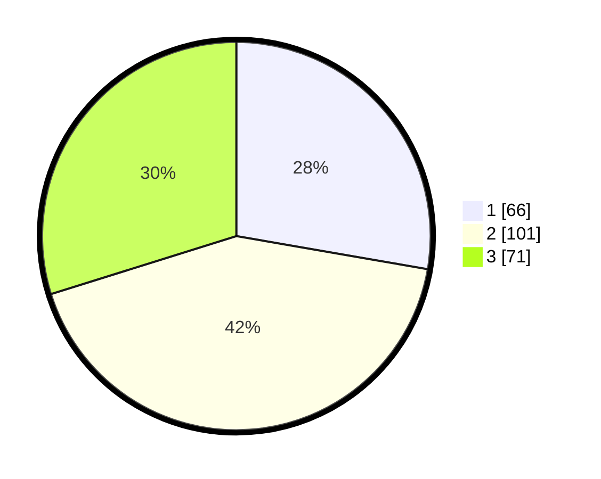

# Hasil

## Grafik

## Tabel

| No. | Nama Paslon    | Suara | Suara (raw) | Persentase |
|:--- |:-------------- | -----:| -----------:| ----------:|
| 1   | ANIES MUHAIMIN | 66    | [66][p-1]   | 27,73      |
| 2   | PRABOWO GIBRAN | 101   | [101][p-2]  | 42,44      |
| 3   | GANJAR MAHFUD  | 71    | [71][p-3]   | 29,83      |

[p-1]: https://github.com/gigit-pemilu/pemilu-2024-34-di-yogyakarta/blob/main/pilpres/hitung-suara/sub/34-di-yogyakarta/sub/04-sleman/sub/11-ngemplak/sub/2004-wedomartani/sub/022-tps/sub/paslon-1.txt
[p-2]: https://github.com/gigit-pemilu/pemilu-2024-34-di-yogyakarta/blob/main/pilpres/hitung-suara/sub/34-di-yogyakarta/sub/04-sleman/sub/11-ngemplak/sub/2004-wedomartani/sub/022-tps/sub/paslon-2.txt
[p-3]: https://github.com/gigit-pemilu/pemilu-2024-34-di-yogyakarta/blob/main/pilpres/hitung-suara/sub/34-di-yogyakarta/sub/04-sleman/sub/11-ngemplak/sub/2004-wedomartani/sub/022-tps/sub/paslon-3.txt

## Foto C Plano

https://sirekap-obj-formc.kpu.go.id/9dff/pemilu/ppwp/34/04/11/20/04/3404112004022-20240215-000829--145f7f65-fffc-45fc-bf1f-1eae558c5707.jpg

https://sirekap-obj-formc.kpu.go.id/9dff/pemilu/ppwp/34/04/11/20/04/3404112004022-20240215-001102--6cd07983-6ed7-468f-92da-b0f6c763148b.jpg

https://sirekap-obj-formc.kpu.go.id/9dff/pemilu/ppwp/34/04/11/20/04/3404112004022-20240215-001250--07e9e458-ea11-4361-8b81-d68d9b5b6230.jpg

## Metadata

| Key        | Value               |
| ---------- | ------------------- |
| Time Stamp | 2024-02-16 22:30:00 |

