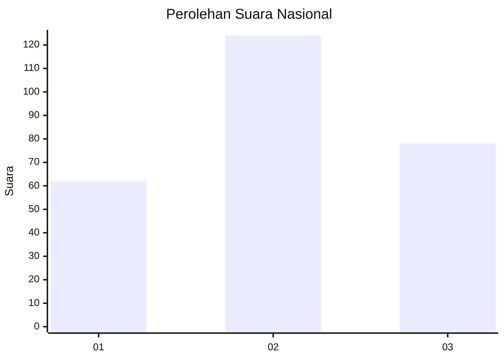
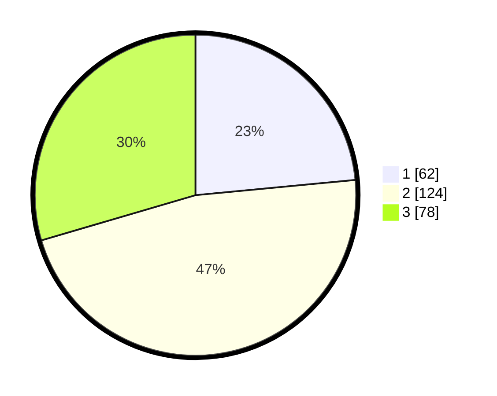

# Hasil

## Grafik

## Tabel

| No. | Nama Paslon    | Suara | Suara (raw) | Persentase |
|:--- |:-------------- | -----:| -----------:| ----------:|
| 1   | ANIES MUHAIMIN | 62    | [62][p-1]   | 23,48      |
| 2   | PRABOWO GIBRAN | 124   | [124][p-2]  | 46,97      |
| 3   | GANJAR MAHFUD  | 78    | [78][p-3]   | 29,55      |

[p-1]: https://github.com/gigit-pemilu/pemilu-2024/blob/main/pilpres/hitung-suara/sub/34-di-yogyakarta/sub/04-sleman/sub/11-ngemplak/sub/2004-wedomartani/sub/024-tps/sub/paslon-1.txt
[p-2]: https://github.com/gigit-pemilu/pemilu-2024/blob/main/pilpres/hitung-suara/sub/34-di-yogyakarta/sub/04-sleman/sub/11-ngemplak/sub/2004-wedomartani/sub/024-tps/sub/paslon-2.txt
[p-3]: https://github.com/gigit-pemilu/pemilu-2024/blob/main/pilpres/hitung-suara/sub/34-di-yogyakarta/sub/04-sleman/sub/11-ngemplak/sub/2004-wedomartani/sub/024-tps/sub/paslon-3.txt

## Foto C Plano

https://sirekap-obj-formc.kpu.go.id/918b/pemilu/ppwp/34/04/11/20/04/3404112004024-20240215-070948--5fb2aad9-3019-403c-834e-adab7c04c5b0.jpg

https://sirekap-obj-formc.kpu.go.id/918b/pemilu/ppwp/34/04/11/20/04/3404112004024-20240215-071049--14627026-ae40-4131-b84a-b2618e97dd40.jpg

https://sirekap-obj-formc.kpu.go.id/918b/pemilu/ppwp/34/04/11/20/04/3404112004024-20240215-071343--2ceefb09-f29d-40a1-a8d0-7747157cda08.jpg

## Metadata

| Key        | Value               |
| ---------- | ------------------- |
| Time Stamp | 2024-02-15 19:00:26 |

