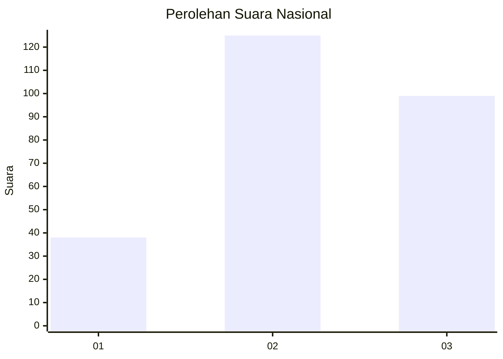
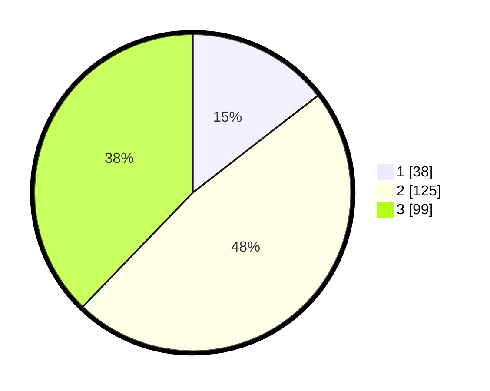

# Hasil

## Grafik

## Tabel

| No. | Nama Paslon    | Suara | Suara (raw) | Persentase |
|:--- |:-------------- | -----:| -----------:| ----------:|
| 1   | ANIES MUHAIMIN | 38    | [38][p-1]   | 14,50      |
| 2   | PRABOWO GIBRAN | 125   | [125][p-2]  | 47,71      |
| 3   | GANJAR MAHFUD  | 99    | [99][p-3]   | 37,79      |

[p-1]: https://github.com/gigit-pemilu/pemilu-2024/blob/main/pilpres/hitung-suara/sub/34-di-yogyakarta/sub/04-sleman/sub/11-ngemplak/sub/2004-wedomartani/sub/028-tps/sub/paslon-1.txt
[p-2]: https://github.com/gigit-pemilu/pemilu-2024/blob/main/pilpres/hitung-suara/sub/34-di-yogyakarta/sub/04-sleman/sub/11-ngemplak/sub/2004-wedomartani/sub/028-tps/sub/paslon-2.txt
[p-3]: https://github.com/gigit-pemilu/pemilu-2024/blob/main/pilpres/hitung-suara/sub/34-di-yogyakarta/sub/04-sleman/sub/11-ngemplak/sub/2004-wedomartani/sub/028-tps/sub/paslon-3.txt

## Foto C Plano

https://sirekap-obj-formc.kpu.go.id/6eeb/pemilu/ppwp/34/04/11/20/04/3404112004028-20240215-023059--a7aa1991-4905-46c2-ae6a-98a75d72d045.jpg

https://sirekap-obj-formc.kpu.go.id/6eeb/pemilu/ppwp/34/04/11/20/04/3404112004028-20240215-023117--2088c649-6e3f-4ca5-9de8-b46bd7bdbd0a.jpg

https://sirekap-obj-formc.kpu.go.id/6eeb/pemilu/ppwp/34/04/11/20/04/3404112004028-20240215-023647--3ff8b0d6-456d-43c1-b8f7-211724345b12.jpg

## Metadata

| Key        | Value               |
| ---------- | ------------------- |
| Time Stamp | 2024-02-15 19:00:26 |

