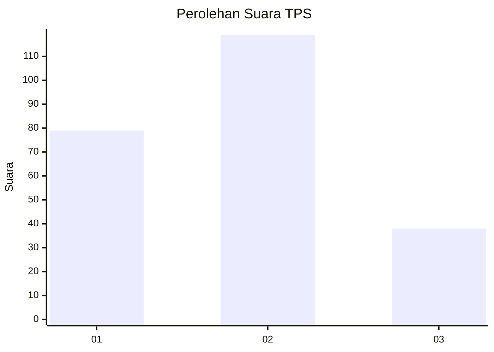
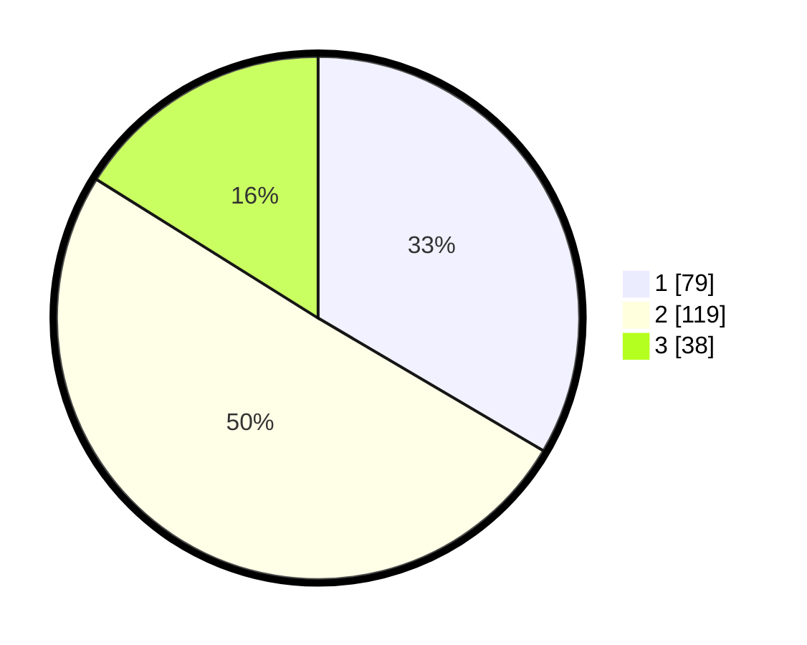

# Hasil

## Grafik

## Tabel

| No. | Nama Paslon    | Suara | Suara (raw) | Persentase |
|:--- |:-------------- | -----:| -----------:| ----------:|
| 1   | ANIES MUHAIMIN | 79    | [79][p-1]   | 33,47      |
| 2   | PRABOWO GIBRAN | 119   | [119][p-2]  | 50,42      |
| 3   | GANJAR MAHFUD  | 38    | [38][p-3]   | 16,10      |

[p-1]: https://github.com/gigit-pemilu/pemilu-2024-34-di-yogyakarta/blob/main/pilpres/hitung-suara/sub/34-di-yogyakarta/sub/04-sleman/sub/11-ngemplak/sub/2004-wedomartani/sub/032-tps/sub/paslon-1.txt
[p-2]: https://github.com/gigit-pemilu/pemilu-2024-34-di-yogyakarta/blob/main/pilpres/hitung-suara/sub/34-di-yogyakarta/sub/04-sleman/sub/11-ngemplak/sub/2004-wedomartani/sub/032-tps/sub/paslon-2.txt
[p-3]: https://github.com/gigit-pemilu/pemilu-2024-34-di-yogyakarta/blob/main/pilpres/hitung-suara/sub/34-di-yogyakarta/sub/04-sleman/sub/11-ngemplak/sub/2004-wedomartani/sub/032-tps/sub/paslon-3.txt

## Foto C Plano

https://sirekap-obj-formc.kpu.go.id/3dd0/pemilu/ppwp/34/04/11/20/04/3404112004032-20240215-014258--f342ac25-4b4f-4d42-b3dd-27c1453f21a6.jpg

https://sirekap-obj-formc.kpu.go.id/3dd0/pemilu/ppwp/34/04/11/20/04/3404112004032-20240215-014301--8438ba3c-9246-4411-b9fd-2ed131c76fc1.jpg

https://sirekap-obj-formc.kpu.go.id/3dd0/pemilu/ppwp/34/04/11/20/04/3404112004032-20240215-014304--03925177-6cb4-4191-80ca-52c0c8952f64.jpg

## Metadata

| Key        | Value               |
| ---------- | ------------------- |
| Time Stamp | 2024-02-15 19:00:26 |

