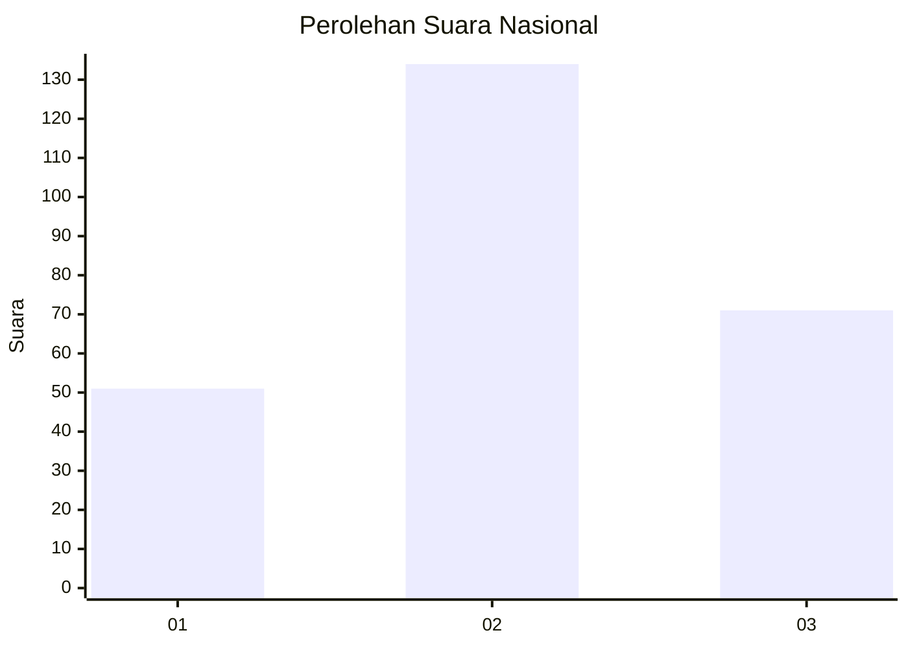
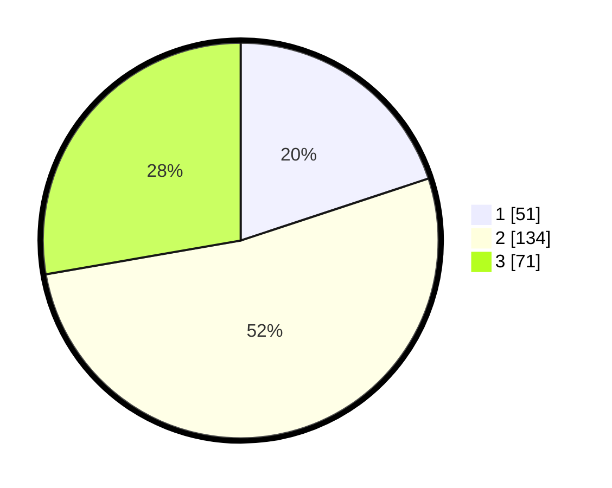

# Hasil

## Grafik

## Tabel

| No. | Nama Paslon    | Suara | Suara (raw) | Persentase |
|:--- |:-------------- | -----:| -----------:| ----------:|
| 1   | ANIES MUHAIMIN | 51    | [51][p-1]   | 19,92      |
| 2   | PRABOWO GIBRAN | 134   | [134][p-2]  | 52,34      |
| 3   | GANJAR MAHFUD  | 71    | [71][p-3]   | 27,73      |

[p-1]: https://github.com/gigit-pemilu/pemilu-2024/blob/main/pilpres/hitung-suara/sub/34-di-yogyakarta/sub/04-sleman/sub/11-ngemplak/sub/2004-wedomartani/sub/037-tps/sub/paslon-1.txt
[p-2]: https://github.com/gigit-pemilu/pemilu-2024/blob/main/pilpres/hitung-suara/sub/34-di-yogyakarta/sub/04-sleman/sub/11-ngemplak/sub/2004-wedomartani/sub/037-tps/sub/paslon-2.txt
[p-3]: https://github.com/gigit-pemilu/pemilu-2024/blob/main/pilpres/hitung-suara/sub/34-di-yogyakarta/sub/04-sleman/sub/11-ngemplak/sub/2004-wedomartani/sub/037-tps/sub/paslon-3.txt

## Foto C Plano

https://sirekap-obj-formc.kpu.go.id/c5ff/pemilu/ppwp/34/04/11/20/04/3404112004037-20240214-210509--ae8aa018-ce25-43af-aa47-9aa3d05ec837.jpg

https://sirekap-obj-formc.kpu.go.id/c5ff/pemilu/ppwp/34/04/11/20/04/3404112004037-20240214-210651--3a965466-414f-45d0-93db-d805a79bb4a5.jpg

https://sirekap-obj-formc.kpu.go.id/c5ff/pemilu/ppwp/34/04/11/20/04/3404112004037-20240214-210339--d7115fdc-dbc5-45eb-b270-2677a5169f51.jpg

## Metadata

| Key        | Value               |
| ---------- | ------------------- |
| Time Stamp | 2024-02-15 19:00:26 |

