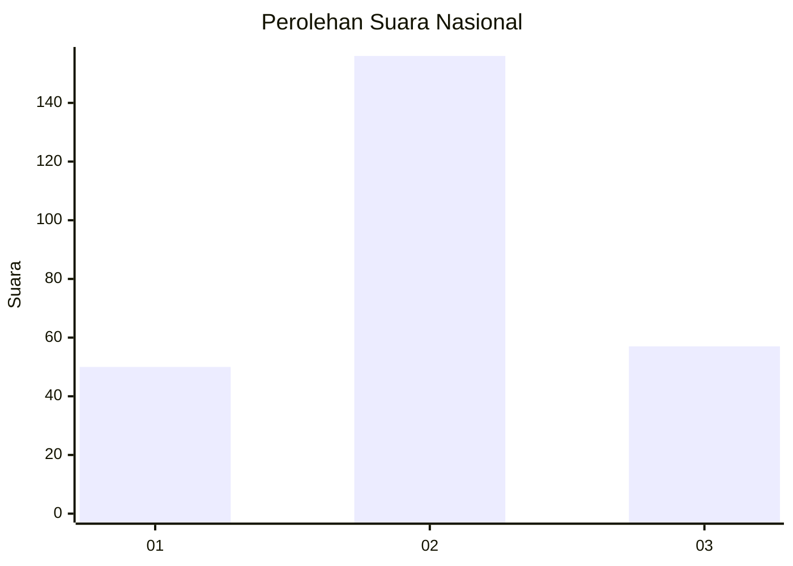
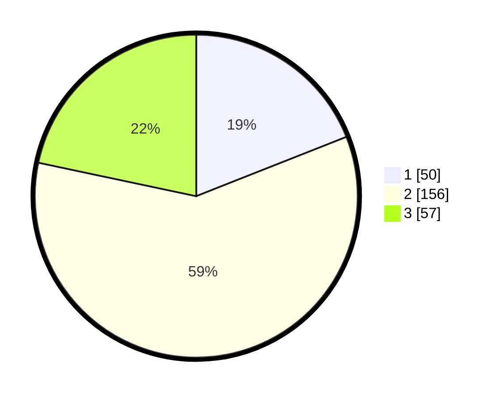

# Hasil

## Grafik

## Tabel

| No. | Nama Paslon    | Suara | Suara (raw) | Persentase |
|:--- |:-------------- | -----:| -----------:| ----------:|
| 1   | ANIES MUHAIMIN | 50    | [50][p-1]   | 19,01      |
| 2   | PRABOWO GIBRAN | 156   | [156][p-2]  | 59,32      |
| 3   | GANJAR MAHFUD  | 57    | [57][p-3]   | 21,67      |

[p-1]: https://github.com/gigit-pemilu/pemilu-2024/blob/main/pilpres/hitung-suara/sub/34-di-yogyakarta/sub/04-sleman/sub/11-ngemplak/sub/2004-wedomartani/sub/042-tps/sub/paslon-1.txt
[p-2]: https://github.com/gigit-pemilu/pemilu-2024/blob/main/pilpres/hitung-suara/sub/34-di-yogyakarta/sub/04-sleman/sub/11-ngemplak/sub/2004-wedomartani/sub/042-tps/sub/paslon-2.txt
[p-3]: https://github.com/gigit-pemilu/pemilu-2024/blob/main/pilpres/hitung-suara/sub/34-di-yogyakarta/sub/04-sleman/sub/11-ngemplak/sub/2004-wedomartani/sub/042-tps/sub/paslon-3.txt

## Foto C Plano

https://sirekap-obj-formc.kpu.go.id/8560/pemilu/ppwp/34/04/11/20/04/3404112004042-20240214-210354--b9e79bdc-ef6f-4e22-aa58-2c4285bbcd6f.jpg

https://sirekap-obj-formc.kpu.go.id/8560/pemilu/ppwp/34/04/11/20/04/3404112004042-20240214-210359--3f678e4d-0dc3-42b3-8c65-20eb07b04fb1.jpg

https://sirekap-obj-formc.kpu.go.id/8560/pemilu/ppwp/34/04/11/20/04/3404112004042-20240214-210405--2ae74f28-c2e3-4147-9f33-6c18b781ea48.jpg

## Metadata

| Key        | Value               |
| ---------- | ------------------- |
| Time Stamp | 2024-02-15 04:00:24 |

## DATA PEMILIH TETAP

Jumlah pemilih dalam DPT: **287**.
 * L: **128**.
 * P: **159**.

## DATA PENGGUNA HAK PILIH

Jumlah pengguna hak pilih dalam DPT: **255**.
 * L: **115**.
 * P: **140**.

Jumlah pengguna hak pilih dalam DPTb: **12**.
 * L: **11**.
 * P: **1**.

Jumlah pengguna hak pilih dalam DPK: **0**.
 * L: **0**.
 * P: **0**.

Jumlah pengguna hak pilih: **267**.
 * L: **126**.
 * P: **141**.

## JUMLAH SUARA SAH DAN TIDAK SAH

JUMLAH SELURUH SUARA SAH: **263**.

JUMLAH SUARA TIDAK SAH: **4**.

JUMLAH SELURUH SUARA SAH DAN SUARA TIDAK SAH: **267**.

