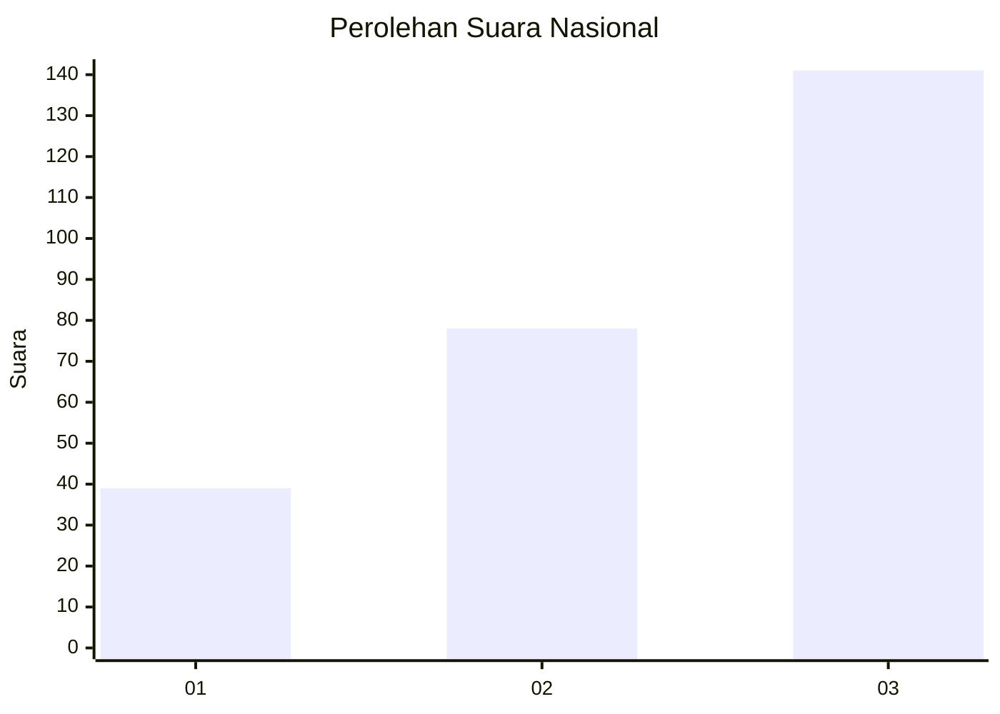
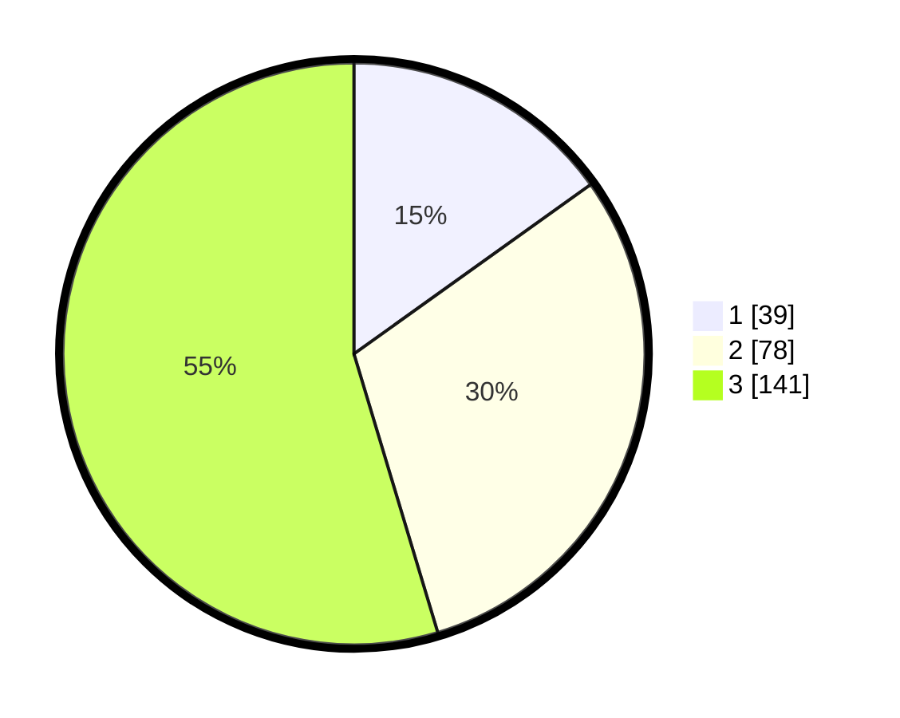

# Hasil

## Grafik

## Tabel

| No. | Nama Paslon    | Suara | Suara (raw) | Persentase |
|:--- |:-------------- | -----:| -----------:| ----------:|
| 1   | ANIES MUHAIMIN | 39    | [39][p-1]   | 15,12      |
| 2   | PRABOWO GIBRAN | 78    | [78][p-2]   | 30,23      |
| 3   | GANJAR MAHFUD  | 141   | [141][p-3]  | 54,65      |

[p-1]: https://github.com/gigit-pemilu/pemilu-2024/blob/main/pilpres/hitung-suara/sub/34-di-yogyakarta/sub/04-sleman/sub/11-ngemplak/sub/2004-wedomartani/sub/044-tps/sub/paslon-1.txt
[p-2]: https://github.com/gigit-pemilu/pemilu-2024/blob/main/pilpres/hitung-suara/sub/34-di-yogyakarta/sub/04-sleman/sub/11-ngemplak/sub/2004-wedomartani/sub/044-tps/sub/paslon-2.txt
[p-3]: https://github.com/gigit-pemilu/pemilu-2024/blob/main/pilpres/hitung-suara/sub/34-di-yogyakarta/sub/04-sleman/sub/11-ngemplak/sub/2004-wedomartani/sub/044-tps/sub/paslon-3.txt

## Foto C Plano

https://sirekap-obj-formc.kpu.go.id/d7d7/pemilu/ppwp/34/04/11/20/04/3404112004044-20240214-202954--d6848fdf-b5f7-4cbb-ae48-8dcf7e4abb83.jpg

https://sirekap-obj-formc.kpu.go.id/d7d7/pemilu/ppwp/34/04/11/20/04/3404112004044-20240214-195540--943d8de4-f47a-4295-b0cc-40da5b22a606.jpg

https://sirekap-obj-formc.kpu.go.id/d7d7/pemilu/ppwp/34/04/11/20/04/3404112004044-20240214-195847--adaadd54-f8fa-4af7-a2c8-5e6a957fc548.jpg

## Metadata

| Key        | Value               |
| ---------- | ------------------- |
| Time Stamp | 2024-02-15 03:06:03 |

