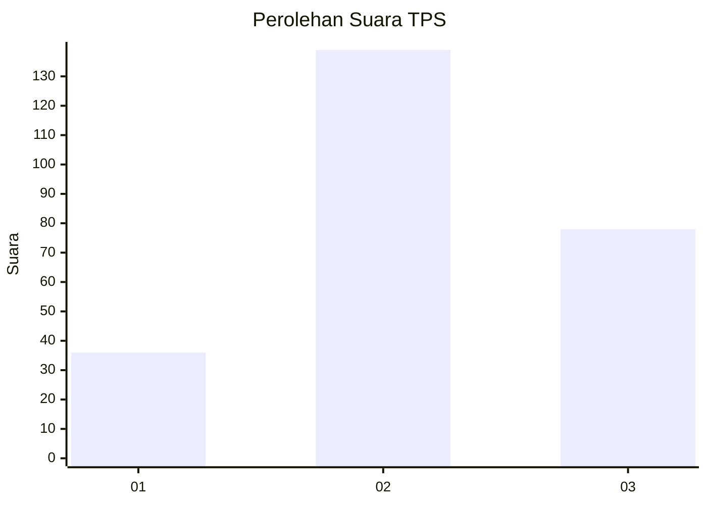
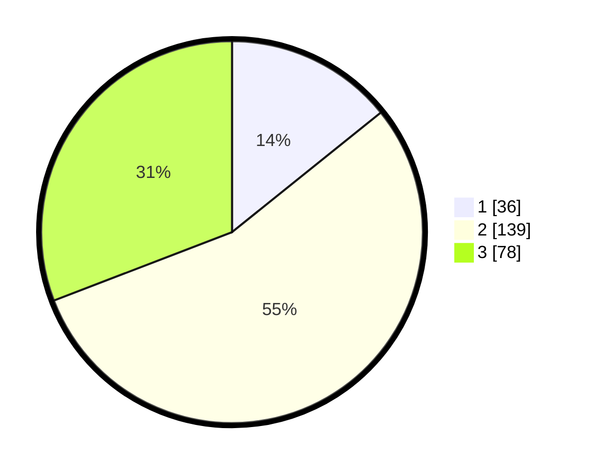

# Hasil

## Grafik

## Tabel

| No. | Nama Paslon    | Suara | Suara (raw) | Persentase |
|:--- |:-------------- | -----:| -----------:| ----------:|
| 1   | ANIES MUHAIMIN | 36    | [36][p-1]   | 14,23      |
| 2   | PRABOWO GIBRAN | 139   | [139][p-2]  | 54,94      |
| 3   | GANJAR MAHFUD  | 78    | [78][p-3]   | 30,83      |

[p-1]: https://github.com/gigit-pemilu/pemilu-2024-34-di-yogyakarta/blob/main/pilpres/hitung-suara/sub/34-di-yogyakarta/sub/04-sleman/sub/11-ngemplak/sub/2004-wedomartani/sub/045-tps/sub/paslon-1.txt
[p-2]: https://github.com/gigit-pemilu/pemilu-2024-34-di-yogyakarta/blob/main/pilpres/hitung-suara/sub/34-di-yogyakarta/sub/04-sleman/sub/11-ngemplak/sub/2004-wedomartani/sub/045-tps/sub/paslon-2.txt
[p-3]: https://github.com/gigit-pemilu/pemilu-2024-34-di-yogyakarta/blob/main/pilpres/hitung-suara/sub/34-di-yogyakarta/sub/04-sleman/sub/11-ngemplak/sub/2004-wedomartani/sub/045-tps/sub/paslon-3.txt

## Foto C Plano

https://sirekap-obj-formc.kpu.go.id/9e0e/pemilu/ppwp/34/04/11/20/04/3404112004045-20240215-050051--429fbb13-0c7f-4671-b1c3-6887b4e3f719.jpg

https://sirekap-obj-formc.kpu.go.id/9e0e/pemilu/ppwp/34/04/11/20/04/3404112004045-20240215-050211--61f55c22-6013-4ddb-b858-b6fb26700c35.jpg

https://sirekap-obj-formc.kpu.go.id/9e0e/pemilu/ppwp/34/04/11/20/04/3404112004045-20240215-050347--62660974-ee8e-4266-a760-8824d562dcf7.jpg

## Metadata

| Key        | Value               |
| ---------- | ------------------- |
| Time Stamp | 2024-02-15 19:00:26 |

