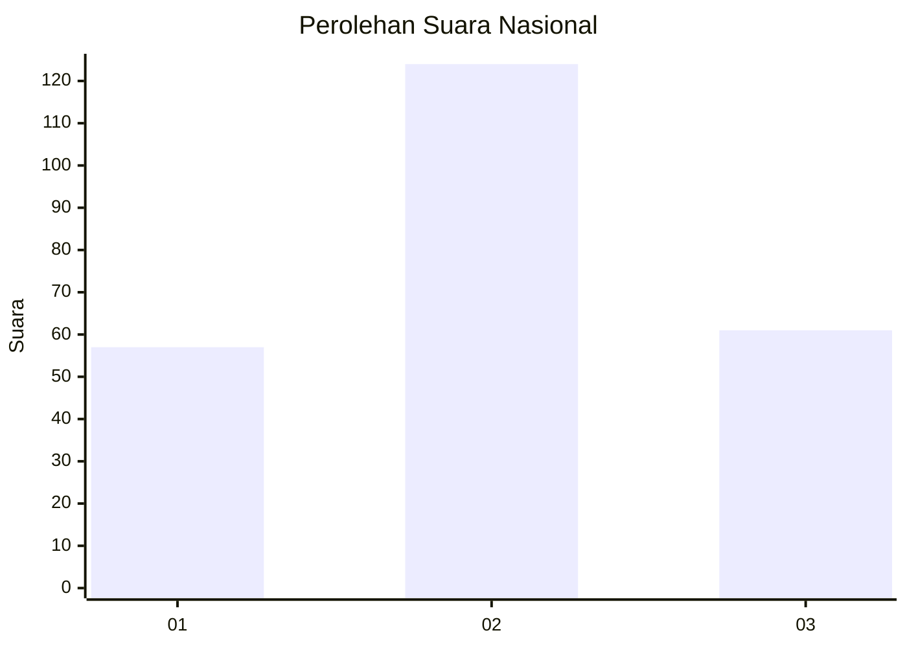
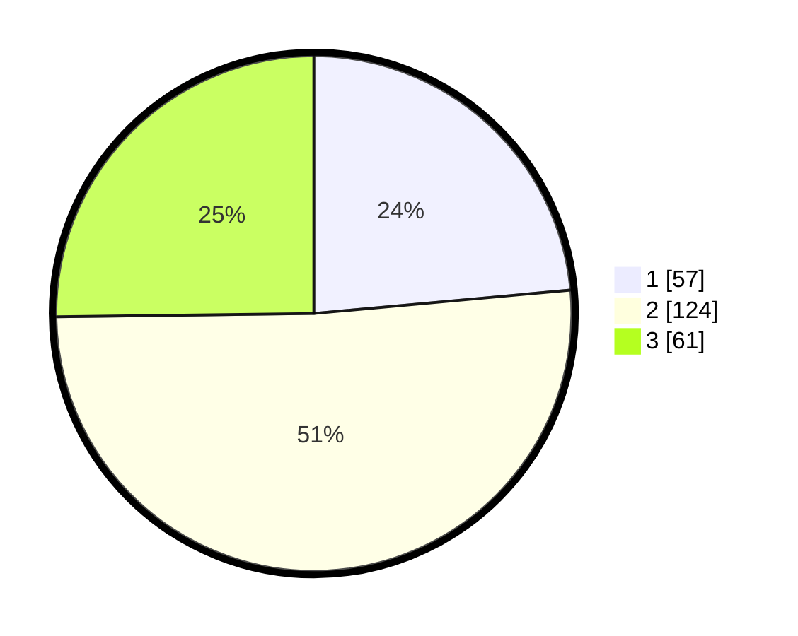

# Hasil

## Grafik

## Tabel

| No. | Nama Paslon    | Suara | Suara (raw) | Persentase |
|:--- |:-------------- | -----:| -----------:| ----------:|
| 1   | ANIES MUHAIMIN | 57    | [57][p-1]   | 23,55      |
| 2   | PRABOWO GIBRAN | 124   | [124][p-2]  | 51,24      |
| 3   | GANJAR MAHFUD  | 61    | [61][p-3]   | 25,21      |

[p-1]: https://github.com/gigit-pemilu/pemilu-2024/blob/main/pilpres/hitung-suara/sub/34-di-yogyakarta/sub/04-sleman/sub/11-ngemplak/sub/2004-wedomartani/sub/046-tps/sub/paslon-1.txt
[p-2]: https://github.com/gigit-pemilu/pemilu-2024/blob/main/pilpres/hitung-suara/sub/34-di-yogyakarta/sub/04-sleman/sub/11-ngemplak/sub/2004-wedomartani/sub/046-tps/sub/paslon-2.txt
[p-3]: https://github.com/gigit-pemilu/pemilu-2024/blob/main/pilpres/hitung-suara/sub/34-di-yogyakarta/sub/04-sleman/sub/11-ngemplak/sub/2004-wedomartani/sub/046-tps/sub/paslon-3.txt

## Foto C Plano

https://sirekap-obj-formc.kpu.go.id/5c1a/pemilu/ppwp/34/04/11/20/04/3404112004046-20240214-200648--a24677cd-6cec-4a2d-9fe5-3036c9f153e4.jpg

https://sirekap-obj-formc.kpu.go.id/5c1a/pemilu/ppwp/34/04/11/20/04/3404112004046-20240214-200752--3c793b45-995e-4163-83a8-235034d433a1.jpg

https://sirekap-obj-formc.kpu.go.id/5c1a/pemilu/ppwp/34/04/11/20/04/3404112004046-20240214-200853--98368ff2-5908-4f4e-a71c-32827f196a99.jpg

## Metadata

| Key        | Value               |
| ---------- | ------------------- |
| Time Stamp | 2024-02-15 19:00:26 |

