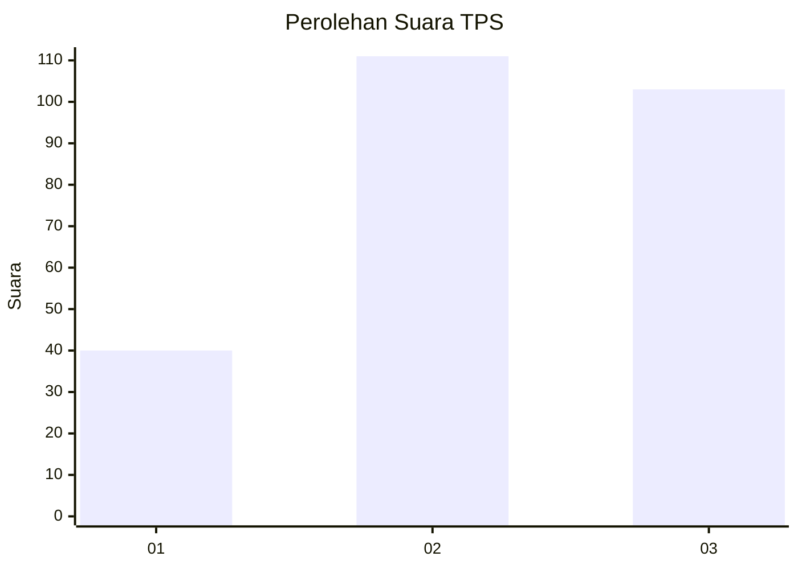
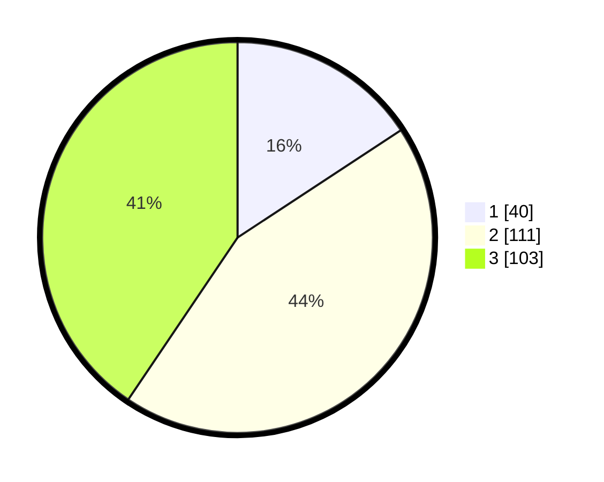

# Hasil

## Grafik

## Tabel

| No. | Nama Paslon    | Suara | Suara (raw) | Persentase |
|:--- |:-------------- | -----:| -----------:| ----------:|
| 1   | ANIES MUHAIMIN | 40    | [40][p-1]   | 15,75      |
| 2   | PRABOWO GIBRAN | 111   | [111][p-2]  | 43,70      |
| 3   | GANJAR MAHFUD  | 103   | [103][p-3]  | 40,55      |

[p-1]: https://github.com/gigit-pemilu/pemilu-2024-34-di-yogyakarta/blob/main/pilpres/hitung-suara/sub/34-di-yogyakarta/sub/04-sleman/sub/11-ngemplak/sub/2004-wedomartani/sub/050-tps/sub/paslon-1.txt
[p-2]: https://github.com/gigit-pemilu/pemilu-2024-34-di-yogyakarta/blob/main/pilpres/hitung-suara/sub/34-di-yogyakarta/sub/04-sleman/sub/11-ngemplak/sub/2004-wedomartani/sub/050-tps/sub/paslon-2.txt
[p-3]: https://github.com/gigit-pemilu/pemilu-2024-34-di-yogyakarta/blob/main/pilpres/hitung-suara/sub/34-di-yogyakarta/sub/04-sleman/sub/11-ngemplak/sub/2004-wedomartani/sub/050-tps/sub/paslon-3.txt

## Foto C Plano

https://sirekap-obj-formc.kpu.go.id/7abf/pemilu/ppwp/34/04/11/20/04/3404112004050-20240217-140040--f02649ea-fbf5-4b1f-aaf2-c573919b76a3.jpg

https://sirekap-obj-formc.kpu.go.id/7abf/pemilu/ppwp/34/04/11/20/04/3404112004050-20240217-140033--9d21fca0-c316-4962-ab59-967351004fd0.jpg

https://sirekap-obj-formc.kpu.go.id/7abf/pemilu/ppwp/34/04/11/20/04/3404112004050-20240217-140045--65f65227-6ef9-4257-aca7-bfdbdabbb09c.jpg

## Metadata

| Key        | Value               |
| ---------- | ------------------- |
| Time Stamp | 2024-02-17 18:30:00 |

