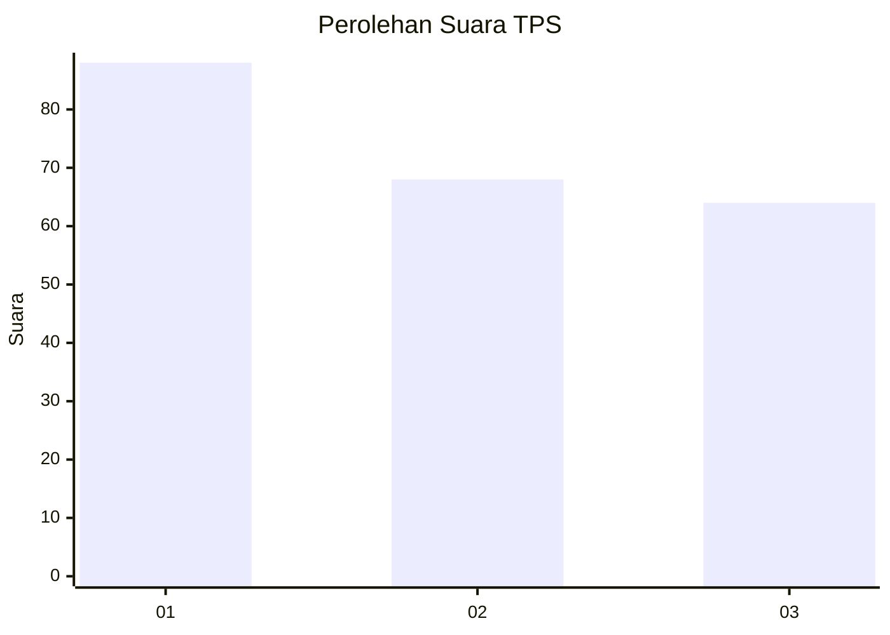
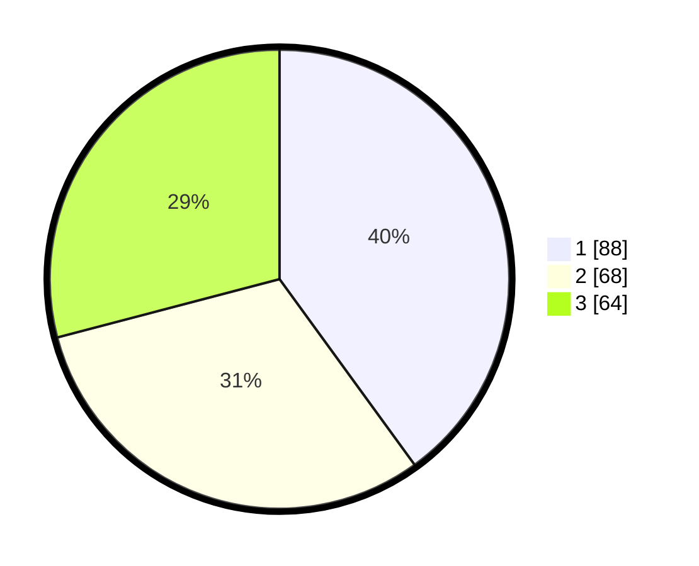

# Hasil

## Grafik

## Tabel

| No. | Nama Paslon    | Suara | Suara (raw) | Persentase |
|:--- |:-------------- | -----:| -----------:| ----------:|
| 1   | ANIES MUHAIMIN | 88    | [88][p-1]   | 40,00      |
| 2   | PRABOWO GIBRAN | 68    | [68][p-2]   | 30,91      |
| 3   | GANJAR MAHFUD  | 64    | [64][p-3]   | 29,09      |

[p-1]: https://github.com/gigit-pemilu/pemilu-2024-34-di-yogyakarta/blob/main/pilpres/hitung-suara/sub/34-di-yogyakarta/sub/04-sleman/sub/11-ngemplak/sub/2004-wedomartani/sub/055-tps/sub/paslon-1.txt
[p-2]: https://github.com/gigit-pemilu/pemilu-2024-34-di-yogyakarta/blob/main/pilpres/hitung-suara/sub/34-di-yogyakarta/sub/04-sleman/sub/11-ngemplak/sub/2004-wedomartani/sub/055-tps/sub/paslon-2.txt
[p-3]: https://github.com/gigit-pemilu/pemilu-2024-34-di-yogyakarta/blob/main/pilpres/hitung-suara/sub/34-di-yogyakarta/sub/04-sleman/sub/11-ngemplak/sub/2004-wedomartani/sub/055-tps/sub/paslon-3.txt

## Foto C Plano

https://sirekap-obj-formc.kpu.go.id/7bc7/pemilu/ppwp/34/04/11/20/04/3404112004055-20240214-230552--e14c67f1-6abe-4cbd-baae-70ac8f9d8099.jpg

https://sirekap-obj-formc.kpu.go.id/7bc7/pemilu/ppwp/34/04/11/20/04/3404112004055-20240214-230555--f8c8c4ea-2978-4162-b53d-b76eb27a36b5.jpg

https://sirekap-obj-formc.kpu.go.id/7bc7/pemilu/ppwp/34/04/11/20/04/3404112004055-20240214-230613--c1c25376-0c27-476e-9c3a-02c793b18dc9.jpg

## Metadata

| Key        | Value               |
| ---------- | ------------------- |
| Time Stamp | 2024-02-15 09:00:24 |

