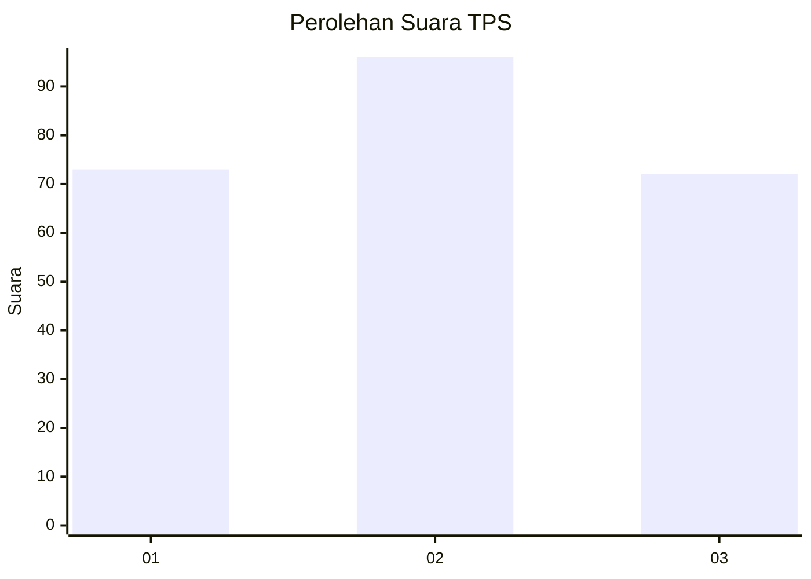
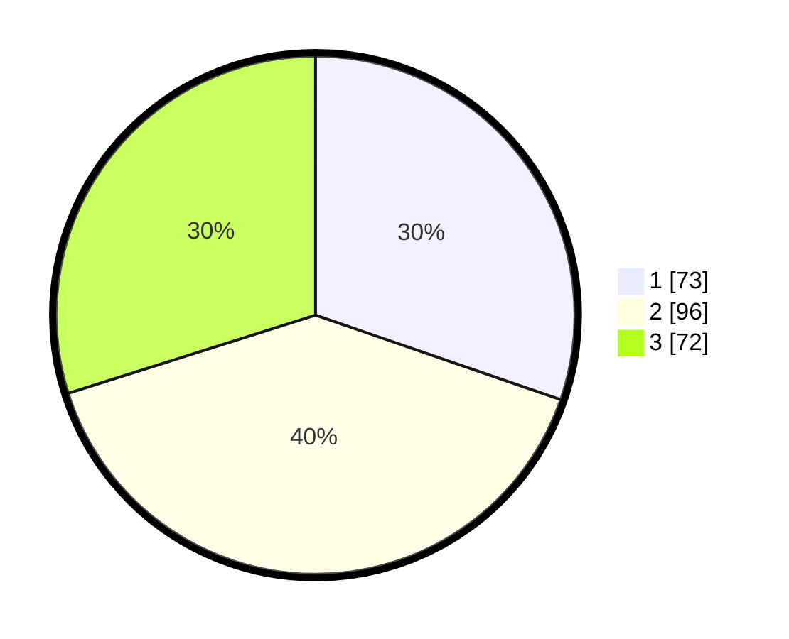

# Hasil

## Grafik

## Tabel

| No. | Nama Paslon    | Suara | Suara (raw) | Persentase |
|:--- |:-------------- | -----:| -----------:| ----------:|
| 1   | ANIES MUHAIMIN | 73    | [73][p-1]   | 30,29      |
| 2   | PRABOWO GIBRAN | 96    | [96][p-2]   | 39,83      |
| 3   | GANJAR MAHFUD  | 72    | [72][p-3]   | 29,88      |

[p-1]: https://github.com/gigit-pemilu/pemilu-2024-34-di-yogyakarta/blob/main/pilpres/hitung-suara/sub/34-di-yogyakarta/sub/04-sleman/sub/11-ngemplak/sub/2004-wedomartani/sub/062-tps/sub/paslon-1.txt
[p-2]: https://github.com/gigit-pemilu/pemilu-2024-34-di-yogyakarta/blob/main/pilpres/hitung-suara/sub/34-di-yogyakarta/sub/04-sleman/sub/11-ngemplak/sub/2004-wedomartani/sub/062-tps/sub/paslon-2.txt
[p-3]: https://github.com/gigit-pemilu/pemilu-2024-34-di-yogyakarta/blob/main/pilpres/hitung-suara/sub/34-di-yogyakarta/sub/04-sleman/sub/11-ngemplak/sub/2004-wedomartani/sub/062-tps/sub/paslon-3.txt

## Foto C Plano

https://sirekap-obj-formc.kpu.go.id/e6d0/pemilu/ppwp/34/04/11/20/04/3404112004062-20240215-034322--a7bd1739-5e87-43b1-b929-6db9938589f0.jpg

https://sirekap-obj-formc.kpu.go.id/e6d0/pemilu/ppwp/34/04/11/20/04/3404112004062-20240215-034409--2dec5e78-8b90-41a0-bc7e-f2a4ffa4b857.jpg

https://sirekap-obj-formc.kpu.go.id/e6d0/pemilu/ppwp/34/04/11/20/04/3404112004062-20240215-034508--5dd4ff70-2e25-4a10-b30a-b956ea64483d.jpg

## Metadata

| Key        | Value               |
| ---------- | ------------------- |
| Time Stamp | 2024-02-15 19:00:26 |

